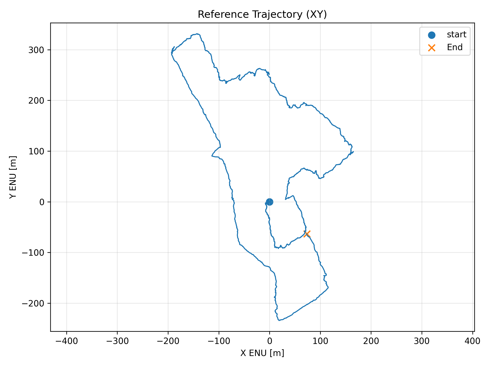
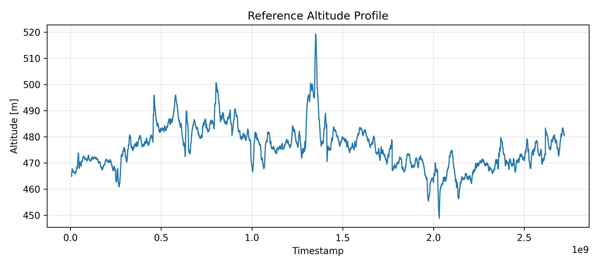
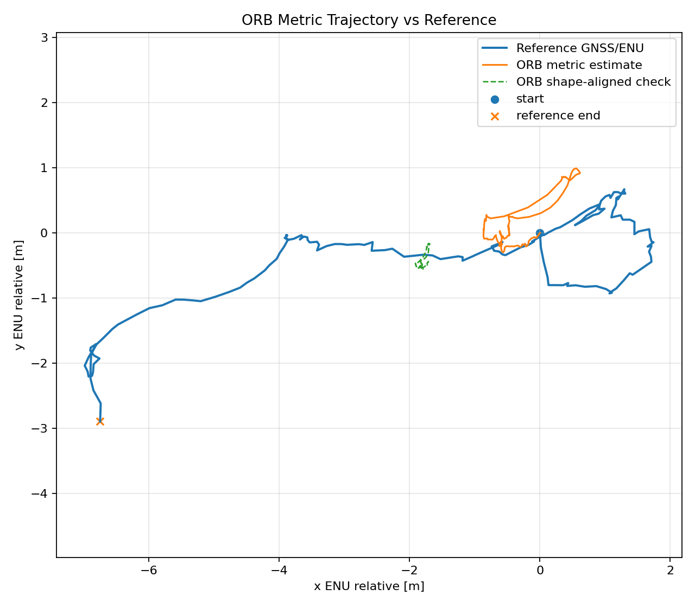
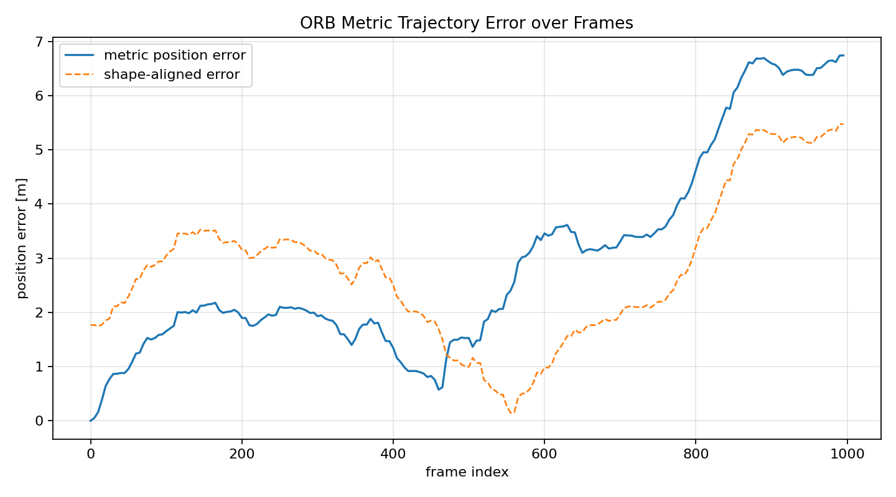
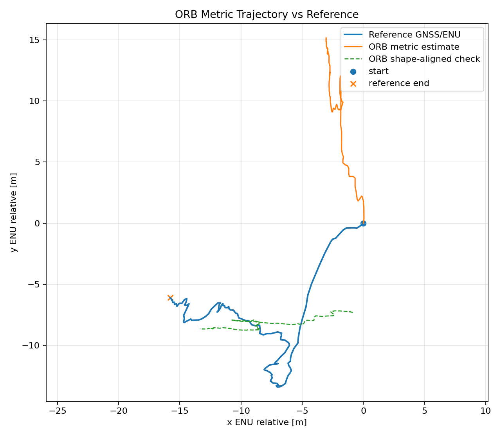
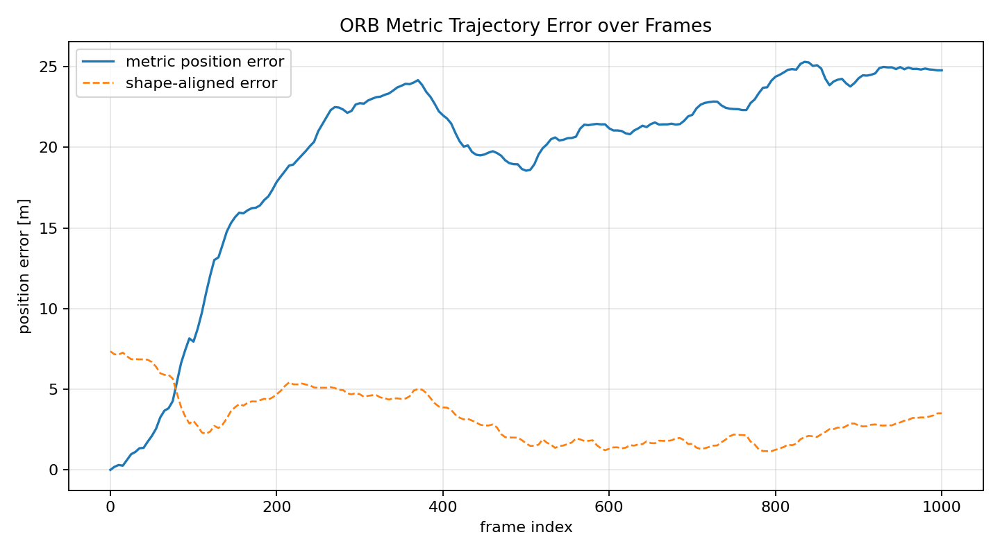
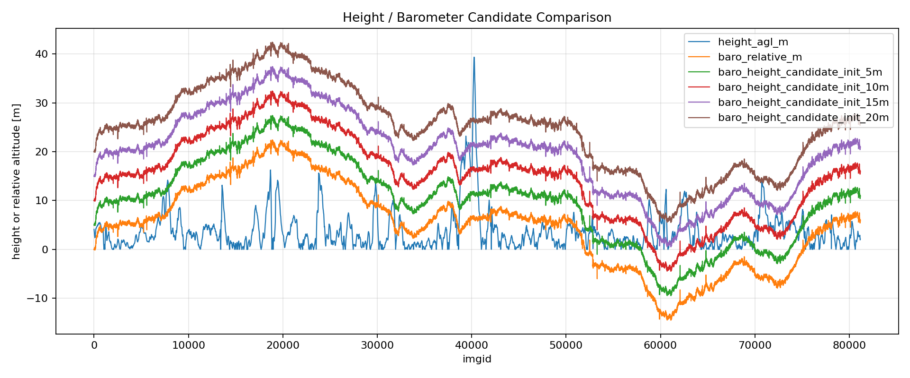

# drone-localisation

Relative and absolute localisation for drones in GNSS-denied environments using onboard camera data, telemetry, and map/reference information for evaluation.

The current project priority is to build a stable, reproducible localisation pipeline before moving into sensor fusion and map-based correction.

```text
camera frames
↓
feature / motion estimation
↓
relative trajectory
↓
metric conversion where camera geometry allows
↓
reference comparison and drift analysis
↓
future: IMU/barometer/optical-flow fusion + map alignment
```

---

## 1. Project Status

| Phase | Status | Main Output |
|---|---|---|
| Week 1 | Complete | Method review, dataset specification, implementation plan |
| Week 2 | Complete | Zurich MAV dataset loader, reference trajectory, frame synchronisation |
| Week 3 | Complete | ORB relative localisation baseline, stride tests, metric scaling, failure analysis |
| Next | Planned | Sensor-readiness diagnostics, visual-inertial/optical-flow branch, map alignment |

Current implemented baseline:

```text
Zurich MAV camera frames
↓
ORB feature matching
↓
RANSAC / homography filtering
↓
accumulated image-motion trajectory
↓
approximate metric scaling using camera intrinsics + height/yaw candidates
↓
comparison against GNSS/reference trajectory
```

GNSS/reference data is used only for evaluation and plotting, not as an input to the visual localisation estimate.

---

## 2. Repository Setup

From the project root:

```bash
cd drone-localisation
pyenv local 3.10.13
python --version
source .drone_venv/bin/activate
which python
python --version
export PYTHONPATH=$PWD/src
```

Common command pattern:

```bash
export PYTHONPATH=$PWD/src
python scripts/<script_name>.py --config configs/<dataset_config>.yaml
```

---

## 3. Important Project Files

### Dataset Configs

```text
configs/dataset_zurich.yaml
configs/dataset_zurich_full.yaml
```

### Core Source Modules

```text
src/uavloc/data/zurich_loader.py
src/uavloc/data/enrich_zurich_sync.py
src/uavloc/geometry/gps_enu.py
src/uavloc/relative/orb_relative_motion.py
src/uavloc/relative/orb_metric_scaling.py
src/uavloc/visualization/trajectory_plot.py
src/uavloc/visualization/folium_map.py
```

### Main Scripts

```text
scripts/inspect_dataset.py
scripts/build_reference_trajectory.py
scripts/run_reference_visualization.py
scripts/sync_zurich_frames.py
scripts/enrich_zurich_synchronized_frames.py
scripts/run_orb_stride_subset_diagnostics.py
scripts/run_orb_relative_motion.py
scripts/run_orb_metric_scaling.py
scripts/run_orb_metric_scaling_sweep.py
scripts/inspect_metric_geometry_inputs.py
scripts/build_relative_evaluation_summary.py
```

---

## 4. Week 1 — Method Review and Dataset Specification

Week 1 defined the localisation problem and selected the first implementation direction.

The project was divided into four method groups:

```text
1. Relative visual localisation / visual odometry
2. Absolute map-based localisation
3. AI / learned visual matching methods
4. Sensor fusion and robustness methods
```

The first implementation baseline was selected as ORB-based relative image-motion estimation because it is lightweight, explainable, CPU-friendly, and suitable for validating the dataset pipeline before adding IMU/barometer/map fusion.

Week 1 also established that GNSS/RTK should be isolated from the estimator and used only for evaluation.

Recommended report location if copied into the repository:

```text
docs/reports/Week_1_Method_Review_and_Dataset_Specification_v1.0.pdf
```

---

## 5. Week 2 — Zurich MAV Dataset Pipeline

Week 2 implemented the reusable dataset pipeline for the Zurich Urban MAV dataset.

### Completed

```text
- Python environment and repository structure
- YAML-based dataset configuration
- Zurich MAV dataset loader
- Robust CSV reader for messy telemetry logs
- Dataset inspection and report generation
- Camera calibration detection
- Reference trajectory generation
- GPS scaling fix
- UTM to local ENU conversion fix
- Reference trajectory visualisation
- Folium interactive map visualisation
- Frame-to-telemetry synchronisation
```

### Dataset Summary

Zurich MAV sample dataset inspection:

```text
MAV images:          350
Calibration images:  30
Street-view images:  113
Onboard GPS rows:    81169
GroundTruthAGL rows: 2708
OnboardPose rows:    135098
Barometer rows:      27052
Accelerometer rows:  27050
Gyroscope rows:      27050
Calibration:         available
```

### Week 2 Commands

```bash
export PYTHONPATH=$PWD/src
python scripts/inspect_dataset.py --config configs/dataset_zurich.yaml
python scripts/build_reference_trajectory.py --config configs/dataset_zurich.yaml
python scripts/run_reference_visualization.py --config configs/dataset_zurich.yaml
python scripts/sync_zurich_frames.py --config configs/dataset_zurich.yaml
```

### Week 2 Outputs

```text
outputs/zurich_mav_sample/reports/dataset_report.json
outputs/zurich_mav_sample/trajectories/reference_trajectory.csv
outputs/zurich_mav_sample/reports/reference_origin.json
outputs/zurich_mav_sample/reports/reference_trajectory_summary.json
outputs/zurich_mav_sample/metadata/synchronized_frames.csv
outputs/zurich_mav_sample/reports/frame_sync_summary.json
```

### Week 2 Visuals

Local generated visual outputs:

```text
outputs/zurich_mav_sample/figures/trajectory_xy.png
outputs/zurich_mav_sample/figures/altitude_profile.png
outputs/zurich_mav_sample/figures/speed_profile.png
outputs/zurich_mav_sample/maps/trajectory_map.html
```

Recommended README/report visuals:

| Visual | Purpose |
|---|---|
| `trajectory_xy.png` | Shows the ENU reference trajectory in metres |
| `altitude_profile.png` | Shows altitude variation across the flight |
| `speed_profile.png` | Shows reference speed trend |
| `trajectory_map.html` | Interactive map view of the travelled path |

Reference trajectory summary:

```text
Rows:        81169
X range [m]: -193.25 to 165.09
Y range [m]: -234.27 to 331.58
Z range [m]: -15.95 to 54.39
```

---

## 6. Week 3 — ORB Relative Localisation Baseline

Week 3 implemented the first visual relative localisation baseline.

### Completed Blocks

```text
07    — ORB relative image-motion baseline on Zurich sample
08    — approximate ORB metric scaling on Zurich sample
08B   — Zurich telemetry enrichment
09A   — full-dataset ORB stride subset diagnostics
09B   — full-dataset ORB relative motion subset runs
09C   — full-dataset ORB metric scaling subset runs
09C.2 — axis/yaw/scale sweep diagnostics
09C.3 — geometry and telemetry diagnostics
09C.4 — stable evaluation summary
09D   — Zurich MAV evaluation and failure analysis
```

---

## 7. Week 3 Sample-Dataset Results

### ORB Image-Motion Baseline

Command:

```bash
export PYTHONPATH=$PWD/src
python scripts/run_orb_relative_motion.py --config configs/dataset_zurich.yaml
```

Outputs:

```text
outputs/zurich_mav_sample/trajectories/07_orb_relative_motion/orb_relative_trajectory.csv
outputs/zurich_mav_sample/reports/07_orb_relative_motion/orb_relative_motion_summary.json
outputs/zurich_mav_sample/figures/07_orb_relative_motion/orb_relative_xy.png
outputs/zurich_mav_sample/figures/07_orb_relative_motion/orb_reference_comparison_xy.png
```

Successful sample run:

```text
Frames used:         350
Attempted pairs:     349
OK pairs:            349
Failed pairs:        0
Median matches:      1347.0
Median inliers:      1202.0
Median inlier ratio: 0.903
Aligned RMSE [m]:    0.656
```

Interpretation:

```text
ORB image-to-image tracking works well on the Zurich MAV sample.
The raw ORB trajectory is in image-motion pixel units.
The similarity-aligned comparison is only a diagnostic shape comparison.
```

### Approximate Metric Scaling on Sample

Outputs:

```text
outputs/zurich_mav_sample/metadata/synchronized_frames_enriched.csv
outputs/zurich_mav_sample/reports/08b_sync_enrichment/sync_enrichment_summary.json
outputs/zurich_mav_sample/reports/08c_metric_input_inspection/metric_input_inspection_summary.json
```

Final sample metric result using enriched height/yaw candidates:

```text
Height column:       height_agl_m
Yaw column:          yaw_deg
Estimated path:      1.489 m
Reference path:      6.095 m
RMSE:                1.703 m
Mean error:          1.629 m
Max error:           2.193 m
Final error:         1.323 m
Drift per 100 m:     21.71
Shape RMSE:          0.684 m
```

Important sensor warning:

```text
OnboardPose Height is constant zero and unusable.
OnboardPose Azimuth is constant zero and unusable.
height_agl_m is approximate/debug only, not verified true AGL.
yaw_deg is a candidate from GroundTruthAGL omega_gt.
```

---

## 8. Week 3 Full-Dataset Results

The Zurich MAV full dataset contains:

```text
Total synchronised frames: 81169
Config: configs/dataset_zurich_full.yaml
```

### 09A — ORB Stride Diagnostics

Five representative full-dataset windows were tested:

```text
full_00001_01000
full_20000_21000
full_40000_41000
full_60000_61000
full_80000_81169
```

Tested strides:

```text
1, 2, 3, 5, 10
```

Median inlier ratio range across tested segments:

```text
stride 1:  0.982 to 0.992
stride 2:  0.960 to 0.985
stride 3:  0.936 to 0.974
stride 5:  0.901 to 0.944
stride 10: 0.828 to 0.916
```

Decision:

```text
stride 1  = safest and strongest baseline
stride 5  = fast-mode candidate
stride 10 = diagnostic mode only
```

### 09B and 09C — Official Evaluation Runs

Official Week 3 evaluation windows:

```text
full_00001_01000_stride1
full_00001_01000_stride5
full_40000_41000_stride1
full_40000_41000_stride5
```

Stable evaluation summary outputs:

```text
outputs/zurich_mav_full/reports/09d_relative_evaluation_summary/evaluation_summary_all_runs.csv
outputs/zurich_mav_full/reports/09d_relative_evaluation_summary/evaluation_summary_official_runs.csv
outputs/zurich_mav_full/reports/09d_relative_evaluation_summary/evaluation_summary_diagnostic_runs.csv
outputs/zurich_mav_full/reports/09d_relative_evaluation_summary/evaluation_summary.json
```

The summary separates:

```text
all runs:        127
official runs:   8
diagnostic runs: 119
```

---

## 9. Official Week 3 Metrics

### ORB Tracking Quality

filename understanding: `full_imgidstart_imgidend_strideused`; full means whole dataset

| Run | Frames | Median inlier ratio | Interpretation |
|---|---:|---:|---|
| `full_00001_01000_stride1` | 1000 | 0.915 | strong tracking |
| `full_00001_01000_stride5` | 200 | 0.803 | usable fast mode |
| `full_40000_41000_stride1` | 1001 | 0.914 | strong tracking |
| `full_40000_41000_stride5` | 201 | 0.661 | usable but weaker |

### Metric ENU Trajectory Evaluation

| Run | Estimated path | Reference path | RMSE | Final error | Drift / 100 m |
|---|---:|---:|---:|---:|---:|
| `full_00001_01000_stride1` | 5.961 m | 19.312 m | 3.548 m | 6.799 m | 35.208 m |
| `full_00001_01000_stride5` | 6.423 m | 19.056 m | 3.481 m | 6.744 m | 35.389 m |
| `full_40000_41000_stride1` | 24.911 m | 41.235 m | 22.675 m | 28.345 m | 68.741 m |
| `full_40000_41000_stride5` | 26.288 m | 41.235 m | 20.519 m | 24.774 m | 60.080 m |

Main conclusion:

```text
ORB image-to-image tracking works well.
The main limitation is metric conversion from image motion to local ENU motion.
```

---

## 10. Geometry and Telemetry Diagnostics

A diagnostic block was added to inspect why metric scaling does not generalise across Zurich MAV windows.

Command:

```bash
export PYTHONPATH=$PWD/src
python scripts/inspect_metric_geometry_inputs.py --config configs/dataset_zurich_full.yaml
```

Outputs:

```text
outputs/zurich_mav_full/metadata/09c3_geometry_telemetry_diagnostics/metric_geometry_inputs_by_frame.csv
outputs/zurich_mav_full/reports/09c3_geometry_telemetry_diagnostics/metric_geometry_summary.json
outputs/zurich_mav_full/figures/09c3_geometry_telemetry_diagnostics/height_candidates.png
outputs/zurich_mav_full/figures/09c3_geometry_telemetry_diagnostics/yaw_vs_reference_course.png
```

Diagnostic findings:

```text
height_agl_m is not reliable enough as a true AGL scale source across all segments.
Barometer altitude is smoother, but it is relative/pressure altitude, not direct height above visible ground.
Yaw/course comparison is noisy when computed frame-to-frame and should be smoothed over larger frame gaps.
Zurich MAV is useful for tracking and failure analysis, but not ideal for simple nadir-style altitude scaling.
```

---

## 11. Report-Ready Visuals

Week 2 reference trajectory:



Week 2 altitude profile:



Week 3 early segment — metric trajectory versus reference:



Week 3 early segment — error over frame:



Week 3 middle segment — metric trajectory versus reference:



Week 3 middle segment — error over frame:



Height and barometer candidate diagnostic:



---

## 12. Current Technical Interpretation

Zurich MAV is retained as a strong dataset for:

```text
- dataset loading and synchronization
- ORB tracking tests
- stride diagnostics
- camera-only relative localisation baseline
- metric-scaling failure analysis
- future visual-inertial and map-alignment experiments
```

Zurich MAV is limited for:

```text
- simple nadir-camera altitude scaling
- true AGL-based image-to-metre conversion
- direct ENU conversion without reliable camera-to-body orientation
```

The current finding is not ORB failing. The finding is that ORB tracking works, while metric conversion needs better geometry, better height/depth information, or fusion.

---

## 13. Sensor Fusion Status

IMU, barometer, and optical-sensor fusion have not yet been implemented in the estimator.

Current status:

| Sensor / Input | Status |
|---|---|
| Camera frames | used |
| Camera calibration | used |
| GNSS/reference | evaluation only |
| Barometer | inspected, not fused |
| Accelerometer | available, not fused |
| Gyroscope | available, not fused |
| OnboardPose height | inspected, unusable/zero |
| OnboardPose azimuth | inspected, unusable/zero |
| Optical sensor / optical flow | planned |
| EKF / VIO | planned |

Reason:

```text
The first milestone was to establish a visual relative-localisation baseline.
Fusion requires careful timestamp alignment, IMU units/axes, camera-to-IMU extrinsics, noise modelling, and validation.
```

Planned next branch:

```text
ORB / optical-flow image motion
+
gyro / accel
+
barometer relative altitude
+
optional optical sensor velocity
↓
EKF / ESKF / visual-inertial smoothing
↓
reference comparison
```

---

## 14. Next Development Plan

Dataset contingency:

```text
If SatLoc, ALTO, or own data becomes available:
  - create a dataset-specific loader/config
  - convert it to the same canonical outputs
  - reuse the same ORB + metric evaluation pipeline

For now:
  - continue with Zurich as the main oblique/urban visual-inertial development dataset
```
---