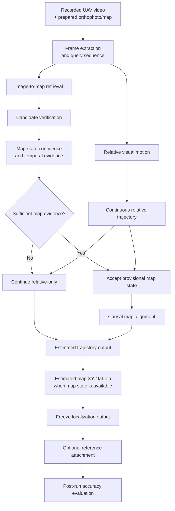
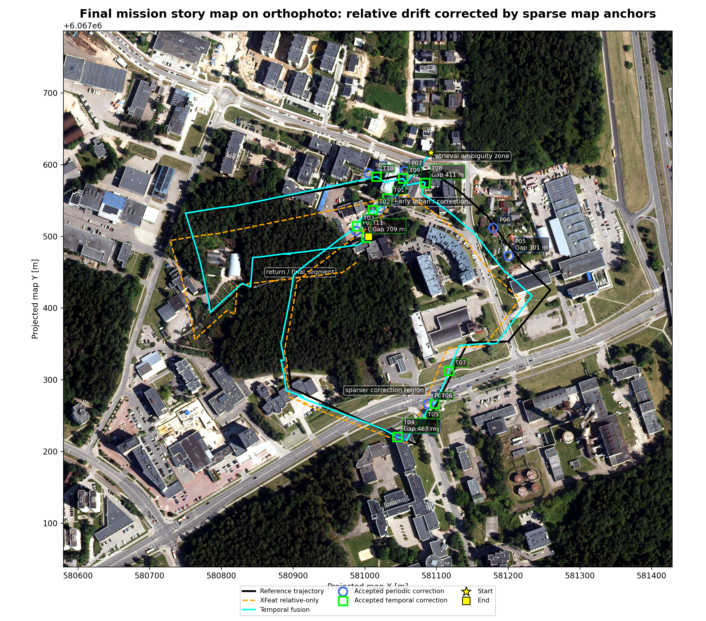
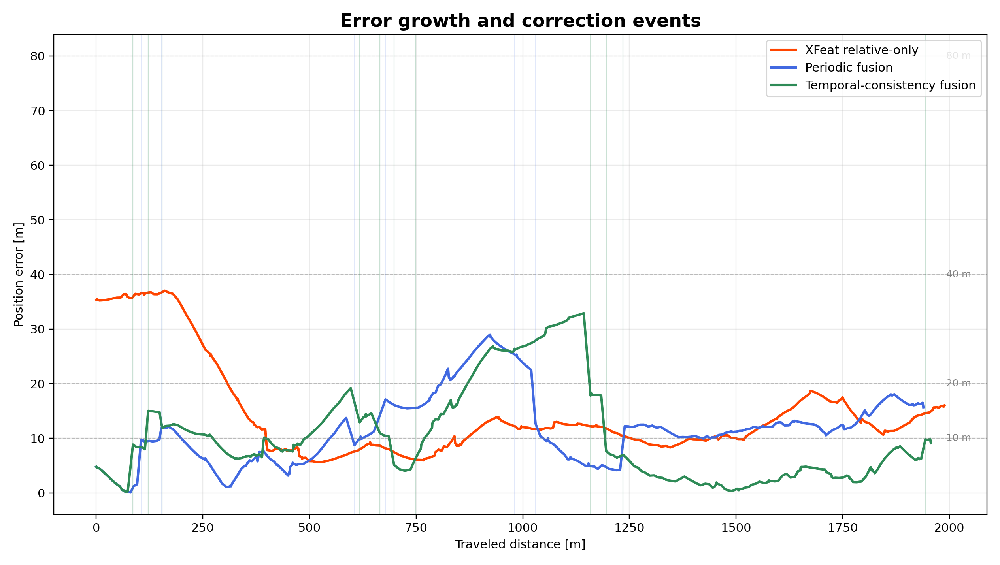
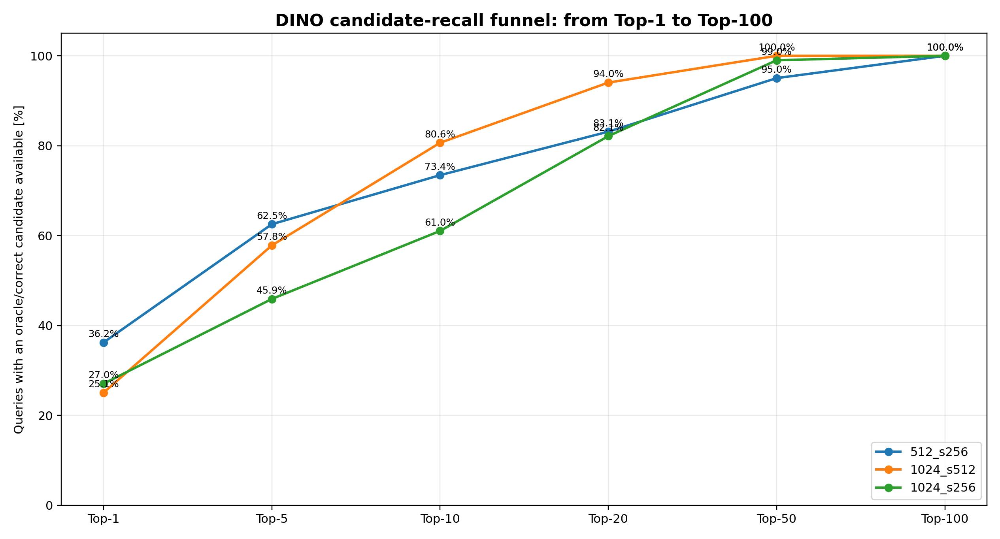
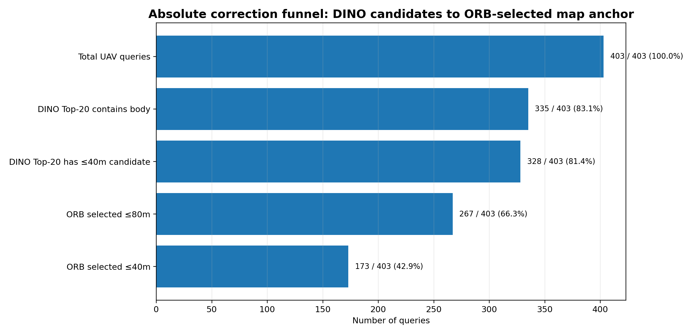

# GNSS-Denied UAV Visual Localization

A recorded-flight UAV localization project for **GNSS-denied or weak-GNSS outdoor environments** using onboard camera imagery and prepared georeferenced orthophoto/map data.

The project combines two complementary sources of position information:

- **relative visual localization** to continuously estimate movement from consecutive UAV frames;
- **absolute image-to-map localization** to obtain occasional geographic evidence from a prepared orthophoto.

The repository contains the complete development path from method review and dataset preparation to relative localization, map retrieval, candidate verification, trajectory correction, quantitative evaluation, and a reference-free **Blind Demo Run**.

> **Current project state**
>
> - The evaluated Villoc pipeline is complete and quantitatively documented on `main`.
> - A complete recorded-flight Blind Demo Run has been orchestrated without GPS/SRT/reference input during localization.
> - Current absolute-localization research continues on `research/minimum-confident-bootstrap`.
> - The Blind Demo can establish a **provisional** map state, but robust absolute initialization and candidate selection remain ongoing research problems.

---

## 1. Initial task alignment

The original internship objective was to develop and demonstrate UAV localization for GNSS-denied or weak-GNSS outdoor operation, with relative localization as the primary target and map-based absolute localization as the stronger/stretch direction.

### Minimum success criteria

| Initial task item | Status | How it was addressed |
|---|---|---|
| Literature / method review | **Achieved** | Reviewed relative localization, map-based localization, feature matching, visual place recognition, sensor-fusion directions, robustness methods, and classical/learned alternatives before selecting implementation baselines. |
| Working dataset loader | **Achieved** | Built video/frame extraction, SRT/telemetry parsing, timestamp alignment, local-coordinate conversion, map preparation, tile indexing, and canonical query-manifest workflows across multiple datasets. |
| Relative localization algorithm | **Achieved** | ORB, KLT optical flow, and XFeat were evaluated. XFeat was retained for the final Villoc and Blind Demo relative-motion path. |
| Trajectory plotted on map | **Achieved** | Estimated and reference trajectories were visualized in local XY coordinates, over the georeferenced orthophoto, and through interactive Folium maps. |
| Accuracy evaluation against a test dataset | **Achieved** | Estimated trajectories were evaluated against isolated reference data using RMSE, mean/median error, p95, maximum/final error, drift, threshold sensitivity, and failure diagnostics. |
| Documented limitations | **Achieved** | Relative drift, retrieval ambiguity, sparse corrections, map mismatch, coarse tile localization, runtime, confidence limitations, and generalization requirements are documented throughout the closeout READMEs. |

### Stronger target

| Target | Status | Result |
|---|---|---|
| Relative localization over a representative flight segment | **Demonstrated experimentally** | Continuous full-sequence relative trajectories were generated and drift was measured over recorded flights. |
| Map-aligned trajectory | **Achieved** | Relative trajectories were aligned/corrected using accepted visual map evidence and expressed in georeferenced coordinates. |
| 2D visualization over orthophoto/map | **Achieved** | Static orthophoto figures and interactive geographic maps were produced. |
| Error statistics | **Achieved** | RMSE, mean, median, p95, maximum, final error, drift per distance/time, and threshold-based diagnostics were evaluated. |
| Robustness analysis | **Demonstrated experimentally** | Camera angle, altitude/context, image quality, vegetation, repetitive structures, map appearance mismatch, candidate ambiguity, and related failure modes were studied across SATLOC and Villoc experiments. |

### Stretch criteria

| Stretch item | Status | Current result |
|---|---|---|
| Absolute GPS/map-coordinate estimation from image-to-map matching | **Demonstrated experimentally; Under research** | DINOv2 retrieval and geometric verification produce map-position estimates. The Blind Demo exports estimated map XY and latitude/longitude after a provisional map state is accepted. |
| Automatic relocalization / drift correction | **Demonstrated experimentally** | The evaluated Villoc pipeline applies sparse confidence/temporal-gated map corrections to reduce relative drift. The Blind Demo performs causal map-state bootstrap and alignment without reference input. |
| Season-/appearance-robust or learned retrieval | **Partially explored** | DINOv2, DINOv2-VLAD, domain-normalized retrieval variants, and learned/local verification experiments were evaluated. A dedicated season-trained localization model was not completed. |
| 3D Cesium visualization | **Not pursued as the final project component** | The final demonstrator prioritizes 2D orthophoto and interactive map visualization. |
| Near-real-time processing | **Not achieved on the tested CPU configuration** | Runtime was measured explicitly. The Blind Demo remained below the 1 Hz target and requires further optimization for onboard/near-real-time deployment. |

---

## 2. System architecture


```mermaid
flowchart TD
    A["Recorded UAV video<br/>+ prepared orthophoto/map"] --> B["Frame extraction<br/>and query sequence"]

    B --> C["Relative visual motion"]
    C --> D["Continuous relative trajectory"]

    B --> E["Image-to-map retrieval"]
    E --> F["Candidate verification"]
    F --> G["Map-state confidence<br/>and temporal evidence"]

    G --> H{"Sufficient map evidence?"}

    H -- "No" --> I["Continue relative-only"]
    H -- "Yes" --> J["Accept provisional map state"]

    D --> I
    D --> J

    I --> K["Estimated trajectory output"]
    J --> L["Causal map alignment"]
    L --> K

    K --> M["Estimated map XY / lat-lon<br/>when map state is available"]
    M --> N["Freeze localization output"]

    N --> O["Optional reference attachment"]
    O --> P["Post-run accuracy evaluation"]
```

The architecture separates **continuous local motion** from **intermittent map evidence**.

Image-to-map localization is not treated as frame-by-frame GPS. A map observation is useful only when the candidate evidence is strong enough and consistent with the recent relative-motion history. If no trustworthy map state is available, the pipeline can continue with a relative-only result rather than forcing an absolute position.

Reference coordinates are attached only for evaluation after an estimated trajectory has been produced.

---

## 3. Development progression

The repository evolved through several datasets and experiment blocks, each with a different role.

| Stage / dataset | Main purpose | Main outcome |
|---|---|---|
| **Zurich MAV** | Early data pipeline, synchronization, local geometry, and relative-motion experiments | Established loading, coordinate handling, trajectory visualization, and early feature-tracking baselines. |
| **SATLOC `traj01`** | Algorithm-development benchmark | Used to study full-map retrieval, candidate generation, classical/learned descriptors, verification, confidence, temporal coverage, and relative–absolute correction logic. |
| **Villoc 90° / 45°** | Local orthophoto benchmark and viewpoint diagnostics | Built the full raw-video → orthophoto → tile → retrieval benchmark and studied nadir/oblique retrieval behavior. |
| **Villoc `traj01_90deg_stable120m`** | Quantitative end-to-end evaluation | Combined XFeat relative motion, DINOv2 retrieval, ORB verification, confidence/temporal gating, fusion, metrics, and orthophoto visualization. |
| **Blind Demo Run** | Reference-free recorded-flight orchestration | Demonstrated the complete video-only execution path, output freeze, safe no-lock behavior, provisional map initialization, estimated geographic export, runtime/resource reporting, and interactive map output. |
| **Current research** | Improve absolute-map initialization | Ongoing work on candidate ambiguity, bootstrap confidence, multi-hypothesis reasoning, and sub-tile/map-observation representation. |

The earlier experiments are retained because they explain **why the current baseline was selected**. The Blind Demo is the orchestration built from those promoted components; ongoing research now continues on top of that working orchestration.

---

## 4. Blind Demo Run

The latest Blind Demo material is kept on the ongoing research branch rather than merged into `main`:

**Branch:** [`research/minimum-confident-bootstrap`](https://github.com/Harishprabhu30/drone-localisation/tree/research/minimum-confident-bootstrap)

**Blind Demo folder:** [`docs/demo/blind_recorded_flight_final_001/`](https://github.com/Harishprabhu30/drone-localisation/tree/research/minimum-confident-bootstrap/docs/demo/blind_recorded_flight_final_001)

**Detailed Blind Demo README:** [`docs/demo/blind_recorded_flight_final_001/README.md`](https://github.com/Harishprabhu30/drone-localisation/blob/research/minimum-confident-bootstrap/docs/demo/blind_recorded_flight_final_001/README.md)

### What the Blind Demo demonstrates

The run uses a recorded RGB flight and a prepared map database while keeping GPS/SRT/reference coordinates unavailable to localization.

| Item | Blind Demo result |
|---|---:|
| Orchestration | **17 / 17 stages passed** |
| Reference / GT used during localization | **No** |
| Query frames | 123 |
| Relative frontend | XFeat |
| Absolute candidate generator | DINOv2 |
| Candidate verification | ORB Top-20 |
| Map state | `PROVISIONAL_ABSOLUTE_LOCK` |
| Map-state maturity | query 30 |
| Relative-only frames | 29 |
| Map-aligned frames | 94 |
| Estimated lat/lon poses | 94 |
| Accepted causal map-state events | 1 |
| Frozen output | estimated trajectory + SHA256 freeze record |

I am not claiming **accuracy from the blind run itself**.

The run demonstrates that the complete pipeline can:

1. process a recorded flight without GPS/SRT/reference input;
2. construct a continuous visual relative trajectory;
3. search a prepared orthophoto for believable regions;
4. geometrically verify retrieved candidates;
5. wait for sufficient evidence instead of accepting the first believable match;
6. establish a provisional map state when the evidence becomes sufficient;
7. causally map-align later poses;
8. export estimated map XY and latitude/longitude;
9. generate figures and an interactive map;
10. freeze the result independently of later evaluation.

The same orchestration is also designed to remain **relative-only** when no trusted/provisional map state can be established.

### Blind estimated trajectory


**Interpretation:** The first part of the flight is not shown on the orthophoto because, at that stage, the system only knows how the drone moved relative to its starting frame; it does not yet have a trusted map coordinate telling it where that relative trajectory belongs geographically.

The yellow marker indicates the first provisional map position accepted by the localization pipeline. DINOv2 first searches the orthophoto for visually similar regions, ORB checks the local geometric evidence, and the bootstrap logic also checks whether the proposed map movement is consistent with the recent relative-motion direction. Only after enough supporting evidence is accumulated is this position accepted as a provisional absolute map state.

Once this map position is available, the subsequent relative trajectory can be transformed into map coordinates and plotted over the orthophoto, which is why the visible map-aligned trajectory begins from this point.

However, the run is blind: GPS, SRT coordinates, and reference ground truth were not available when this decision was made. Therefore, although the selected location was considered believable from the available visual and motion evidence, we still do not know from the blind run alone whether it is the true geographic area where the drone was flying. This is why the state is reported as a PROVISIONAL_ABSOLUTE_LOCK rather than a confirmed absolute position.

The Blind Demo folder also contains the interactive map, generated run summary, and supporting outputs committed for inspection.

---

## 5. Evaluated Villoc result

The main quantitative demonstrator is Villoc:

```text
traj01_90deg_stable120m
```

This dataset contains a stable near-nadir DJI RGB sequence and an official orthophoto of the flight area. Reference coordinates are kept outside the localization decisions and used afterwards to measure performance.

### Final evaluated setup

| Item | Villoc setup |
|---|---|
| Query frames | 403 frames extracted at 1 fps |
| Flight path | approximately 1.96 km |
| Camera view | near-nadir, approximately 120 m relative altitude |
| Relative frontend | XFeat |
| Absolute candidate generation | DINOv2 Top-K orthophoto retrieval |
| Local verification | ORB + RANSAC inside DINO Top-20 |
| Learned verifier | LightGlue evaluated diagnostically |
| Final evaluated correction policy | temporal-consistency-gated sparse soft correction |
| Map visualization | ORT10LT orthophoto + interactive Folium maps |

### Main evaluated result

| Method | RMSE | p95 | Final error | Drift |
|---|---:|---:|---:|---:|
| XFeat relative-only | 35.76 m | 46.24 m | 39.57 m | 2.32 m/100 m |
| Best RMSE fusion | **13.84 m** | **25.24 m** | 15.69 m | 0.92 m/100 m |
| Recommended temporal-consistency fusion | 14.02 m | 30.16 m | **9.09 m** | **0.53 m/100 m** |

These values are **dataset-specific experimental results**, not universal performance guarantees.

The selected temporal policy accepted 11 sparse correction events. Post-estimation evaluation classified 10 of those events within the selected `<=40 m` evaluation threshold and one outside it, with no accepted correction beyond 100 m error in that run.

### 5.1 Mission story on the orthophoto



**Interpretation:** the relative trajectory provides continuous movement but gradually departs from the reference route. Sparse accepted map observations pull the estimate back toward the mapped route without replacing the continuous relative-motion chain.

### 5.2 Error evolution with correction events



**Interpretation:** relative-only error grows as small frame-to-frame errors accumulate. Accepted map corrections periodically reduce that accumulated error, which is why absolute localization is used as an intermittent correction source rather than trusted at every frame.

### 5.3 DINOv2 candidate retrieval



**Interpretation:** geographically useful candidates appear more often when several retrieved map candidates are retained than when only DINOv2 Top-1 is used. DINOv2 is therefore treated as a **candidate generator**, not as the final position estimate.

### 5.4 ORB verification / reranking



**Interpretation:** local geometric verification improves candidate selection in many frames, but visually and geometrically believable false candidates still occur. Candidate selection therefore remains one of the main limitations of absolute localization.

More curated figures, tables, maps, and interpretation notes are available in:

- [`docs/assets/villoc_traj01_final/README.md`](docs/assets/villoc_traj01_final/README.md)
- [`docs/README_villoc_traj01_s8_full_pipeline_fusion_closeout.md`](docs/README_villoc_traj01_s8_full_pipeline_fusion_closeout.md)

---

## 6. How the localization pipeline works

### Relative visual motion

Consecutive UAV images are matched to estimate frame-to-frame movement. Those increments are accumulated into a trajectory from the known start point.

Relative localization is continuous and does not require a map, but small translation/orientation/scale errors accumulate over distance.

Methods evaluated include ORB, KLT optical flow, and XFeat. XFeat was retained for the final Villoc and Blind Demo path.

### Map search

Each UAV query image is compared with a prepared georeferenced orthophoto tile database using DINOv2 descriptors.

DINOv2 returns several visually plausible map regions. Similar roads, roofs, fields, vegetation, and repeated structures can occur at different geographic locations, so Top-1 retrieval is not treated as a final location.

### Candidate verification and map-state decision

ORB + RANSAC checks local geometric evidence inside the DINO Top-20 candidate set.

Confidence and temporal evidence are then used to decide whether the absolute observation is strong enough to influence the trajectory. The Blind Demo additionally waits for sufficient accumulated evidence before accepting a provisional global map state.

### Trajectory output

The relative trajectory continues at all times.

If no suitable map state is available, the output remains relative-only.

If a map state is accepted, the transform is applied causally to later poses and the trajectory can be expressed in map coordinates and converted to estimated latitude/longitude.

---

## 7. Additional work beyond the initial scope

The project expanded beyond the minimum relative-trajectory prototype in several areas:

- full-map classical and learned visual candidate retrieval;
- ORB, LightGlue, structural, and learned-verifier comparisons;
- DINOv2 global and DINOv2-VLAD candidate-generation studies;
- confidence calibration and threshold-sensitivity analysis;
- temporal-consistency checks for map observations;
- relative–absolute trajectory fusion and sparse drift correction;
- drift-over-distance and drift-over-time diagnostics;
- accepted-correction safety analysis;
- 45° versus 90° viewpoint/retrieval diagnostics;
- map-resolution and candidate-pool studies;
- runtime, memory/resource, and offline-versus-per-flight cost reporting;
- estimated map XY and latitude/longitude export;
- reference-free plots and interactive maps;
- one-command Blind Demo orchestration;
- frozen-output / post-freeze evaluation separation;
- post-freeze diagnostics for candidate ambiguity, bootstrap behavior, and map-tile observability.

---

## 8. Ongoing research

The complete Blind Demo orchestration is operational, but the accepted map state remains purposfully **conditional**. Research therefore continues on stronger absolute initialization rather than treating the current lock logic as finished.

Current work is kept on:

[`research/minimum-confident-bootstrap`](https://github.com/Harishprabhu30/drone-localisation/tree/research/minimum-confident-bootstrap)

### Research question 1 — Candidate ambiguity

> **How can several plausible map candidates be retained and evaluated over time instead of committing too early to one candidate?**

Post-freeze diagnostics showed cases where a geographically useful candidate was already present inside the retrieved candidate pool, while reranking/selection preferred another locally believable candidate.

The current direction is to investigate combinations of:

```text
visual retrieval evidence
+ geometric verification
+ relative-motion consistency
+ multiple candidate hypotheses
+ longer temporal history
```

before committing to a global map state.

### Research question 2 — Beyond tile-center observations

> **How can map observations be represented below the tile-center level so that repeated observations of the same tile still provide useful geometric information?**

Current diagnostics show that several correct consecutive observations can map to the same tile center, reducing the motion information available to bootstrap geometry. At the same time, incorrect neighboring tile selections can create artificial spatial diversity.

This motivates research into stronger sub-tile localization, candidate-region geometry, and multi-frame map evidence.

---

## 9. Start here

| If you want to inspect… | Start here |
|---|---|
| Main evaluated Villoc result | [`docs/assets/villoc_traj01_final/README.md`](docs/assets/villoc_traj01_final/README.md) |
| Full Villoc execution chain and commands | [`docs/README_villoc_traj01_s8_full_pipeline_fusion_closeout.md`](docs/README_villoc_traj01_s8_full_pipeline_fusion_closeout.md) |
| Current Blind Demo Run | [`research/minimum-confident-bootstrap → docs/demo/blind_recorded_flight_final_001/`](https://github.com/Harishprabhu30/drone-localisation/tree/research/minimum-confident-bootstrap/docs/demo/blind_recorded_flight_final_001) |
| Ongoing bootstrap research | [`research/minimum-confident-bootstrap`](https://github.com/Harishprabhu30/drone-localisation/tree/research/minimum-confident-bootstrap) |
| Detailed experiment history | [`docs/`](docs/) |
| Source code | [`src/`](src/) and [`scripts/`](scripts/) |
| Configuration files | [`configs/`](configs/) |

---

## 10. Repository structure

The `main` branch contains the established experimental pipeline and evaluated Villoc documentation:

```text
.
├── configs/                  Dataset and experiment YAML configurations
├── src/uavloc/               Reusable loading, geometry and localization modules
├── scripts/
│   ├── satloc/               Algorithm-development experiments
│   └── villoc/               Villoc data/retrieval/relative/fusion workflows
├── docs/                     Stage closeouts and experiment documentation
├── docs/assets/
│   └── villoc_traj01_final/  Curated figures, tables, maps and interpretation notes
├── data/                     Local raw/processed data — not fully versioned
├── outputs/                  Generated experiment outputs — not fully versioned
└── third_party/              Local external model/frontend dependencies
```

After checking out:

```text
research/minimum-confident-bootstrap
```

the repository also includes the current Blind Demo orchestration/configuration, committed Blind Demo result under `docs/demo/`, and ongoing absolute-bootstrap/post-freeze diagnostic work. These research-branch files are intentionally kept separate from `main` while the research continues.

---

## 11. Setup and reproduction

### Important reproduction note

A fresh Git clone contains the source code, committed documentation, selected figures/tables/maps, and configuration files.

It does **not** contain all assets required to reproduce the full localization experiments.

Raw flight media, large processed data, map-tile databases, descriptor caches, model files, and several generated outputs are intentionally not fully versioned.

To reproduce the evaluated Villoc pipeline or the Blind Demo, the corresponding local data and caches must be available.

### 11.1 Base environment

The project was developed with Python 3.10.13.

```bash
git clone https://github.com/Harishprabhu30/drone-localisation.git
cd drone-localisation

python -m venv .drone_venv
source .drone_venv/bin/activate

python -m pip install --upgrade pip
pip install -r requirements.txt

export PYTHONPATH="$PWD/src"
```

The tested learned components also used PyTorch/torchvision versions recorded by the project environment.

### 11.2 External/local assets required for a full run

At minimum, the corresponding run requires:

#### Raw UAV data

For evaluated Villoc `traj01`:

```text
data/raw/villoc/traj01_90deg_stable120m/
├── villoc_traj01_90deg_stable120m_V_merged.MP4
└── villoc_traj01_90deg_stable120m_V_merged.SRT
```

The Blind Demo uses its own recorded video. SRT/GPS/reference is **not** required for the localization run.

#### Prepared orthophoto / map data

The demonstrated Villoc workflows reuse a prepared ORT10LT orthophoto AOI and its tile database.

The corresponding local assets include:

```text
data/processed/villoc/90_deg/maps/ort10lt_2024_2026/
```

This local map area contains the prepared orthophoto crop and orthophoto tile images used by retrieval.

The promoted Blind Demo tile variant is:

```text
512_s256
```

#### Map tile index

```text
outputs/villoc/90_deg/metadata/
s8_9_satellite_tile_index_512_s256.csv
```

Other evaluated tile variants may require their corresponding tile-index files.

#### DINOv2 map descriptor cache

The demonstrated pipeline reuses precomputed descriptors for the prepared map:

```text
outputs/villoc/90_deg/descriptors/
s8_11b_dinov2_map_512_s256_
dinov2_vits14_img518_center_square_avgpatch_cpu.npz
```

Map descriptor construction is an offline/one-time cost for a fixed:

```text
AOI + tile variant + descriptor protocol
```

A new flight in the same mapped area can reuse the map descriptor cache.

#### DINOv2 model cache

DINOv2 is loaded through PyTorch Hub.

The first model load requires either:

- internet access so PyTorch Hub can populate the local model cache, or
- an already populated compatible local Torch Hub/model cache.

An offline machine therefore needs the required DINOv2 model files already cached.

#### XFeat dependency / model files

The final relative frontend uses the official VERLab XFeat implementation from:

```text
third_party/accelerated_features/
```

The tested checkout used commit:

```text
e92685f57f8318b18725c5c8c0bd28c7fe188d9a
```

Example setup:

```bash
mkdir -p third_party

git clone https://github.com/verlab/accelerated_features.git \
  third_party/accelerated_features

git -C third_party/accelerated_features checkout \
  e92685f57f8318b18725c5c8c0bd28c7fe188d9a
```

Any model/weight files required by that checkout must also be locally available.

#### ORB / OpenCV

ORB verification uses OpenCV and does not require a separate learned model cache.

### 11.3 Evaluated Villoc workflow

Main configuration:

```text
configs/dataset_villoc_traj01_90deg_stable120m.yaml
```

The full command order, cache-reuse decisions, expected inputs/outputs, and troubleshooting notes are documented in:

[`docs/README_villoc_traj01_s8_full_pipeline_fusion_closeout.md`](docs/README_villoc_traj01_s8_full_pipeline_fusion_closeout.md)

### 11.4 Blind Demo workflow

The Blind Demo implementation and current research live on:

```text
research/minimum-confident-bootstrap
```

Checkout:

```bash
git checkout research/minimum-confident-bootstrap
```

Primary Blind Demo configuration:

```text
configs/demo_villoc_blind_recorded.yaml
```

One-command orchestration:

```bash
python scripts/demo/run_recorded_flight_demo.py \
  --config configs/demo_villoc_blind_recorded.yaml \
  --run-id <NEW_UNIQUE_RUN_ID>
```

A fresh run ID should be used for a complete new execution.

The environment preflight checks the required video, map assets, tile index, caches, dependencies, and writable output path before the full run proceeds.

Detailed Blind Demo instructions and the committed example result are available at:

[`docs/demo/blind_recorded_flight_final_001/README.md`](https://github.com/Harishprabhu30/drone-localisation/blob/research/minimum-confident-bootstrap/docs/demo/blind_recorded_flight_final_001/README.md)

### Reproduction boundary

Because the raw recorded flights, orthophoto products, generated tile database, and large model/descriptor caches are not fully committed, the repository should be interpreted as:

```text
source code + configurations + documentation + selected evidence
```

rather than a self-contained downloadable dataset bundle.

---

## 12. Limitations

The current prototype has several important limitations:

- Absolute map localization remains scene-dependent.
- Repetitive roads, fields, roofs, vegetation, and similar structures can produce geographically wrong but visually plausible candidates.
- A correct candidate may be present inside Top-K while the verifier/reranker still selects another candidate.
- Accepted absolute observations can be sparse over difficult route segments.
- The Blind Demo map state is intentionally **conditional**, not a claim of guaranteed absolute accuracy.
- Tile-level observations provide limited sub-tile position information.
- Confidence and temporal thresholds were developed on the available datasets and are not universal constants.
- Broader validation is needed across additional flights, seasons, illumination, altitudes, viewpoints, cameras, and map ages.
- The current CPU implementation does not meet the targeted 1 Hz near-real-time processing rate.
- The project is an offline/recorded-flight localization prototype, not real-time.

---

## Current conclusion

I believe that this project satisfies internship objective with a working relative-localization pipeline, quantitative evaluation, map visualization, and documented limitations.

And I have also progressed substantially into the stretch direction by combining visual map retrieval, candidate verification, sparse drift correction, estimated geographic-coordinate export, and a complete reference-free Blind Demo Run.

The next research focus is not to rebuild the orchestration. It is to make the **absolute-map evidence more reliable before a global map state is accepted**.