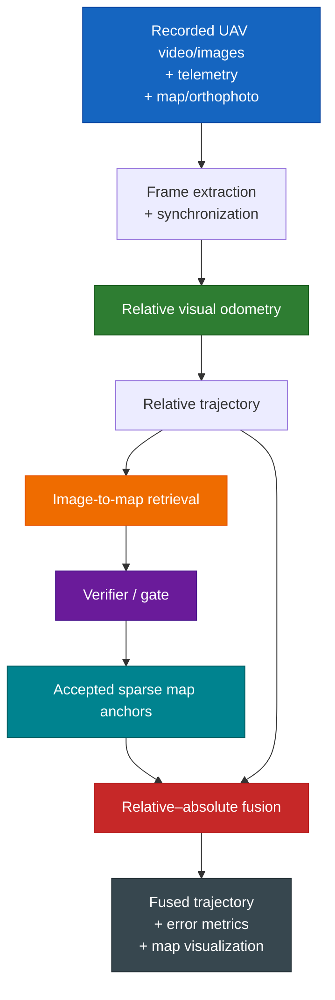
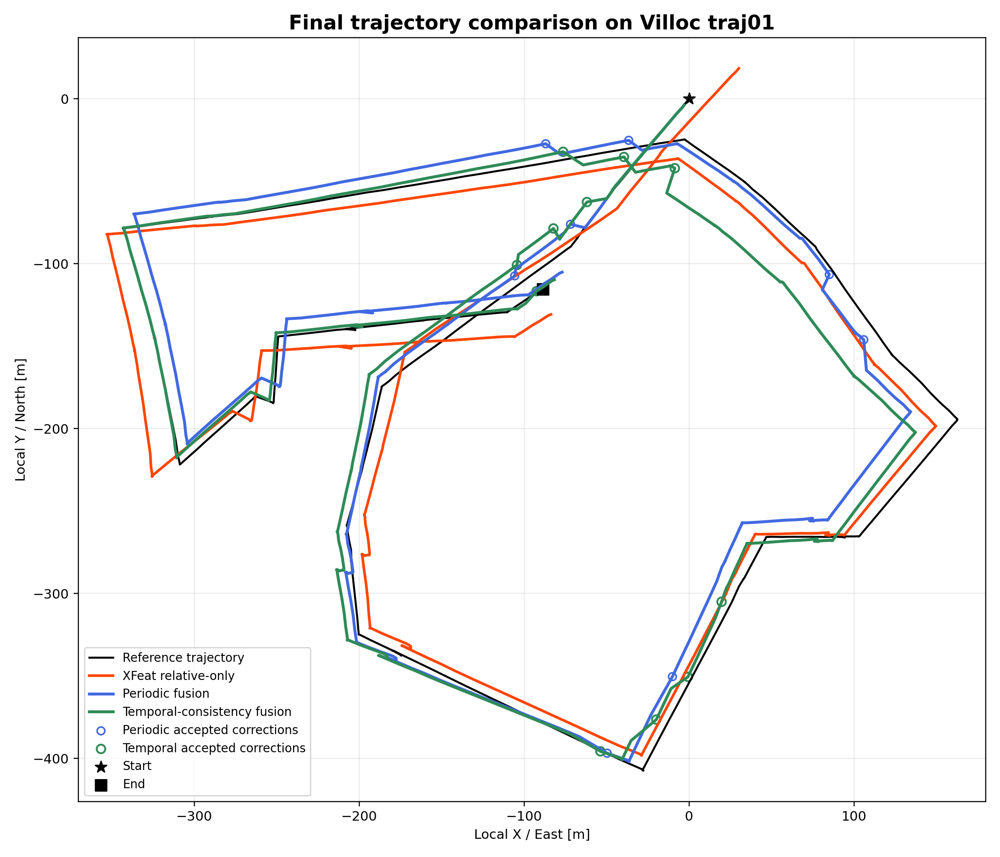
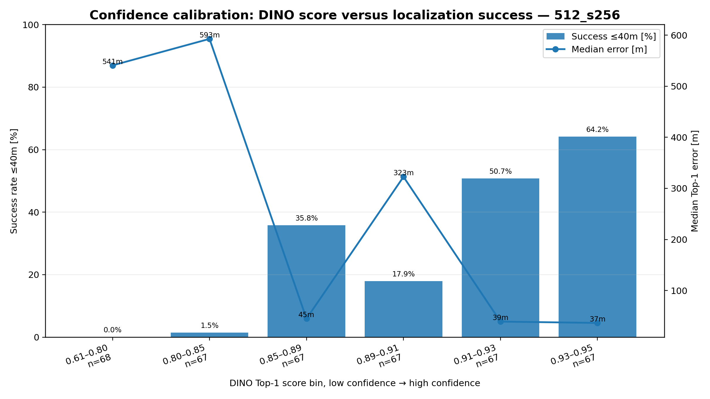

# GNSS-Denied UAV Visual Localization

A project for **UAV localization in GNSS-denied or weak-GNSS outdoor environments** using onboard camera imagery, recorded telemetry, and georeferenced map/orthophoto data.

The repository demonstrates the complete chain from recorded UAV data to a fused map-aligned trajectory. The final Villoc demonstrator combines:

* **continuous relative visual odometry** for local motion,
* **DINOv2 image-to-map retrieval** for global candidate generation,
* **ORB geometric verification/reranking** for absolute-map evidence,
* **confidence and temporal-consistency gating** for safe sparse corrections, and
* **relative–absolute fusion** for drift reduction.

> **Project status:** final recorded-data prototype demonstrated on Villoc `traj01_90deg_stable120m`.

---

## 1. System architecture


```mermaid
flowchart TD
    A[Recorded UAV video/images<br/>+ telemetry<br/>+ map/orthophoto]
    B[Frame extraction<br/>+ synchronization]
    C[Relative visual odometry]
    D[Relative trajectory]
    E[Image-to-map retrieval]
    F[Verifier / gate]
    G[Accepted sparse map anchors]
    H[Relative–absolute fusion]
    I[Fused trajectory<br/>+ error metrics<br/>+ map visualization]

    A --> B
    B --> C
    C --> D
    D --> E
    E --> F
    F --> G
    G --> H
    D --> H
    H --> I

    style A fill:#1565c0,color:white,stroke:#0d47a1
    style C fill:#2e7d32,color:white,stroke:#1b5e20
    style E fill:#ef6c00,color:white,stroke:#e65100
    style F fill:#6a1b9a,color:white,stroke:#4a148c
    style G fill:#00838f,color:white,stroke:#006064
    style H fill:#c62828,color:white,stroke:#b71c1c
    style I fill:#37474f,color:white,stroke:#263238
```

The design intentionally separates **continuous relative motion** from **intermittent absolute map correction**. Image-to-map localization is not treated as frame-by-frame GPS; a map estimate is used only when the visual evidence is strong enough and is consistent with recent relative motion.

---

## 2. Final demonstrator: Villoc `traj01`

The final local recorded-data uses a stable near-nadir DJI RGB sequence and an official orthophoto of the flight area.

| Item                         | Final Villoc setup                                                 |
| ---------------------------- | ------------------------------------------------------------------ |
| Dataset                      | `traj01_90deg_stable120m`                                          |
| Query frames                 | 403 frames extracted at 1 fps                                      |
| Flight path                  | approximately 1.96 km                                              |
| Camera view                  | near-nadir, approximately 120 m relative altitude                  |
| Relative frontend            | XFeat                                                              |
| Absolute candidate generator | DINOv2 Top-K retrieval                                             |
| Local verifier               | ORB + RANSAC inside DINO Top-20                                    |
| Learned verifier             | LightGlue evaluated as a diagnostic, not promoted for final fusion |
| Final correction policy      | confidence + temporal-consistency-gated sparse soft corrections    |
| Map visualization            | ORT10LT orthophoto + Folium HTML views                             |

### What the final run showed

* Relative visual odometry provides continuous motion but accumulates drift over distance.
* DINOv2 is useful as a **candidate generator**, but its Top-1 tile is not reliable enough to use directly as position.
* On the primary `512_s256` absolute branch, ORB reranking improved the strict `<=40 m` selected result from **114/403 DINO Top-1 cases to 173/403 ORB-reranked cases**.
* The final temporal policy accepted **11 sparse correction events**; evaluation afterwards classified 10 as `<=40 m`, 1 as false, and none as a dangerous `>100 m` false correction.
* The selected temporal-consistency fusion ended with a **9.09 m final position error** on this trajectory.

These values are dataset-specific experimental results.

---

## 3. Final result figures

### Mission story on the orthophoto

This is the main project figure: reference path for evaluation, relative-only drift, the temporally fused trajectory, retrieval outcomes, and accepted correction events on the real orthophoto.


### Final trajectory comparison



### Error evolution and correction events


### Absolute retrieval and verification

DINOv2 is used to create a candidate pool; ORB then checks local geometric evidence inside that pool.


### Confidence diagnostics



More report-ready figures and CSV tables are indexed in:

* [`docs/assets/villoc_traj01_final/README.md`](docs/assets/villoc_traj01_final/README.md)

---

## 4. Interactive maps

The preview links below:

| Interactive view                  | File path                                                                                         |
| --------------------------------- | ------------------------------------------------------------------------------------------------ |
| Final mission story on orthophoto | [HTML](docs/assets/villoc_traj01_final/maps/map_final_mission_story_orthophoto_interactive.html) |
| Final trajectory overlay          | [HTML](docs/assets/villoc_traj01_final/maps/map_final_trajectory_overlay.html)                   |
| Spatial retrieval failures        | [HTML](docs/assets/villoc_traj01_final/maps/map_spatial_retrieval_failure_512_s256.html)         |
| Accepted correction evidence      | [HTML](docs/assets/villoc_traj01_final/maps/map_correction_evidence_interactive.html)            |

---

## 5. Quick setup

The project was developed with Python 3.10.13.

```bash
git clone https://github.com/Harishprabhu30/drone-localisation.git
cd drone-localisation

# Optional if pyenv is used
pyenv local 3.10.13

python -m venv .drone_venv
source .drone_venv/bin/activate

python -m pip install --upgrade pip
pip install -r requirements.txt

# ML packages used by the final learned frontends/retrieval experiments
pip install torch==2.2.2 torchvision==0.17.2 pillow

export PYTHONPATH="$PWD/src"
```

`requirements.txt` captures the base repository dependencies. Some historical map-rebuild and optional learned-verifier branches use extra packages that are checked by their individual scripts;

### XFeat dependency

The final relative frontend loads the official VERLab XFeat checkout from `third_party/accelerated_features`. The tested project version used commit:

```text
e92685f57f8318b18725c5c8c0bd28c7fe188d9a
```

Set it up with:

```bash
mkdir -p third_party

git clone https://github.com/verlab/accelerated_features.git \
  third_party/accelerated_features

git -C third_party/accelerated_features checkout \
  e92685f57f8318b18725c5c8c0bd28c7fe188d9a
```

### DINOv2 model

DINOv2 is loaded through PyTorch Hub. The first run may need internet access to populate the local Torch Hub/model cache; later runs can reuse the cached model.

### LightGlue

LightGlue/SuperPoint was evaluated as a separate learned-verifier diagnostic. It is **not required for the promoted final Villoc fusion path**, which uses ORB verification. If reproducing the LightGlue experiments, install the upstream LightGlue package in the active environment.

---

## 6. Data required to rerun the final Villoc experiment

Large/raw data are intentionally not versioned in this repository. A fresh clone can inspect the committed code, documentation, figures, tables, and HTML demonstrations, but the full experiment requires the local UAV and map data.

Expected Villoc raw inputs:

```text
data/raw/villoc/traj01_90deg_stable120m/
├── villoc_traj01_90deg_stable120m_V_merged.MP4
└── villoc_traj01_90deg_stable120m_V_merged.SRT
```

The final run also used the Villoc 90° orthophoto/tile assets and generated descriptor caches. The main dataset config is:

```text
configs/dataset_villoc_traj01_90deg_stable120m.yaml
```

Output root:

```text
outputs/villoc/traj01_90deg_stable120m/
```

Important: `data/raw/`, `data/processed/`, `outputs/`, `third_party/`, large model files, and large media files are ignored by Git and also, they are confidential. 

---

## 7. Pipeline execution order

The final Villoc workflow is organized into deterministic stages:

```text
S8.1–S8.5   Parse SRT, extract frames, build reference trajectory,
            audit image quality, create canonical UAV index

S8.6        Check orthophoto AOI reuse

S8.10B      Audit query-to-tile geometric coverage / oracle availability

S8.11B/C    Build or reuse DINOv2 query/map descriptor caches

S8.11D      Run independent DINOv2 Top-K image-to-map retrieval

S8.12D      Build retrieval diagnostics and failure buckets

S8.12E.1    ORB + RANSAC verification/reranking inside DINO Top-20

S8.12E.1B   LightGlue Top-20 diagnostic comparison

S8.R1–R3    ORB and KLT relative baselines

S8.R4       XFeat relative visual odometry

S8.F1       Build absolute correction manifest and online confidence policies

S8.F2       Controlled relative–absolute fusion replay

S8.F3       Temporal-consistency gating

S8.F3B      Temporal-gated fusion replay

```

The complete commands, inputs, output paths, branch decisions, and troubleshooting notes are documented in:

* **[Villoc traj01 full pipeline and fusion closeout](docs/README_villoc_traj01_s8_full_pipeline_fusion_closeout.md)**

---

## 8. How the localization pipeline works

### 8.1 Data preparation

Recorded DJI video and SRT telemetry are parsed and synchronized. Frames are extracted at a controlled rate, projected/reference coordinates are prepared for later evaluation, and image-quality diagnostics are generated.

### 8.2 Relative localization

Relative localization estimates motion between consecutive UAV frames and accumulates the motion into a trajectory from the known start point.

Methods evaluated in the repository include:

* ORB + RANSAC,
* KLT optical flow,
* XFeat learned local features.

XFeat was promoted for the final Villoc relative branch. Relative localization is continuous and map-independent, but small motion errors accumulate into drift.

### 8.3 Absolute image-to-map retrieval

Each UAV query image is compared against georeferenced orthophoto tiles using DINOv2 descriptors. DINOv2 returns a ranked Top-K candidate list.

This stage is treated as **candidate generation**, not as a final GPS estimate. Repetitive roads, roofs, fields, vegetation, and similar urban structures can produce visually plausible but geographically wrong Top-1 candidates.

### 8.4 Geometric verification

ORB features and RANSAC are applied inside the DINO Top-20 candidate pool. This adds local geometric evidence and reranks the global retrieval candidates.

LightGlue/SuperPoint was also evaluated, but the full Villoc run did not outperform the simpler ORB verifier on the promoted strict criterion, so ORB was retained for the final pipeline.

### 8.5 Confidence gating

Absolute map matches are not accepted blindly. The pipeline uses online-available evidence such as retrieval/verifier score, good matches, RANSAC inliers, inlier ratio, and correction spacing to construct candidate acceptance policies.

### 8.6 Temporal consistency

A proposed absolute correction is checked against recent relative motion. In simplified form:

```text
relative displacement = current relative position - previous relative position
absolute displacement = current map anchor - previous accepted map anchor

temporal residual = || absolute displacement - relative displacement ||
```

A small residual means the relative and absolute branches tell a compatible movement story. This helps reject locally plausible but geographically inconsistent map matches.

### 8.7 Relative–absolute fusion

Accepted absolute anchors are applied as **soft corrections**, not hard frame-by-frame resets:

```text
fused_position =
    (1 - alpha) * current_relative_position
    + alpha * accepted_absolute_position
```

The selected reporting policy uses `alpha = 0.25`, so a map anchor corrects drift without allowing one noisy absolute estimate to dominate the trajectory.

---

## 9. Reference-data / leakage rule

This boundary is central to the project.

### Allowed during localization

```text
UAV image content
map/orthophoto image content
relative visual displacement
DINO descriptor similarity/rank
ORB verifier score
matches / inliers / inlier ratio
previous accepted correction state
distance travelled from the estimated relative trajectory
```

### Evaluation only

```text
GNSS/SRT reference latitude and longitude
reference X/Y trajectory
ground-truth error
oracle candidate identity
<=40 m hit labels
dangerous-false labels
post-run RMSE / p95 / maximum error
```

SRT/video timestamps are used for synchronization. Reference coordinate fields are kept outside the online estimator and are used for reference-trajectory construction, offline map/oracle auditing, plotting, and **post-estimation evaluation**. They are not used to rank retrieval candidates or decide whether an online correction is correct.

---

## 10. Repository structure

```text
.
├── configs/              Dataset and experiment YAML configurations
├── src/uavloc/           Reusable loading, geometry, localization and visualization code
├── scripts/
│   ├── satloc/           Retrieval/fusion algorithm-development experiments
│   └── villoc/           Villoc dataset, retrieval, relative and fusion workflows
├── docs/                 Detailed stage closeouts and engineering notes
├── docs/assets/
│   └── villoc_traj01_final/
│       ├── figures/      Curated final figures
│       ├── tables/       Final CSV summaries
│       ├── maps/         Interactive Folium HTML files
│       └── manifests/    Interpretation notes
├── data/                 Local raw/processed datasets (not committed)
├── outputs/              Generated experiment outputs (not committed)
└── third_party/          Local learned-feature dependencies (not committed)
```

---

## 11. Development progression

The repository evolved through three main dataset roles:

| Dataset         | Role                                                                | Main lesson / outcome                                                                                                                                                           |
| --------------- | ------------------------------------------------------------------- | ------------------------------------------------------------------------------------------------------------------------------------------------------------------------------- |
| Zurich MAV      | Data pipeline, synchronization, relative/local geometry diagnostics | Dataset loading, ENU/reference visualization and ORB tracking worked; oblique geometry and uncertain AGL/camera-to-body interpretation made simple metric conversion unreliable |
| SATLOC `traj01` | Algorithm-development benchmark                                     | Used to develop full-map retrieval, candidate pools, learned/global retrieval, local verification, confidence gating, temporal coverage and relative–absolute correction logic  |
| Villoc `traj01` | Final local recorded-data demonstrator                              | Combined the matured relative, absolute, gating, fusion, evaluation and visualization components on a local near-nadir UAV sequence                                             |

This README focuses on the final Villoc result.

---

## 12. Limitations

Several issues remain:

* Absolute retrieval is still scene-dependent and can fail in repetitive or visually ambiguous areas.
* Correct map candidates may exist below Top-1, so candidate-pool design remains important.
* Accepted absolute corrections can be sparse over difficult route segments.
* Confidence thresholds and temporal-gating parameters were validated on the available datasets and are not universal constants.
* The map anchor is based on tile-level localization; it should not be interpreted as guaranteed metre-level sub-tile GPS.
* Runtime was developed primarily for offline evaluation, not hard real-time onboard deployment.
* Broader validation is still needed across additional flights, seasons, illumination, altitudes, viewpoints, cameras, and maps.

---

## 13. Recommended next steps

1. Validate the frozen pipeline on more local flights and different map dates/seasons.
2. Improve candidate retrieval in repetitive vegetation/open-field/urban regions.
3. Add stronger temporal retrieval and multi-frame context before local verification.
4. Evaluate IMU/heading/altitude cues as online supporting signals where calibration is reliable.
5. Profile and optimize DINO/verification runtime for onboard or near-real-time execution.

---

## 15. Key documentation

* **[Villoc traj01 full pipeline + fusion closeout](docs/README_villoc_traj01_s8_full_pipeline_fusion_closeout.md)** — complete execution order, commands, outputs, results, branch decisions, and troubleshooting.
* **[Villoc traj01 final asset index](docs/assets/villoc_traj01_final/README.md)** — curated figures, tables, interactive maps, and interpretation notes.
* **[`requirements.txt`](requirements.txt)** — base Python dependencies used by the repository.

---

