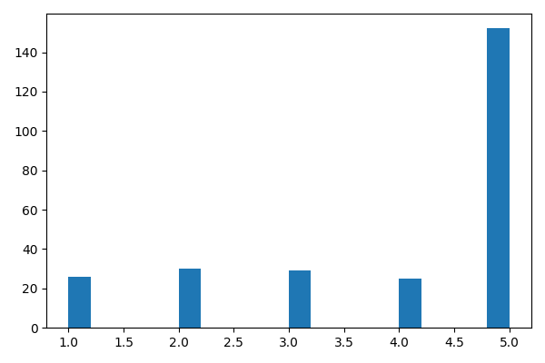
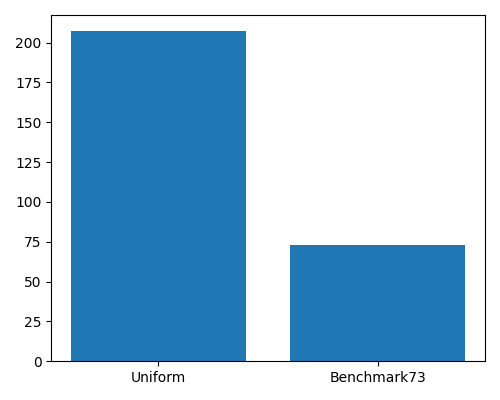
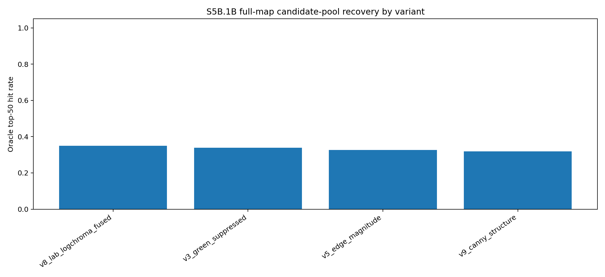
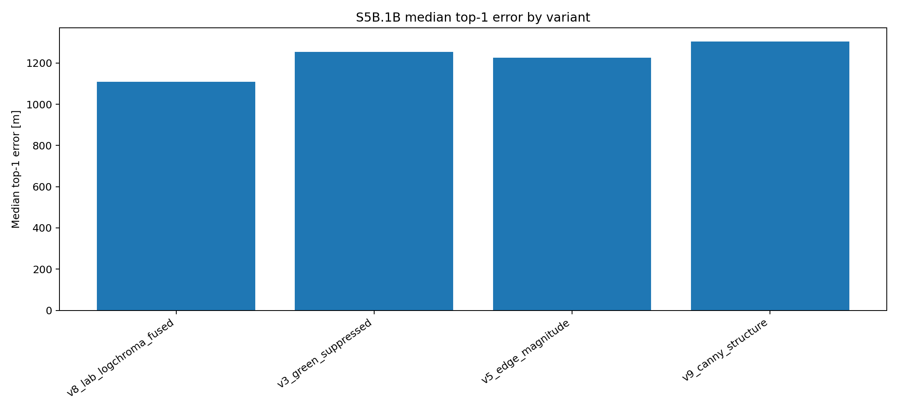
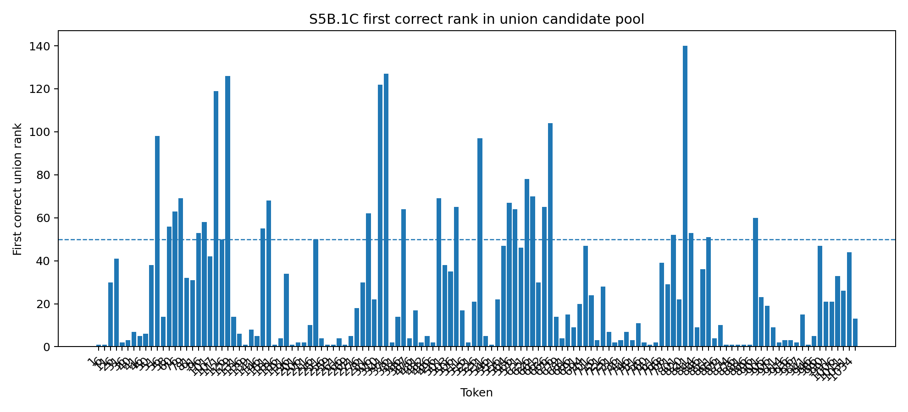
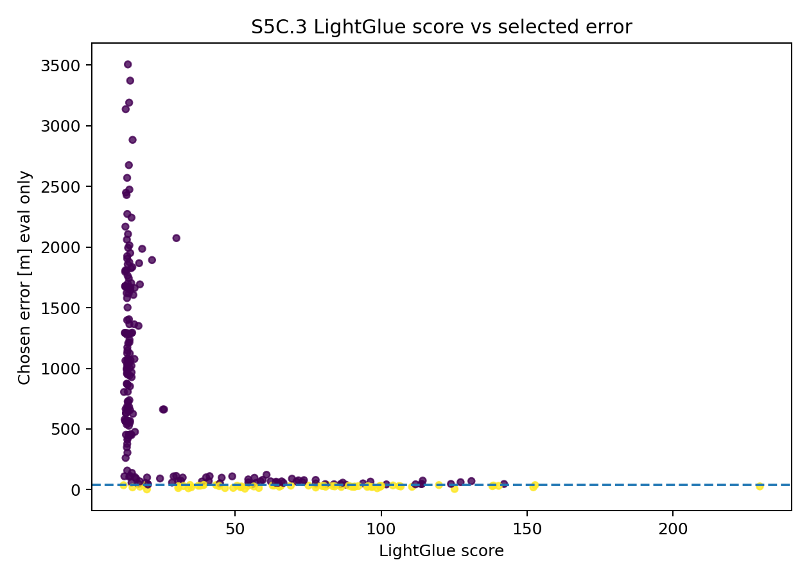
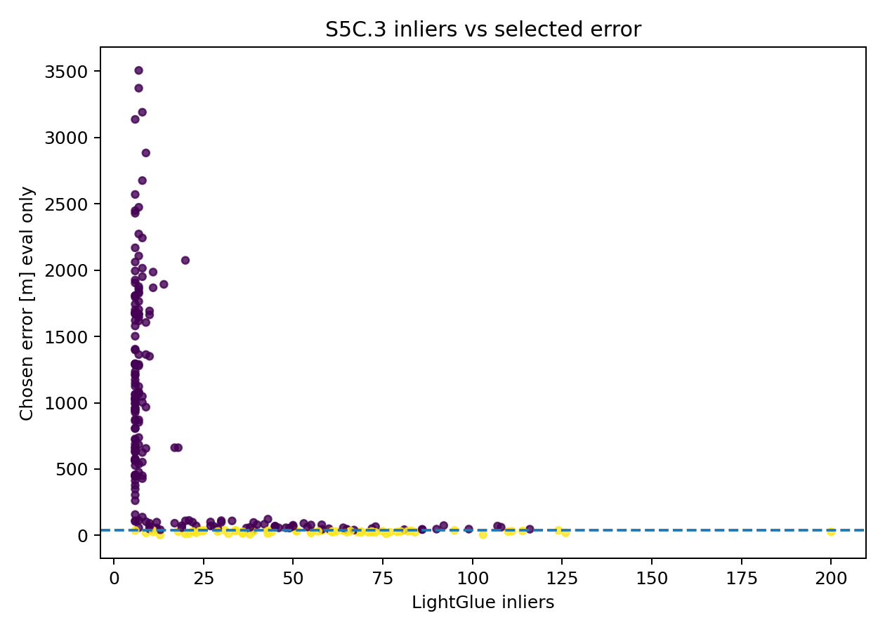
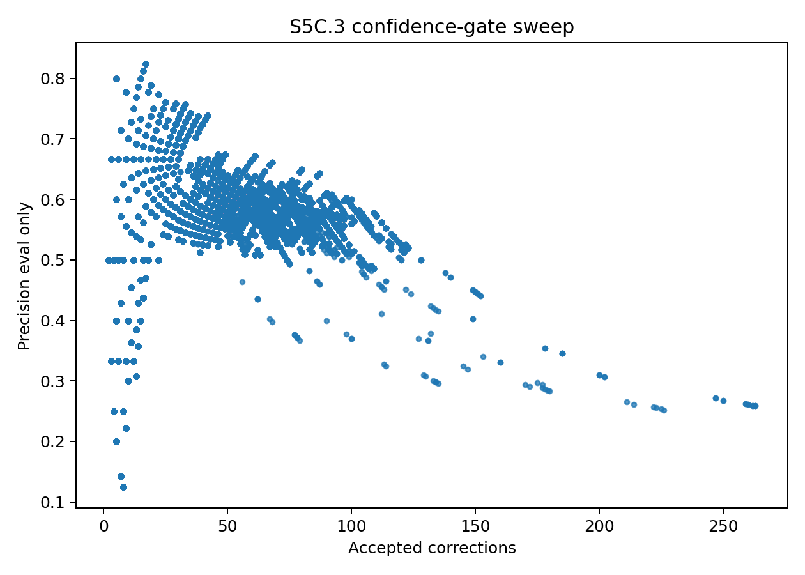

# S5C Temporal Absolute Benchmark — `traj01`

Branch: `addon/traj01-temporal-abs-run`  
Stage status: **S5C.0 → S5C.3 completed**  
Next stage: **S6B — Relative + Absolute Correction Replay**

---

## 1. Why this block was added

Before S6B fusion, we needed to answer a missing question:

> If absolute localization is used as a drift-correction module, how often does it provide usable map fixes along the actual `traj01` trajectory?

Earlier S5A/S5B results were strong for method development, but the 73 evaluated frames were not temporally structured. They were selected from benchmark/failure-analysis needs, not from a fixed stride or correction deadline. Therefore, they were not sufficient to estimate correction spacing, consecutive failure runs, or whether absolute fixes appear before relative drift exceeds a budget.

So inserted:

```text
S5C — Temporal Absolute Coverage Benchmark
```

between:

```text
S6A relative localization
        ↓
S5C temporal absolute benchmark
        ↓
S6B relative + absolute fusion
```

S5C does **not** apply relative corrections. It only prepares temporally structured absolute-localization outputs for later fusion.

---

## 2. Locked experimental rule

Throughout S5C:

> UAV filename/reference lon-lat and evaluation coordinates are used only after ranking/selection to compute error metrics.

They are **not** used for retrieval, LightGlue ranking, or confidence-gate acceptance.

Online-usable evidence includes LightGlue score, inliers, matches, image coverage, union rank, and LightGlue score margin.

Evaluation-only labels include `chosen_error_m`, `hit_le_threshold`, `oracle_*`, and `eval_error_m`.

---

## 3. Scripts used

### New S5C scripts

```text
scripts/satloc/s5c/s5c_0_temporal_absolute_manifest.py
scripts/satloc/s5c/s5c_3_confidence_gate_calibration.py
```

### Existing proven S5B scripts reused

```text
scripts/satloc/s5b/s5b_1b_fullmap_domain_normalized_phog.py
scripts/satloc/s5b/s5b_1c_build_variant_union_pool.py
scripts/satloc/s5b/s5b_2_lightglue_union_pool_verifier.py
```

A custom reimplementation attempt of S5C.1 was rejected because it broke the maintained pipeline logic and did not reproduce earlier S5B behavior. The official S5C.1 path uses the existing S5B candidate-generation code.

---

# 4. S5C.0 — Temporal Absolute Query Manifest

## Goal

Create a fixed temporal query schedule for absolute-localization testing.

## Query sources

The manifest combines uniform every-5-frame temporal sampling and the existing 73 S5A/S5B benchmark tokens, then deduplicates by `token0_id`.

## Result

```text
Frames in traj01:       1034
Uniform queries:        207
Existing benchmark:      73
Total unique queries:   263
```

Output:

```text
outputs/satloc/metadata/s5c_temporal/s5c0_absolute_query_manifest.csv
```

## Interpretation

The 263-token manifest is the first temporally meaningful absolute-localization benchmark in this project. It preserves the earlier difficult 73 benchmark frames while adding uniform coverage along the trajectory.





---

# 5. S5C.1 — Temporal Candidate-Pool Coverage

## Goal

Before spending hours on LightGlue, measuring whether the correct satellite tile appears in the candidate pool.

This stage runs **candidate generation only**.

No LightGlue. No correction. No fusion.

## Correct implementation

We reused the proven S5B full-map domain-normalized PHOG pipeline:

```text
s5b_1b_fullmap_domain_normalized_phog.py
```

with the 263 S5C temporal tokens.

## Candidate variants

```text
v3_green_suppressed
v5_edge_magnitude
v8_lab_logchroma_fused
v9_canny_structure
```

All variants searched 8625 satellite tiles.

## Per-variant S5C.1 result

| Variant | Top-1 hits | Top-1 hit rate | Oracle@50 hits | Oracle@50 rate | Median top-1 error | Median oracle@50 error | Median first correct rank |
|---|---:|---:|---:|---:|---:|---:|---:|
| `v8_lab_logchroma_fused` | 21 | 0.0798 | 92 | 0.3498 | 1107.97 m | 98.62 m | 117 |
| `v3_green_suppressed` | 20 | 0.0760 | 89 | 0.3384 | 1253.64 m | 106.35 m | 165 |
| `v5_edge_magnitude` | 26 | 0.0989 | 86 | 0.3270 | 1226.14 m | 88.38 m | 149 |
| `v9_canny_structure` | 10 | 0.0380 | 84 | 0.3194 | 1305.02 m | 122.31 m | 218 |

## Interpretation

Top-1 retrieval remains weak. However, candidate-pool recall is useful: each variant places correct candidates into the top-50 for roughly one-third of temporal queries.

The best single variant is:

```text
v8_lab_logchroma_fused
Oracle@50 = 92 / 263 = 34.98%
```





---

## S5C.1 union candidate pool

I then built a union pool from the four variants using:

```text
s5b_1c_build_variant_union_pool.py
```

To avoid accidentally mixing old S5B candidate-pool-failure tokens, an empty old-ranked CSV was passed as `--old-ranked`.

## Union result

```text
Tokens:                    263
Oracle hits:               102 / 263
Oracle hit rate:           0.388
Top1 hits:                 16 / 263
Median union candidates:   127
Median first correct rank: 16
```

## Oracle depth audit

| Metric | Hits | Rate |
|---|---:|---:|
| Oracle@10 | 57 / 263 | 0.217 |
| Oracle@20 | 70 / 263 | 0.266 |
| Oracle@50 | 102 / 263 | 0.388 |

## Interpretation

Top-20 was not enough. It would miss 32 recoverable queries compared with Top-50.

Therefore S5C.2 was frozen as:

```text
LightGlue on union Top-50
```



---

# 6. S5C.2 — Temporal LightGlue Verification on Union Top-50

## Goal

Run LightGlue on the S5C.1 union Top-50 candidate pool.

This stage answers:

> Given the candidate pool, can LightGlue select the correct satellite tile?

It still does **not** apply relative-localization corrections.

## Scale

```text
263 tokens × 50 candidates = 13,150 LightGlue pairs
```

The first single full run was stopped because it produced no checkpointed output for many hours. The final run was executed safely in chunks.

| Chunk | Tokens | Candidate pairs | LightGlue-only hits | Oracle available | Notes |
|---|---:|---:|---:|---:|---|
| chunk00 | 50 | 2500 | 15 | 21 | strong early/urban structure |
| chunk01 | 50 | 2500 | 15 | 19 | higher median wrong-selection error |
| chunk02 | 50 | 2500 | 8 | 14 | hardest chunk |
| chunk03 | 50 | 2500 | 15 | 21 | recovered well |
| chunk04 | 50 | 2500 | 12 | 22 | vegetation/green-heavy regions harder |
| chunk05 | 13 | 650 | 3 | 5 | final short chunk |

Final merged outputs:

```text
outputs/satloc/metadata/s5c_temporal/s5c2_lightglue_union_candidate_scores_top50_full263.csv
outputs/satloc/metadata/s5c_temporal/s5c2_lightglue_union_query_summary_top50_full263.csv
outputs/satloc/metadata/s5c_temporal/s5c2_lightglue_union_policy_summary_top50_full263.csv
outputs/satloc/reports/s5c_temporal/s5c2_lightglue_union_top50_full263_summary.json
```

## Final S5C.2 policy summary

| Policy | Tokens | Hits | Hit rate | Median error | Oracle processed hits | Oracle processed rate | Median oracle error | Median oracle LG rank |
|---|---:|---:|---:|---:|---:|---:|---:|---:|
| `lightglue_only` | 263 | 68 | 0.2586 | 138.14 m | 102 | 0.3878 | 69.93 m | 6.0 |
| `lightglue_plus_union_prior` | 263 | 68 | 0.2586 | 457.17 m | 102 | 0.3878 | 69.93 m | 6.0 |
| `union_rank_only` | 263 | 16 | 0.0608 | 1164.08 m | 102 | 0.3878 | 69.93 m | 6.0 |

## Interpretation

The frozen S5C.2 selection policy is:

```text
lightglue_only
```

because it has the same hit count as `lightglue_plus_union_prior` but much lower median error.

Important derived metric:

```text
LightGlue selected 68 of 102 recoverable candidate-pool cases
= 66.7% of available recoverable cases
```

---

# 7. S5C.3 — Confidence-Gate Calibration

## Goal

Build an online-safe rule to decide which LightGlue absolute fixes are trustworthy enough to accept.

This stage uses LightGlue evidence for acceptance and evaluation labels only after acceptance.

## Baseline

Accept all LightGlue-only outputs:

```text
68 / 263 hits
precision = 25.9%
median error = 138.1 m
```

This is not safe enough for drift correction.

## Recommended gates

| Profile | Accepted | True hits | False accepts | Precision | Hit retention vs LG hits | Dangerous false accepts >100 m | Median error | Rule |
|---|---:|---:|---:|---:|---:|---:|---:|---|
| `balanced_precision_0p75` | 33 | 25 | 8 | 0.7576 | 0.3676 | 0 | 30.99 m | `inliers >= 48`, `coverage >= 0.50` |
| `permissive_precision_0p65` | 80 | 52 | 28 | 0.6500 | 0.7647 | 1 | 33.78 m | `coverage >= 0.375`, `margin >= 2` |
| `exploratory_precision_0p55` | 110 | 63 | 47 | 0.5727 | 0.9265 | 4 | 36.15 m | `inliers >= 8`, `matches >= 120`, `coverage >= 0.1875` |

## Frozen S6B recommendation

Use:

```text
balanced_precision_0p75
```

as the primary realistic correction gate.

It accepts fewer corrections but has:

```text
0 dangerous false accepts >100 m
75.8% precision
31.0 m median accepted error
```

Use `permissive_precision_0p65` only as an ablation.

Do not use `exploratory_precision_0p55` as the main correction policy because it accepts too many false corrections.







---

# 8. Final S5C summary

| Stage | Main output | Result |
|---|---|---|
| S5C.0 | Temporal manifest | 263 temporally structured queries |
| S5C.1 | Union candidate pool | 102 / 263 Oracle@50 |
| S5C.2 | LightGlue verification | 68 / 263 selected hits |
| S5C.3 | Balanced confidence gate | 33 accepted, 25 true, 75.8% precision |

The final deployable-style absolute correction pool for S6B is not all 68 LightGlue hits. It is the confidence-gated set:

```text
balanced gate:
33 accepted fixes
25 true fixes
8 false accepts
0 dangerous false accepts >100 m
```

---

# 9. What was learned

## Retrieval alone is not enough

Union top-1 hit rate is only 16 / 263 = 6.1%, so retrieval rank alone is not suitable for correction.

## Candidate pool is useful but incomplete

Union Oracle@50 gives 102 / 263 = 38.8%. This is the ceiling for LightGlue with the current Top-50 candidate pool.

## LightGlue improves selection but cannot exceed candidate ceiling

LightGlue-only gives 68 / 263 = 25.9%, which is 68 / 102 = 66.7% of the recoverable Top-50 cases.

## Confidence gating is necessary

Accepting all LightGlue outputs has only 25.9% precision. The balanced gate improves this to 75.8% precision while keeping zero dangerous false accepts above 100 m.

## Vegetation and low-structure regions remain hard

The chunked run made this visible. Agriculture/vegetation-heavy and rotated/less-structured areas gave fewer reliable absolute selections. These regions will need special treatment later, such as semantic masking, rotation-aware retrieval, larger candidate pools, temporal consistency, relative-prediction gating, and heading-aware absolute correction.

---

# 10. What is still missing before S6B

Before correction replay, S6B must build a dedicated absolute-correction manifest.

Required joins:

```text
S5C.3 accepted fixes
+ chosen satellite tile coordinates
+ S6A sequence frame mapping
+ S6A relative trajectory state
```

S6B must test at least:

1. Relative-only ORB baseline.
2. Oracle absolute corrections — evaluation-only upper bound.
3. Balanced confidence-gated corrections — realistic main policy.
4. Permissive gate — ablation.

Important: S6B must not use `chosen_error_m` to decide online acceptance.

---