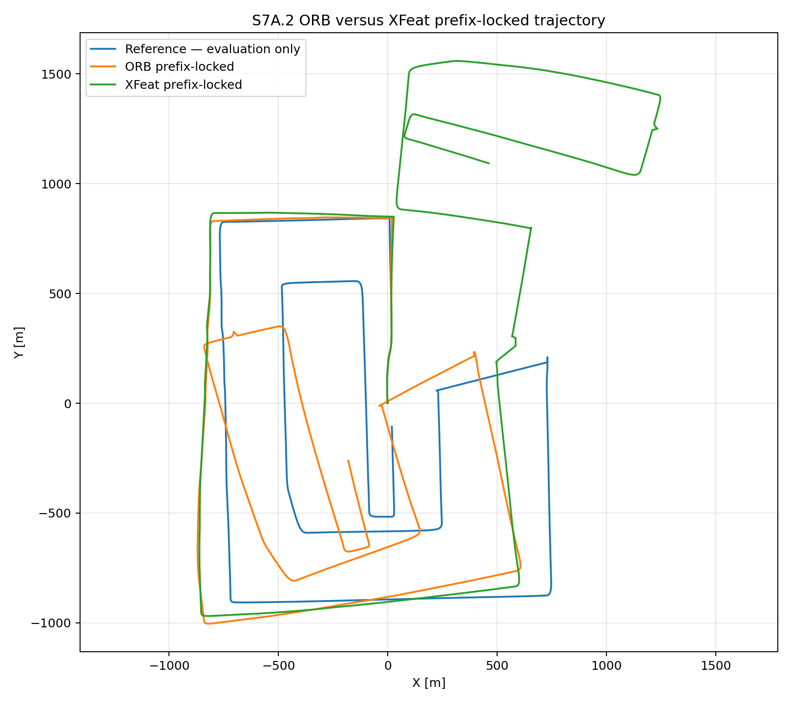
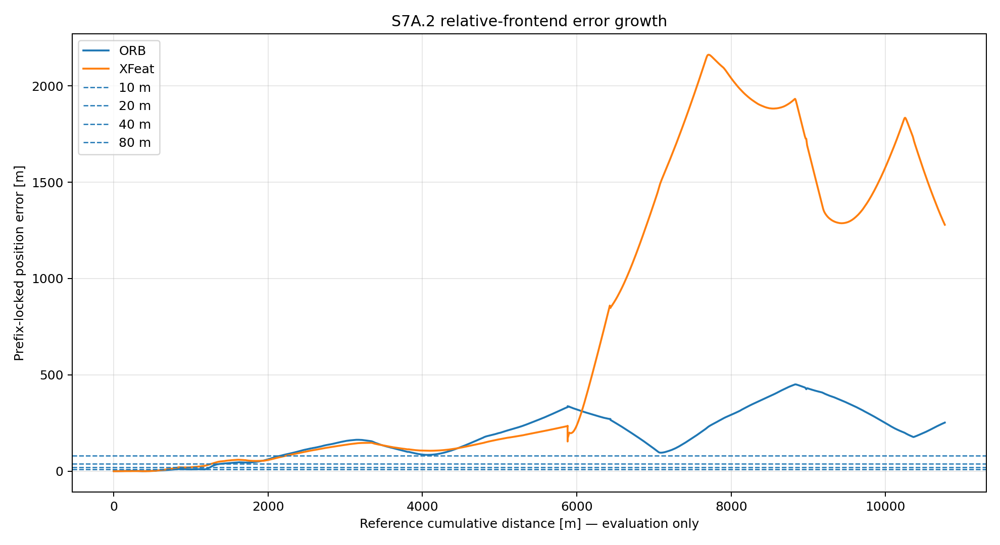
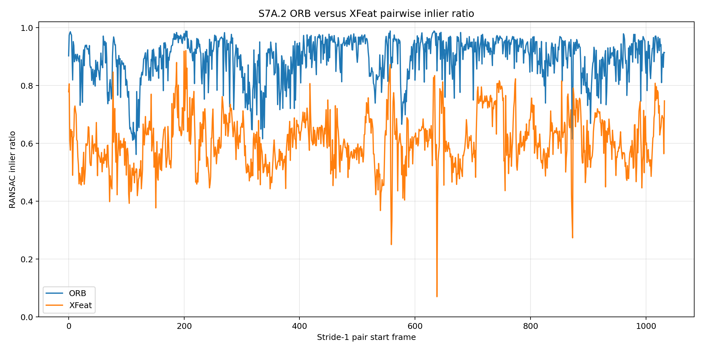
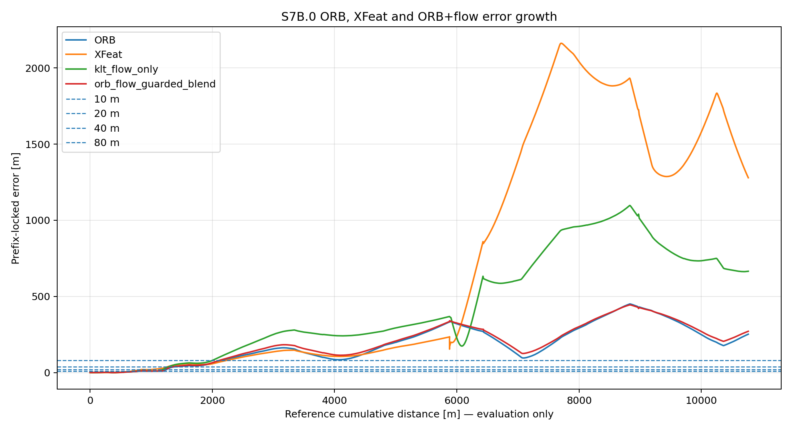
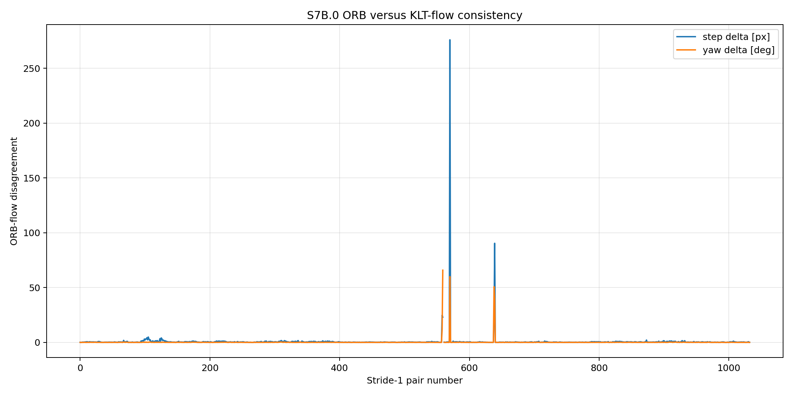
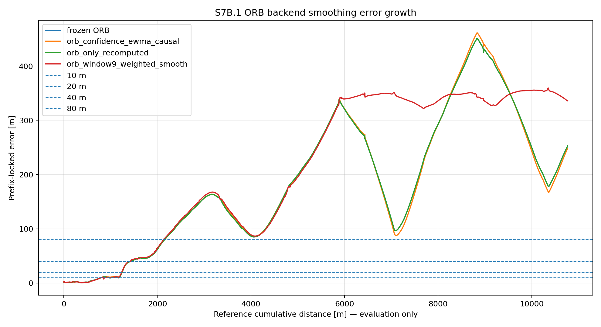
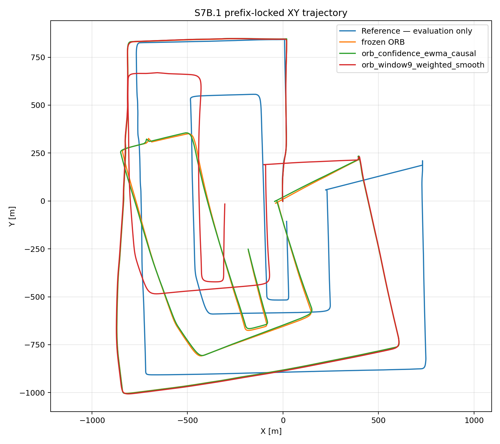

# S7 Relative Frontend Closeout and S7C Transition

**Project:** GNSS-denied / weak-GNSS UAV localization  
**Dataset stage:** SatLoc `traj01`  
**Stage covered:** S7A and S7B relative-frontend/backend comparison  
**Closeout decision:** **KEEP ORB**  
**Next stage:** **S7C — Absolute Retrieval / Candidate Generation Upgrade**

---

## 1. Executive conclusion

S7 tested whether the relative-motion component should move beyond the frozen ORB baseline.

The result is clear:

```text
Frozen relative frontend:  ORB affine stride-1
Frozen relative backend:   SE(2) scale-normalized accumulation
Decision:                  KEEP_ORB
```

XFeat, KLT optical flow, ORB+flow fusion, and ORB backend smoothing were all tested as bounded alternatives. None produced an improvement over frozen ORB.

The main technical lesson is:

```text
ORB is not failing locally.
Remaining error is accumulated relative drift.
The next useful improvement is absolute/map correction, not another relative frontend.
```

Therefore, the project should move to:

```text
S7C — Absolute Retrieval / Candidate Generation Upgrade
```

---

## 2. Why not move now to SP-SLAM3 / Light-SLAM?

SP-SLAM3, SuperPoint-SLAM3, Light-SLAM, and related methods are full SLAM systems. They typically include keyframes, mapping, loop closure, bundle adjustment or pose-graph optimization, and sometimes learned place recognition.

They are scientifically interesting, but they are not the best immediate next step because:

1. **Our relative frontend is already locally stable.**  
   ORB, KLT flow, and smoothing studies showed that the issue is not local pair failure.

2. **Our project bottleneck is absolute correction.**  
   S6B already showed that absolute correction/fusion reduces trajectory RMSE far more than relative-side swaps.

3. **Learned-feature SLAM does not guarantee better behavior here.**  
   XFeat was valid locally but much worse after accumulated relative integration. That already warns against blindly importing a learned-feature SLAM frontend.

---

## 3. Stage overview

### S7A — ORB versus XFeat

Goal:

```text
Check whether XFeat can replace ORB as the relative visual frontend.
```

Result:

```text
S7A.1 Trial Run:
  XFeat passed local pair robustness.

S7A.2 full trajectory:
  XFeat was much worse than ORB after accumulation.

Decision:
  KEEP_ORB.
```

### S7B.0 — ORB + optical-flow consistency

Goal:

```text
Check whether sparse KLT optical flow can detect bad ORB steps or improve ORB.
```

Result:

```text
KLT flow almost fully agreed with ORB.
No suspicious ORB steps were detected.
ORB+flow did not improve drift.

Decision:
  KEEP_ORB.
```

### S7B.1 — ORB backend smoothing

Goal:

```text
Check whether smoothing ORB SE(2) increments reduces accumulated drift.
```

Result:

```text
Causal smoothing did not improve overall RMSE/p95.
Centered window smoothing improved p95 but worsened RMSE/final drift and is offline.
No interesting backend improvement.

Decision:
  KEEP_ORB.
```

---

## 4. Key quantitative results

### 4.1 S7A.1 XFeat smoke test

```text
Status:                    PASS
XFeat commit:              e92685f57f8318b18725c5c8c0bd28c7fe188d9a
Device:                    cpu
Diagnostic pairs:          169
Unique frames extracted:   330

ORB affine success:        1.0000
XFeat affine success:      1.0000

ORB good-quality rate:     1.0000
XFeat good-quality rate:   1.0000

ORB inlier ratio median:   0.9123
XFeat inlier ratio median: 0.6090
XFeat inlier ratio p05:    0.4705

XFeat feature mean ms:     287.13
XFeat match+RANSAC ms:     8.18
Amortized frontend ms:     728.68
Peak process memory MB:    342.9

Smoke gate pass:           True
```

Interpretation:

```text
XFeat is runnable and locally valid.
However, its inlier structure is weaker than ORB.
```

---

### 4.2 S7A.2 full XFeat trajectory comparison

```text
Status:                    COMPLETE_KEEP_ORB
Device:                    cpu
Frames:                    1034
Pairs:                     1033

ORB affine success:        1.0000
XFeat affine success:      1.0000

ORB prefix RMSE m:         230.188
XFeat prefix RMSE m:       1054.132

ORB prefix p95 m:          412.658
XFeat prefix p95 m:        1989.549

ORB final drift m/100m:    2.461
XFeat final drift m/100m:  12.465

ORB frontend ms/pair:      94.52
XFeat frontend ms/pair:    297.80

Decision:                  KEEP_ORB
```

Interpretation:

```text
XFeat did not fail pairwise.
It failed as a long-chain relative odometry frontend.
Small local motion biases accumulated into much larger trajectory drift.
```

---

### 4.3 S7B.0 ORB + optical-flow consistency study

```text
Status:                     COMPLETE_KEEP_ORB
Frames:                     1034
Pairs:                      1033

Flow affine success:        0.9990
Flow good-quality rate:     0.9942
ORB-flow agreement rate:    0.9903
Suspicious ORB step rate:   0.0000

ORB prefix RMSE m:          230.188
orb_flow_fallback RMSE m:   230.188

ORB prefix p95 m:           412.658
orb_flow_fallback p95 m:    412.658

ORB final drift m/100m:     2.461
orb_flow_fallback drift:    2.461

Flow wall ms/pair:          139.10
Decision:                   KEEP_ORB
```

Interpretation:

```text
Optical flow confirms ORB rather than contradicting it.
The remaining drift is not caused by obvious bad ORB pair steps.
Flow is useful as a diagnostic, not as a replacement or correction layer here.
```

---

### 4.4 S7B.1 ORB sliding-window SE(2) smoothing

```text
Status:                         COMPLETE_KEEP_ORB
Frames:                         1034
Pairs:                          1033
Diagnostic scene pairs:         169

ORB prefix RMSE m:              230.188
Causal EWMA prefix RMSE m:      230.770
Window9 prefix RMSE m:          260.451

ORB prefix p95 m:               412.658
Causal EWMA prefix p95 m:       420.787
Window9 prefix p95 m:           354.082

ORB final drift m/100m:         2.461
Causal EWMA final drift m/100m: 2.418
Window9 final drift m/100m:     3.275

Backend ms/pair:                6.125
Decision:                       KEEP_ORB
```

Interpretation:

```text
Causal smoothing slightly improves final drift but worsens RMSE and p95.
Window9 improves p95 but worsens RMSE/final drift.
No backend variant dominates ORB.
```

---

## 6. Figures for report

### 6.1 ORB versus XFeat trajectory



Figure shows that XFeat is locally valid but globally worse after accumulation.

---

### 6.2 ORB versus XFeat error growth



Figure shows why the final decision is not based only on pair success rate.

---

### 6.3 ORB versus XFeat inlier ratio



Figure explains why the weaker XFeat inlier structure.

---

### 6.4 ORB + optical flow error growth



Figure shows optical flow did not improve the trajectory.

---

### 6.5 ORB-flow disagreement



Figure shows flow mostly agrees with ORB and did not detect many bad ORB steps.

---

### 6.6 ORB backend smoothing error growth



Figure shows smoothing does not dominate raw ORB.

---

### 6.7 ORB backend smoothing XY



Figure shows the smoothed trajectory does not provide a clearly better spatial path.

---

## 8. Final closeout statement

```text
I compared the frozen ORB relative frontend against XFeat, optical-flow consistency, ORB+flow fusion, and ORB backend smoothing. XFeat and optical flow were geometrically valid locally, but neither improved accumulated trajectory performance. Optical flow strongly agreed with ORB and found no suspicious ORB steps, which suggests the remaining error is not caused by frontend failure. ORB remains the best relative frontend/backend. The next stage should focus on absolute satellite/map candidate generation and correction, where previous fusion experiments showed much larger performance gains.
```

---

## 9. Transition to S7C

Planned next stage:

```text
S7C — Absolute Retrieval / Candidate Generation Upgrade
```

Main objective:

```text
Improve the probability that the correct or near-correct satellite candidate enters the absolute correction pool.
```