# SatLoc S5 Absolute Localization Results — Domain-Normalized Candidate Generation + LightGlue Verification

**Project:** GNSS-denied UAV localization using visual map matching  
**Stage covered:** SatLoc absolute localization, S4C → S5A → S5B.2  
**Current stopping point:** S5B.2 LightGlue reranking inside S5B.1C union candidate pools  
**Next planned stage:** S6A relative visual-motion baseline on SatLoc traj01, then S6B relative + absolute correction simulation

---

## 1. Why this stage matters

The current absolute-localization branch is intended to become the **map-based correction module** for a longer relative-localization pipeline.

The final system idea is:

```text
camera frame-to-frame relative motion
        ↓
short-term trajectory estimate, but drift accumulates
        ↓
periodic absolute map localization against satellite/map imagery
        ↓
accept correction only when confidence is high
        ↓
reset/correct accumulated relative drift
```

So the absolute method does not need to localize every single frame perfectly. It must provide **reliable correction points** when the scene is distinctive enough. This is especially important because river banks, vegetation, forest-like regions, and repeated agricultural structures can look very similar in satellite imagery.

---

## 2. Copy report assets into `docs/assets`

Run this from the repository root before committing the README.

```bash
mkdir -p docs/assets/s5b_lightglue

# S5B.0 visual-domain diagnostics
cp -f outputs/satloc/figures/s5b_candidate_pool_improvement/s5b0_uav_edge_density_by_split_top50_all73.png \
  docs/assets/s5b_lightglue/s5b0_uav_edge_density_by_split_top50_all73.png
cp -f outputs/satloc/figures/s5b_candidate_pool_improvement/s5b0_sat_top1_edge_density_by_split_top50_all73.png \
  docs/assets/s5b_lightglue/s5b0_sat_top1_edge_density_by_split_top50_all73.png
cp -f outputs/satloc/figures/s5b_candidate_pool_improvement/s5b0_uav_green_ratio_by_split_top50_all73.png \
  docs/assets/s5b_lightglue/s5b0_uav_green_ratio_by_split_top50_all73.png
cp -f outputs/satloc/figures/s5b_candidate_pool_improvement/s5b0_sat_top1_green_ratio_by_split_top50_all73.png \
  docs/assets/s5b_lightglue/s5b0_sat_top1_green_ratio_by_split_top50_all73.png
cp -f outputs/satloc/figures/s5b_candidate_pool_improvement/s5b0_uav_orientation_peak_ratio_by_split_top50_all73.png \
  docs/assets/s5b_lightglue/s5b0_uav_orientation_peak_ratio_by_split_top50_all73.png
cp -f outputs/satloc/figures/s5b_candidate_pool_improvement/s5b0_uav_sat_lab_l_diff_by_split_top50_all73.png \
  docs/assets/s5b_lightglue/s5b0_uav_sat_lab_l_diff_by_split_top50_all73.png

# S5B.1B full-map candidate-generation variant comparisons
cp -f outputs/satloc/figures/s5b_candidate_pool_improvement/s5b1b_fullmap_oracle_topk_hit_rate_cpf_fullmap_all40.png \
  docs/assets/s5b_lightglue/s5b1b_fullmap_oracle_top50_rate_original_variants_all40.png
cp -f outputs/satloc/figures/s5b_candidate_pool_improvement/s5b1b_fullmap_median_error_cpf_fullmap_all40.png \
  docs/assets/s5b_lightglue/s5b1b_fullmap_median_error_original_variants_all40.png
cp -f outputs/satloc/figures/s5b_candidate_pool_improvement/s5b1b_fullmap_oracle_topk_hit_rate_cpf_fullmap_logchroma_all40.png \
  docs/assetss5b_lightglue/s5b1b_fullmap_oracle_top50_rate_logchroma_variants_all40.png
cp -f outputs/satloc/figures/s5b_candidate_pool_improvement/s5b1b_fullmap_median_error_cpf_fullmap_logchroma_all40.png \
  docs/assets/s5b_lightglue/s5b1b_fullmap_median_error_logchroma_variants_all40.png

# S5B.1C union-pool result
cp -f outputs/satloc/figures/s5b_candidate_pool_improvement/s5b1c_union_first_correct_rank_cpf_union_v3_v5_v8_v9.png \
  docs/assets/s5b_lightglue/s5b1c_union_first_correct_rank_cpf_union_v3_v5_v8_v9.png

# S5B.2 LightGlue union-pool verifier result
cp -f outputs/satloc/figures/s5b_candidate_pool_improvement/s5b2_lightglue_union_policy_hit_rates_cpf_union_all40.png \
  docs/assets/s5b_lightglue/s5b2_lightglue_union_policy_hit_rates_cpf_union_all40.png

# Optional CSVs:
cp -f outputs/satloc/metadata/s5b_candidate_pool_improvement/s5b1b_fullmap_variant_summary_cpf_fullmap_all40.csv \
  docs/assets/s5b_lightglue/s5b1b_fullmap_variant_summary_cpf_fullmap_all40.csv
cp -f outputs/satloc/metadata/s5b_candidate_pool_improvement/s5b1b_fullmap_variant_summary_cpf_fullmap_logchroma_all40.csv \
  docs/assets/s5b_lightglue/s5b1b_fullmap_variant_summary_cpf_fullmap_logchroma_all40.csv
cp -f outputs/satloc/metadata/s5b_candidate_pool_improvement/s5b1c_union_query_summary_cpf_union_v3_v5_v8_v9.csv \
  docs/assets/s5b_lightglue/s5b1c_union_query_summary_cpf_union_v3_v5_v8_v9.csv
cp -f outputs/satloc/metadata/s5b_candidate_pool_improvement/s5b2_lightglue_union_policy_summary_cpf_union_all40.csv \
  docs/assets/s5b_lightglue/s5b2_lightglue_union_policy_summary_cpf_union_all40.csv

---

## 3. Experiment chain overview

The SatLoc absolute-localization work moved through the following chain:

```text
S4A: ORB full-map retrieval
  ↓
S4B: HOG + edge structural retrieval
  ↓
S4C: macro-contour PHOG + Chamfer/LSD reranking
  ↓
S5A: PHOG top-50 + LightGlue/SuperPoint local verifier
  ↓
S5B.0: failure-token split and visual-domain diagnostics
  ↓
S5B.1B: full-map domain-normalized PHOG candidate generation
  ↓
S5B.1C: multi-variant union candidate pool
  ↓
S5B.2: LightGlue reranking inside union pools
```

The key bottleneck discovered in S5A/S5B was not only the final verifier. The bigger limitation was that many correct satellite tiles were **not present in the candidate pool**. Therefore S5B focused on improving full-map candidate generation before LightGlue verification.

---

## 4. Locked evaluation rule

The SatLoc UAV filenames and coordinate labels are treated as **evaluation-only reference**.

They are used only to calculate error after ranking:

```text
ranking/retrieval/verifier score: image data only
reference coordinates: evaluation only after ranking
```

This rule was preserved in S5B.1B, S5B.1C, and S5B.2.

---

## 5. S5B.0 visual-domain diagnostics

S5B.0 split the 73-frame benchmark into:

| Split | Count | Meaning |
|---|---:|---|
| candidate_pool_failure | 40 | Correct tile was not available in old PHOG top-50 |
| hybrid_success | 30 | S5A/S5A.3E pipeline succeeded |
| recoverable_missed | 3 | Correct tile was available but final selection missed |

Important diagnostic insight:

- Candidate-pool failures were **not simply blank or texture-poor UAV frames**.
- Failed top-1 satellite candidates often had high edge density, meaning PHOG was being attracted to structural clutter.
- Vegetation was part of the issue, but not the only issue.
- Some frames showed strong dominant orientation, supporting later observations such as 180° orientation mismatch.
- UAV/satellite illumination and L-channel differences supported domain-normalization experiments.

### UAV edge-density by split

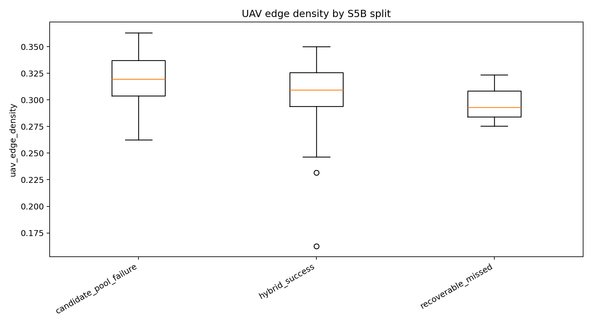

Interpretation: candidate-pool failures still contain many edges. The problem is not absence of structure; the problem is misleading or repeated structure.

### Satellite top-1 edge-density by split

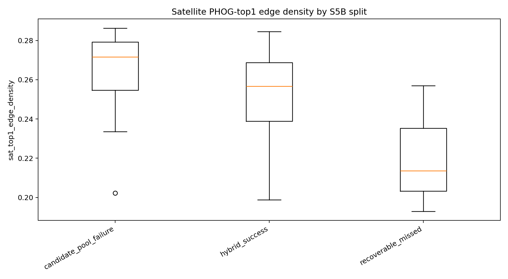

Interpretation: wrong candidates can also be edge-rich. A plain structural descriptor can be fooled by roads, field boundaries, tree lines, and repeated rural patterns.

### UAV green-ratio by split

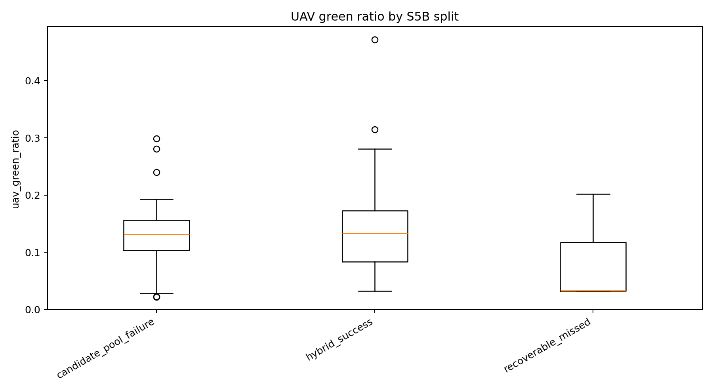

Interpretation: vegetation contributes to confusion, but it does not fully separate success from failure.

### Satellite top-1 green-ratio by split

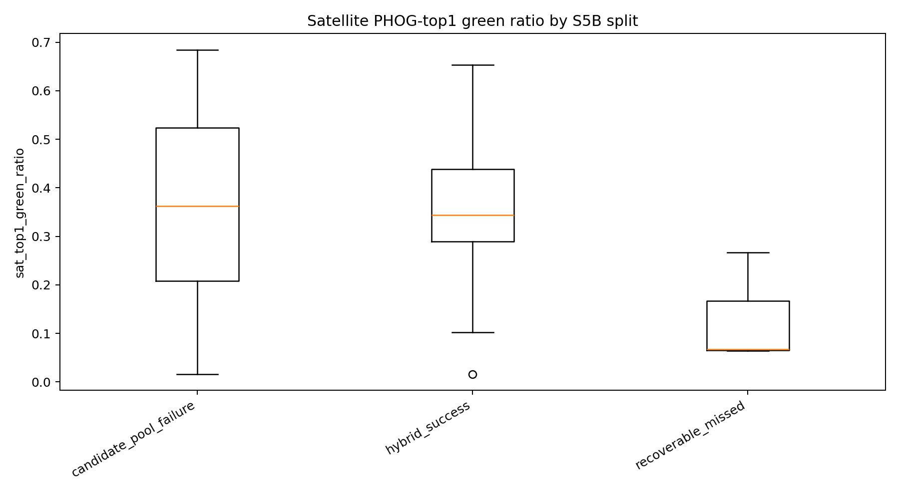

Interpretation: some false positives are vegetation-heavy, while others are low-green structural clutter. This motivated multiple preprocessing variants rather than one vegetation-only filter.

### UAV orientation-peak ratio by split

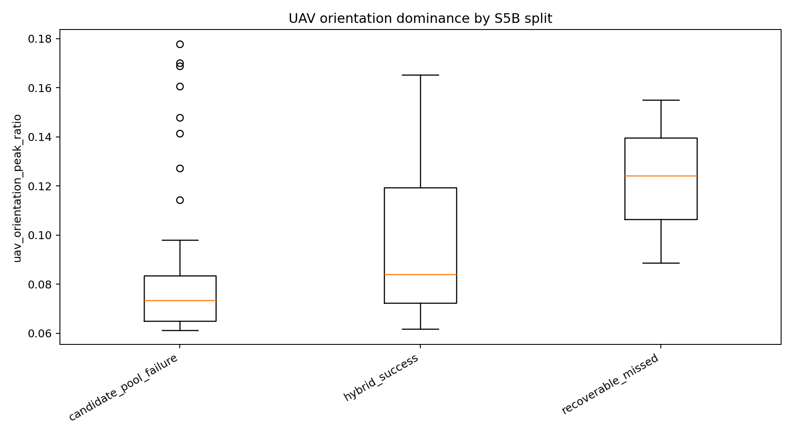

Interpretation: some hard frames contain strong dominant orientations. This supports future orientation-aware verification, especially for cases like token 564 where the UAV/satellite orientation appears close to 180° opposite.

### UAV-satellite LAB L difference by split

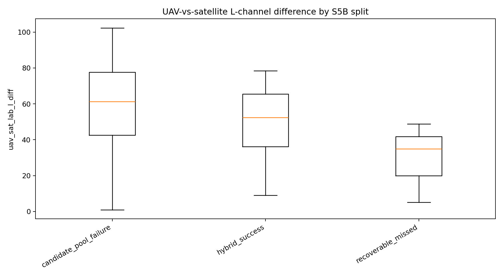

Interpretation: illumination and sensor-domain mismatch are real. UAV images are sharper/newer/warmer, while satellite tiles can be older, blurrier, greener, cloudy, or differently exposed.

---

## 6. Main quantitative result chain

| Stage | Hit result | Rate | Interpretation |
|---|---:|---:|---|
| Old PHOG/S4C candidate pool on hard group | 0 / 40 | 0.0% | These frames were unrecoverable because the correct tile was absent from old top-50 |
| S5B.1C union oracle on hard group | 12 / 40 | 30.0% | Full-map multi-variant candidate generation brought correct tiles into the union pool |
| S5B.2 LightGlue selected on hard group | 9 / 40 | 22.5% | LightGlue selected 9 newly recovered cases from the old impossible group |
| S5A hybrid selected on all 73 | 30 / 73 | 41.1% | Previous strongest full benchmark result |
| Projected combined selected on all 73 | 39 / 73 | 53.4% | S5A successes plus S5B.2 newly recovered hard-group successes |
| Projected combined oracle on all 73 | 45 / 73 | 61.6% | Current upper ceiling if final verifier selected every available correct candidate |

---

## 7. S5B.1B full-map domain-normalized PHOG variants

S5B.1 initially returned all-zero recovery because it reranked only old S4C top-50/top-200 lists. That was not a valid candidate-generation test. S5B.1B fixed this by searching the full satellite map:

```text
satellite tiles searched: 8625
candidate-pool-failure tokens: 40
resize-long: 512
metric: oracle top-50 hit rate
```

### Original domain-normalization variants

| Variant | Oracle top-50 hits | Rate | Median top-1 error | Median oracle top-50 error | Median first correct rank |
|---|---:|---:|---:|---:|---:|
| v3_green_suppressed | 10 / 40 | 25.0% | 1505.06 m | 142.11 m | 275.5 |
| v5_edge_magnitude | 8 / 40 | 20.0% | 1420.77 m | 184.42 m | 358.5 |
| v1_lab_l_clahe | 7 / 40 | 17.5% | 1564.33 m | 203.32 m | 498.0 |
| v2_sat_detail | 7 / 40 | 17.5% | 1403.47 m | 205.44 m | 551.5 |
| v4_uav_blur_sat_sharpen | 6 / 40 | 15.0% | 1323.66 m | 210.33 m | 456.5 |

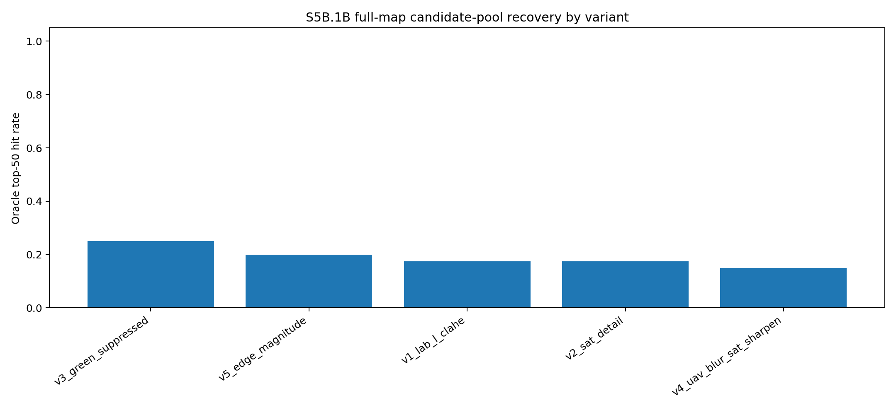

Interpretation: green suppression was the best single global candidate-generation variant. This supports the hypothesis that vegetation/green-domain mismatch and repeated field boundaries were major contributors to candidate-pool failure.

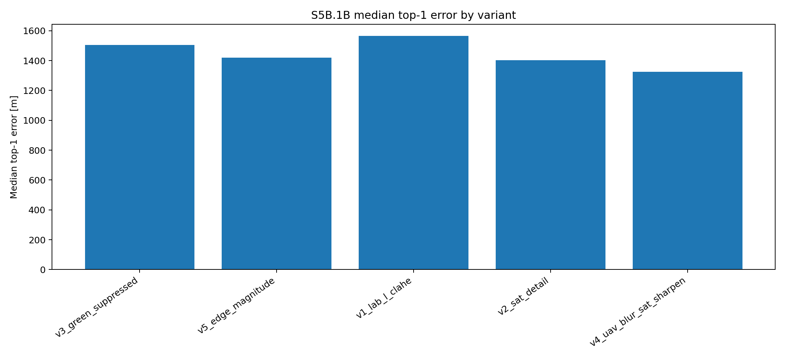

Interpretation: top-1 error remained high. That is acceptable here because S5B.1B is not the final localizer; it is a candidate-generator. The important metric is whether a correct tile enters the top-50 candidate set.

### Log-chromaticity and edge-only variants

| Variant | Oracle top-50 hits | Rate | Median top-1 error | Median oracle top-50 error | Median first correct rank |
|---|---:|---:|---:|---:|---:|
| v8_lab_logchroma_fused | 7 / 40 | 17.5% | 1095.36 m | 142.65 m | 232.0 |
| v7_log_chroma_edges | 3 / 40 | 7.5% | 662.89 m | 258.84 m | 633.0 |
| v9_canny_structure | 3 / 40 | 7.5% | 1526.11 m | 183.79 m | 512.5 |
| v6_log_chroma_clahe | 3 / 40 | 7.5% | 1311.96 m | 269.49 m | 458.0 |

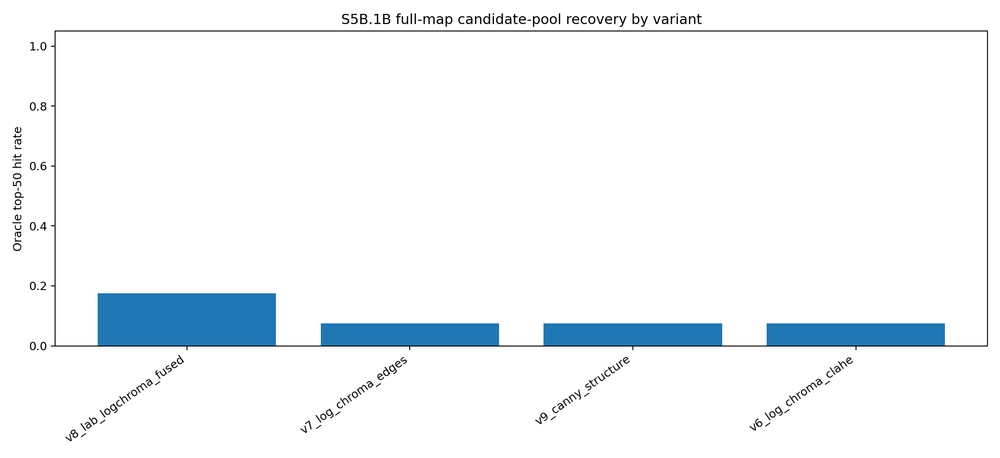

Interpretation: log-chromaticity did not beat green suppression as a single method, but it added one unique recovered token, token 662. Therefore it is useful as part of a multi-variant candidate union.

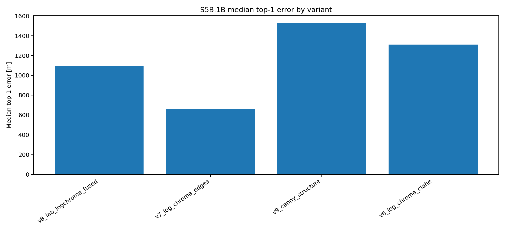

Interpretation: some log-chroma variants reduced median top-1 error but did not necessarily improve top-50 candidate recall. This shows why final evaluation must separate candidate recall from top-1 retrieval quality.

---

## 8. S5B.1B recovered-token union

Combining all tested variants recovered 12 unique tokens from the previous candidate-pool-failure group:

```text
50, 58, 387, 503, 564, 662, 679, 768, 820, 844, 937, 1034
```

Selected per-token observations:

| Token | Important successful variants | Note |
|---:|---|---|
| 50 | v3, v5 | Recovered by green suppression and edge magnitude |
| 58 | v3, v6, v7 | Log-chroma produced very strong rank for this token |
| 387 | v3, v5, v6, v8, v9 | Robustly recoverable by multiple structural variants |
| 503 | v1, v2, v3, v8 | Correct candidate available, but later LightGlue top-1 chose a near wrong tile |
| 564 | v1, v2, v3, v4, v6 | Correct candidate available, but LightGlue struggled; likely orientation mismatch case |
| 662 | v8 only | New unique token added by LAB + log-chroma fusion |
| 679 | many variants | Easy once generated; LightGlue selected correctly |
| 820 | v5 only | Unique edge-magnitude recovery |
| 844 | many variants, v9 strong | Edge-only Canny structure placed correct tile very high |
| 1034 | many variants | Robust across domain-normalized variants |

---

## 9. S5B.1C union candidate pool

S5B.1C built a union candidate pool from the most useful variants:

```text
v3_green_suppressed
v5_edge_magnitude
v8_lab_logchroma_fused
v9_canny_structure
```

Configuration:

```text
per-variant top-N: 50
union top-K evaluation: 200
tokens: 40 candidate-pool-failure frames
median union candidates: 125.5
```

Result:

| Metric | Value |
|---|---:|
| Oracle hits | 12 / 40 |
| Oracle hit rate | 30.0% |
| Top-1 hits by union rank | 0 / 40 |
| Median union candidates | 125.5 |
| Median first correct rank | 32.0 |

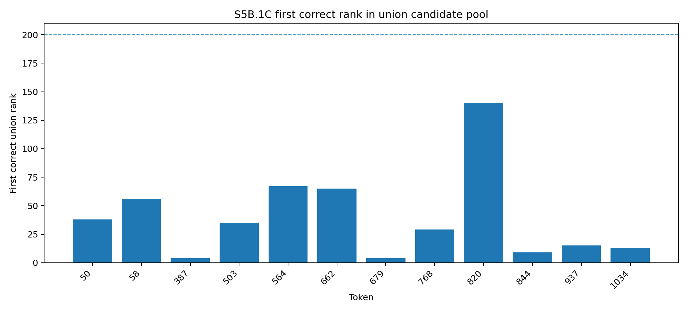

Interpretation: the union pool improves candidate recall but not final top-1 selection. This is expected. The union stage is designed to provide candidates for LightGlue, not to be a final localization output.

---

## 10. S5B.2 LightGlue verification inside union pools

S5B.2 ran LightGlue/SuperPoint inside the S5B.1C union pools.

Configuration:

```text
tokens: 40 old candidate-pool-failure frames
max candidates per token: 200
candidate rows processed: 5049
status: all ok
resize-long: 512
max keypoints: 1024
```

Policy comparison:

| Policy | Hits | Rate | Median selected error | Oracle processed hits | Oracle processed rate | Median oracle error | Median oracle LG rank |
|---|---:|---:|---:|---:|---:|---:|---:|
| lightglue_only | 9 / 40 | 22.5% | 324.82 m | 12 / 40 | 30.0% | 89.76 m | 11.5 |
| lightglue_plus_union_prior | 8 / 40 | 20.0% | 390.24 m | 12 / 40 | 30.0% | 89.76 m | 11.5 |
| union_rank_only | 0 / 40 | 0.0% | 1355.29 m | 12 / 40 | 30.0% | 89.76 m | 11.5 |

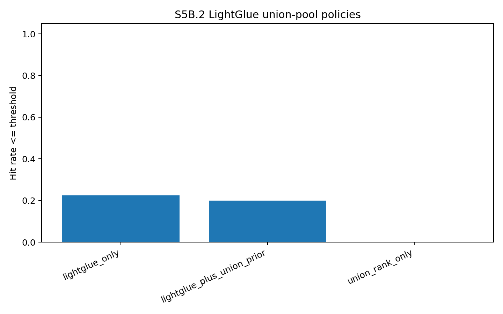

Interpretation:

- `lightglue_only` is the best final selection policy.
- The union prior reduced performance, so it should not be used as the final selector.
- Union rank is useful only for candidate recall, not localization output.
- LightGlue selected 9 newly recovered cases from the previously impossible hard group.

---

## 11. Recoverable S5B.2 misses

Among the 12 recovered-union tokens, LightGlue selected 9 correctly and missed 3:

| Token | Chosen error | Oracle error | Oracle LightGlue rank | Interpretation |
|---:|---:|---:|---:|---|
| 503 | 73.30 m | 31.25 m | 4 | Moderate verifier miss; correct candidate was in LightGlue top-4 |
| 564 | 518.92 m | 38.76 m | 84 | Hard verifier failure; likely 180° orientation mismatch / repeated structure |
| 662 | 45.18 m | 4.81 m | 2 | Near miss; chosen candidate just outside 40 m threshold |

Important note on token 564:

The UAV frame appears close to a 180° heading reversal relative to the satellite tile. Therefore, the remaining failure is likely not candidate-generation failure, but orientation-sensitive local verification failure. A future targeted experiment should test rotation-aware LightGlue with rotations `[0°, 180°]` first, then optionally `[0°, 90°, 180°, 270°]`. Flip/reflection should be treated separately as a diagnostic, not default behavior.

---

## 12. What worked and what did not

### What worked

1. **LightGlue/SuperPoint verifier inside candidate pools**  
   S5A proved that learned local verification is much stronger than AKAZE/classical local verification.

2. **Full-map candidate generation instead of reranking old top-50/top-200 pools**  
   S5B.1B fixed the earlier all-zero issue by searching all 8625 satellite tiles.

3. **Green suppression and structural edge variants**  
   `v3_green_suppressed` was the best single variant with 10/40 oracle top-50 hits on old candidate-pool failures.

4. **Multi-variant union candidate pool**  
   The union recovered 12/40 old impossible frames.

5. **LightGlue final selection**  
   LightGlue selected 9/12 recovered candidates correctly.

### What did not work well

1. **Old PHOG top-50 candidate pool**  
   It had 0/40 oracle recovery on the hard candidate-pool-failure group.

2. **Union rank as a final output**  
   Union top-1 selected 0/40 correctly. It is only a candidate-recall mechanism.

3. **Adding union prior to LightGlue score**  
   It reduced performance from 9/40 to 8/40 on the hard group.

4. **Log-chroma alone as best single method**  
   Log-chroma did not outperform green suppression, although `v8_lab_logchroma_fused` added token 662 and is useful in the union.

---

## 13. Current absolute-localization conclusion

The current best absolute-localization chain is:

```text
S5A hybrid protected LightGlue on original PHOG top-50:
  30 / 73 = 41.1%

S5B.2 additional hard-group recoveries:
  +9 / 73

Projected combined selected result:
  39 / 73 = 53.4%

Projected combined oracle ceiling:
  45 / 73 = 61.6%
```

---

## 14. How this connects to relative localization

The absolute module should later be connected to relative localization as follows:

```text
relative visual odometry / frame-to-frame image motion
        ↓
accumulated trajectory with drift
        ↓
periodic absolute candidate generation
        ↓
LightGlue confidence check
        ↓
if confident, correct/reset accumulated drift
        ↓
continue relative tracking
```

This is important because absolute map matching is not reliable everywhere. Repeated vegetation, river banks, fields, and forests can produce false positives. Therefore the absolute module should act as a **confidence-gated drift corrector**.

---

## 15. Next planned work: S6A and S6B

### S6A — SatLoc traj01 relative baseline

Goal:

```text
Use the UAV image sequence itself to estimate frame-to-frame visual motion.
Measure yaw/translation consistency and drift per 100 m.
```

Likely methods:

```text
ORB / AKAZE / optical flow frame-to-frame tracking
relative yaw estimate from image transform
rough accumulated trajectory after scale/heading alignment for evaluation
```

Evaluation-only reference:

```text
reference lon/lat is used only to compute ground-truth travelled distance,
ground-truth heading, drift per 100 m, and failure timing.
```

### S6B — relative + absolute correction simulation

Goal:

```text
Simulate how periodic S5 absolute corrections reduce accumulated relative drift.
```

Outputs to target:

```text
relative-only trajectory error
absolute correction accepted frames
corrected trajectory error
drift per 100 m before/after correction
recommended correction interval or confidence trigger
```

---

