# SatLoc S6 — Relative + Absolute Localization and Causal Drift Correction

**Project:** GNSS-denied UAV localization using onboard imagery and georeferenced satellite maps  
**Dataset used for development:** SatLoc `traj01`  
**Stage covered:** S6A relative localization → S5C temporal absolute bridge → S6B relative–absolute fusion  
**Status:** **Completed and frozen as the `traj01` development result**  
**Primary causal policy on `traj01`:** `raw_bootstrap_hybrid_r60_hard_online`

---

## 1. Why this stage exists

A frame-to-frame visual estimator can provide smooth local motion without GNSS, but its small errors accumulate. An absolute image-to-map matcher can provide global position observations, but it is not reliable on every frame.

The combined idea is therefore:

```text
consecutive UAV frames
        ↓
ORB relative motion
        ↓
local trajectory that gradually drifts
        ↓
periodic satellite candidate generation
        ↓
LightGlue verification and confidence gating
        ↓
temporal consistency check across nearby UAV query frames
        ↓
accepted map correction
        ↓
continue relative tracking from the corrected global position
```

The absolute module is not treated as frame-by-frame GPS. It is an intermittent, confidence-gated relocalization source.

---

## 2. Scope and task alignment

The internship task requires a working recorded-data prototype, relative trajectory estimation, accuracy testing against hidden reference data, visualization, limitations, and production recommendations. Absolute map localization and automatic relocalization are stronger/stretch outcomes.

This stage therefore exceeds the minimum relative-localization requirement by demonstrating:

1. Camera-only relative motion on a full sequence.
2. Confidence-gated absolute image-to-satellite matching.
3. Temporal correction coverage analysis.
4. Controlled relative–absolute fusion.
5. A causal raw-trajectory bootstrap into the map frame.
6. Post-bootstrap drift correction without using GNSS/reference coordinates for online correction decisions.

This README does **not** claim that the frozen numerical thresholds generalize to every trajectory. All exact lock times, correction counts, and errors reported below are `traj01` outcomes.

---

## 3. Locked ground-truth rule

### Online-usable information

The realistic/casual-style path may use:

```text
UAV image content
satellite image content
PHOG/domain-normalized candidate scores
candidate rank
LightGlue score
matches
inliers
inlier ratio
coverage
score margin
selected satellite tile centre
relative ORB displacement
agreement between consecutive absolute and relative displacements
sequence order
time/distance since the previous correction
```

### Evaluation-only information

The following must never be used to retrieve, rank, select, accept, or weight a realistic correction:

```text
UAV filename/reference longitude and latitude
reference trajectory X/Y
chosen_error_m
hit_le_threshold / hit_eval_only
oracle candidate identity
oracle error
dangerous_false_eval_only
post-correction ground-truth error
RMSE, p95, maximum error and failure labels
```

Reference information is used only after the estimated trajectory has been generated, to calculate metrics and inspect failure cases.

### Important distinction between S6B.1 and S6B.2

- **S6B.1** uses a prefix-aligned relative trajectory. Its map scale/orientation were fitted using reference data, so it is a **controlled evaluation replay**.
- **S6B.2** starts from the raw ORB pixel trajectory and estimates scale, rotation and translation from accepted absolute observations. It is the stronger **causal-style replay**.

---

## 4. Complete stage chain

```text
S6A.0  Sequence-order validation
  ↓
S6A.1  ORB + partial-affine RANSAC motion diagnostics
  ↓
S6A.2  Relative trajectory construction
  ↓
S6A.3  Rolling-anchor safe-horizon analysis
  ↓
S6A.4  KLT comparison; ORB retained
  ↓
S5C.0  Temporally structured absolute-query manifest
  ↓
S5C.1  Full-map multi-variant candidate generation
  ↓
S5C.2  LightGlue verification in union Top-50
  ↓
S5C.3  Online-safe confidence gates
  ↓
S6B.0  Absolute-correction manifest and spacing
  ↓
S6B.1A Controlled position-only correction replay
  ↓
S6B.1C Temporal confirmation and hard/soft correction studies
  ↓
S6B.2A Raw visual-frame bootstrap preflight
  ↓
S6B.2B Causal transform lock
  ↓
S6B.2C Raw causal relative–absolute fusion replay
  ↓
S6B.2D Causal-fusion closeout
```

---

# Part I — S6A Relative Localization

## 5. Relative estimator

The selected relative baseline is:

```text
ORB keypoints and descriptors
Lowe ratio filtering
partial-affine RANSAC
stride-1 consecutive frame matching
SE(2) scale-normalized trajectory accumulation
```

Large image rotations were retained rather than rejected solely by angle magnitude.

### Dataset ordering audit

The original token field produced duplicated/non-sequential ordering. The validated sequence used `token0_id`.

```text
Frames:                         1034
Unique sequence IDs:            1034
Reference distance:             10,768.616 m, evaluation only
Median reference step:          approximately 11.64 m
Visual affine success:          1.0
```

This ordering correction was essential. The earlier kilometre-scale step pattern was a sequence-indexing problem, not UAV motion.

---

## 6. ORB motion diagnostics

```text
Stride-1 pairs:                 1033
Affine success rate:            1.000
Good-quality pair rate:         1.000
Median ORB matches:             approximately 722
Median RANSAC inliers:          approximately 653
Median inlier ratio:            approximately 0.911
p05 inlier ratio:               approximately 0.743
Lowest observed inlier ratio:   approximately 0.561
Median FB cycle error:          approximately 0.136 px
```

Interpretation:

- Consecutive-frame visual motion is highly trackable.
- The main limitation is not pairwise matching failure.
- Long-term error comes from accumulating small translation, scale and orientation errors.

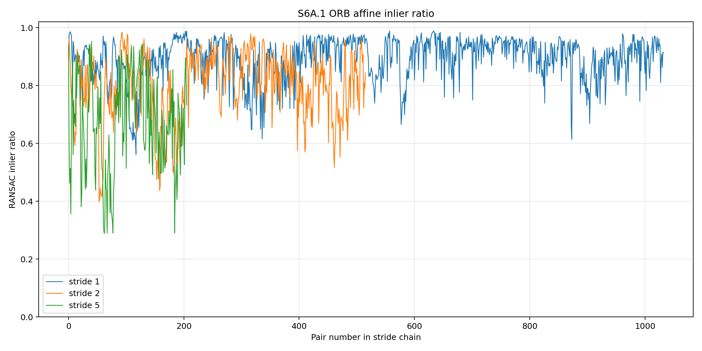

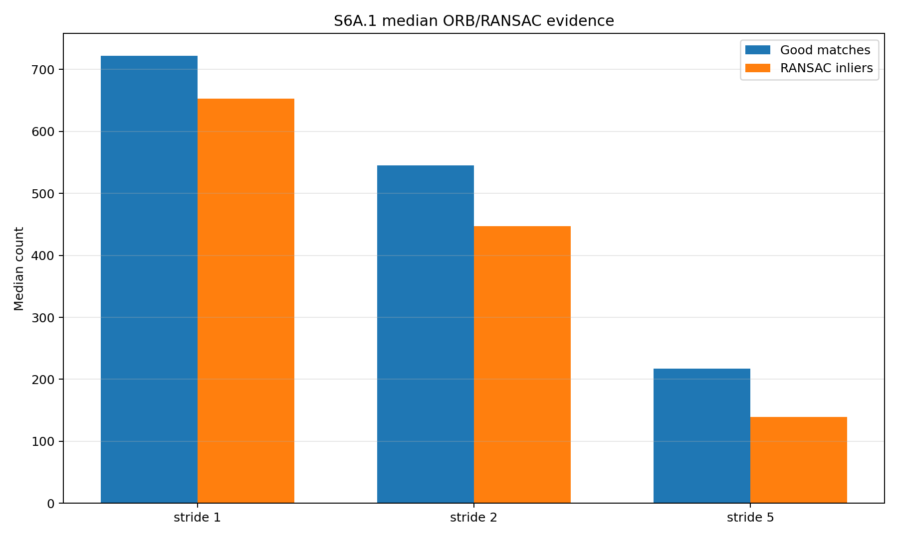

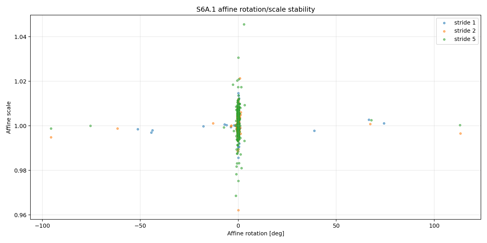

---

## 7. Relative trajectory result

Official variant:

```text
se2_scale_normalized
```

Controlled prefix-aligned result:

| Metric | Result |
|---|---:|
| RMSE | 230.19 m |
| p95 | 412.66 m |
| Maximum error | 450.89 m |
| Final error | 252.52 m |
| Final drift | approximately 2.46 m per 100 m |

The pairwise estimator remains strong while the integrated trajectory drifts. This provides the reason for adding intermittent absolute correction.

---

## 8. Safe-horizon interpretation

A simulated correction was inserted at several trajectory anchors, and the distance travelled before the relative error exceeded a budget was measured.

Representative conservative results included:

| Error budget | Conservative safe horizon |
|---|---:|
| 10 m | approximately 116 m |
| 20 m | approximately 172 m |

A broader earlier analysis also showed that position-only corrections lose accuracy sooner than position-plus-heading resets.

These are **evaluation diagnostics**, not universal online correction intervals. The final system does not know its true current error and cannot trigger directly when a ground-truth budget is crossed.

---

## 9. KLT comparison

KLT produced strong local inlier consistency but worse long-term drift. One failed pair required ORB fallback.

```text
ORB remained the official relative estimator.
```

The lesson was that excellent short-term correspondence consistency does not guarantee the best integrated trajectory.

---

# Part II — S5C Temporal Absolute Bridge

## 10. Why S5C was required

The earlier absolute benchmark used 73 development/failure-analysis frames. It was not temporally regular and could not answer:

```text
How often can the map matcher produce a useful correction?
How long are the correction blackouts?
Can map fixes appear before relative drift grows too far?
```

S5C combined every-fifth-frame sampling with the original benchmark frames and deduplicated the result.

```text
Trajectory frames:              1034
Uniform every-5 queries:         207
Existing benchmark frames:        73
Unique temporal queries:         263
```

The every-five-frame schedule is an **experiment sampling schedule**, not a frozen deployment interval.

See the separate detailed report:

```text
docs/README_s5c_temporal_absolute_benchmark.md
```

---

## 11. Absolute candidate and verifier result

Candidate generation used four full-map variants over 8,625 satellite tiles:

```text
v3_green_suppressed
v5_edge_magnitude
v8_lab_logchroma_fused
v9_canny_structure
```

The variant union and LightGlue Top-50 verifier produced:

| Stage | Result |
|---|---:|
| Union Oracle@50 availability | 102 / 263 = 38.8% |
| LightGlue selected hits | 68 / 263 = 25.9% |
| Balanced confidence gate | 33 accepted |
| Balanced true/false, evaluation only | 25 / 8 |
| Balanced precision, evaluation only | 75.8% |
| Balanced dangerous false accepts >100 m | 0 |

The main absolute bottleneck remains candidate-pool coverage: a verifier cannot recover a correct tile that is absent from the Top-50 pool.

---

# Part III — S6B Relative + Absolute Fusion

## 12. S6B.0 correction manifest

S6B.0 joined:

```text
S5C selected absolute tile
+ chosen tile map coordinates
+ online LightGlue evidence
+ confidence-gate acceptance flags
+ S6A sequence frame
+ relative trajectory state
+ reference fields marked evaluation-only
```

Frozen counts:

```text
Correction opportunities:       263
LightGlue hits, evaluation only: 68
Oracle available in pool:        102
Balanced accepted:                33
Balanced true/false:              25 / 8
Permissive accepted:              80
```

Balanced corrections were precise but sparse. The largest observed balanced correction blackout was approximately 3,016 m.

This motivated temporal confirmation: retain strong balanced observations and recover additional medium-confidence observations when nearby query frames tell a consistent movement story.

---

## 13. What temporal confirmation means

Temporal confirmation does **not** mean selecting the geographically nearest tile among the candidates of one UAV frame.

It compares observations from different UAV query frames.

For two query frames:

```text
relative displacement =
    current relative position - previous relative position

absolute displacement =
    current selected tile centre - previous selected tile centre

temporal residual =
    norm(absolute displacement - relative displacement)
```

Small residual means:

```text
ORB and the absolute observations describe similar movement.
```

Large residual means:

```text
the selected absolute observations jump in a way that contradicts
the relative motion.
```

The selected map position remains the LightGlue-selected tile centre. Sub-tile metre-level refinement was not implemented in this stage.

---

# Part IV — S6B.1 Controlled Fusion Replay

## 14. Position-only hard-reset replay

A correction preserves subsequent relative increments but changes the active global position offset.

### Baseline and confidence-gated policies

| Policy | Events | True/false | RMSE | p95 | Max | Final | Failure >40 m |
|---|---:|---:|---:|---:|---:|---:|---:|
| Relative only | 0 | — | 224.67 m | 410.89 m | 450.89 m | 252.52 m | 87.33% |
| Oracle, evaluation only | 102 | 102 / 0 | 55.07 m | 132.76 m | 158.68 m | 26.66 m | 33.46% |
| Balanced online gate | 33 | 25 / 8 | 84.56 m | 171.55 m | 222.48 m | 44.07 m | 64.60% |
| Permissive online gate | 80 | 52 / 28 | 71.22 m | 146.62 m | 212.65 m | 26.66 m | 60.93% |

Interpretation:

- Absolute position corrections strongly reduce accumulated drift.
- Balanced is safer but can leave long blackouts.
- Permissive improves coverage but admits more false corrections.
- Oracle remains imperfect because “oracle success” means the best available candidate within the 40 m criterion, not exact ground truth.

---

## 15. Correction-event impact

An accepted correction can be evaluation-labelled true and still make the current estimate worse. It may reset a 10 m relative error to a 30 m tile-centre error.

A correction labelled false by the 40 m threshold can still improve a badly drifted estimate. For example, moving from approximately 197 m error to approximately 47 m is operationally useful even though 47 m fails the 40 m success label.

Therefore:

```text
evaluation correctness
is not identical to
instant operational usefulness
```

This is why fusion requires trajectory context rather than only a fixed hit threshold.

---

## 16. Temporal-agreement diagnostics

Median lag-1 residuals separated true and false observations:

```text
Balanced true fixes:       approximately 36.7 m
Balanced false fixes:      approximately 86.2 m

Permissive true fixes:     approximately 30.2 m
Permissive false fixes:    approximately 54.2 m
```

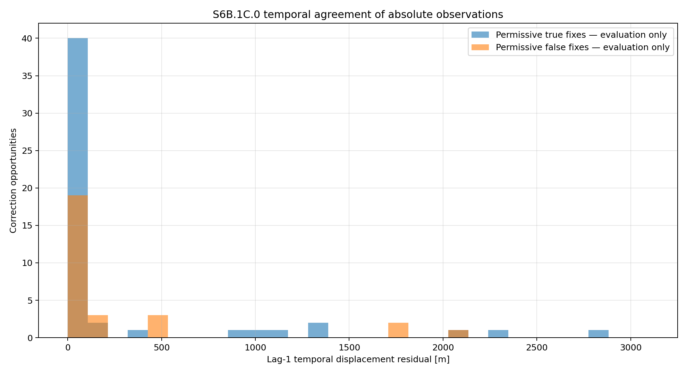

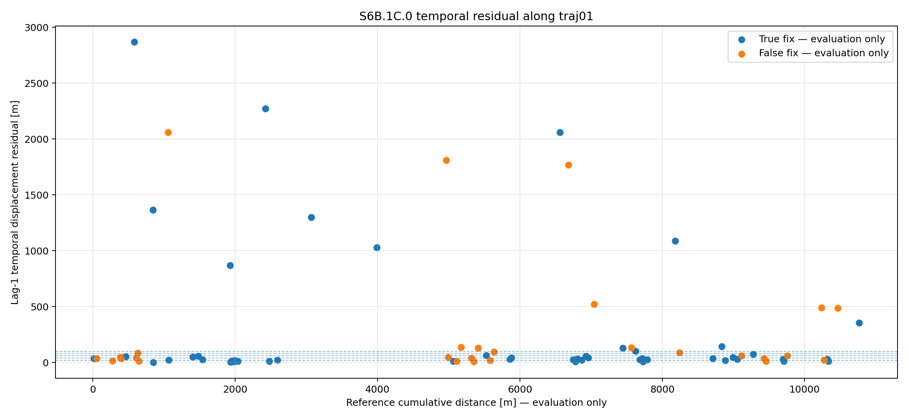

Temporal evidence was useful, but temporal-only gating discarded some strong balanced fixes. The better rule was:

```text
accept balanced
OR
accept permissive when temporally supported
```

---

## 17. Temporal hard-reset replay

| Policy | Accepted | True/false | Dangerous >100 m | RMSE | p95 | Failure >40 m |
|---|---:|---:|---:|---:|---:|---:|
| Balanced hard | 33 | 25 / 8 | 0 | 84.56 m | 171.55 m | 64.60% |
| Temporal-r40 only | 46 | 35 / 11 | 0 | 90.40 m | 178.75 m | 66.92% |
| Temporal-r60 only | 62 | 44 / 18 | 0 | 85.74 m | 175.99 m | 64.99% |
| Balanced OR temporal-r40 | 61 | 45 / 16 | 0 | 73.70 m | 158.04 m | 59.57% |
| Balanced OR temporal-r60 | 72 | 50 / 22 | 0 | 71.95 m | 146.91 m | 58.12% |

The hybrid-r60 policy nearly matched permissive aggregate performance while excluding the dangerous permissive correction observed on `traj01`.

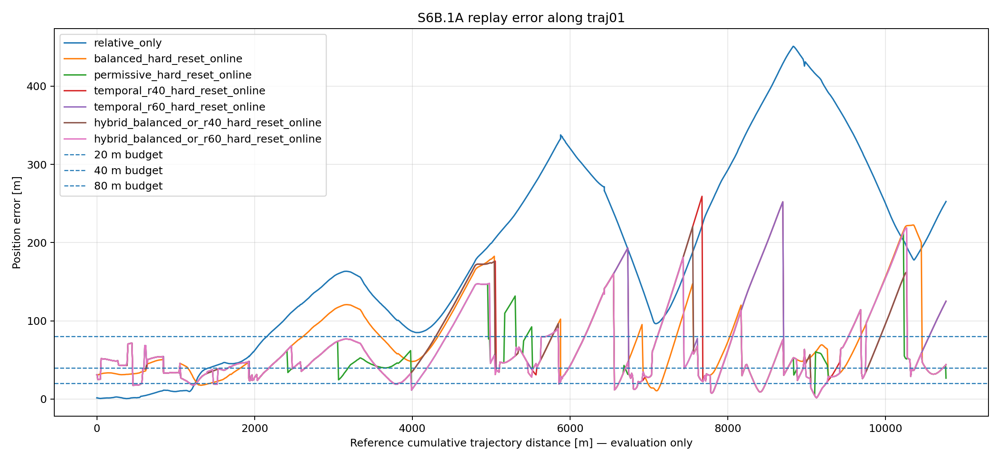

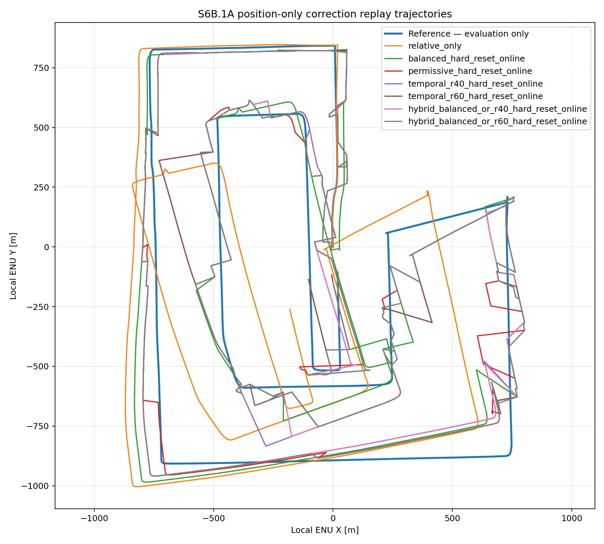

---

## 18. Controlled soft-correction sweep

The correction equation was:

```text
innovation = absolute position - current fused position
new position = current position + alpha × innovation
```

Selected results:

| Policy | Meaning | RMSE | p95 | Max | Failure >40 m |
|---|---|---:|---:|---:|---:|
| Hybrid-r60 hard | all accepted alpha 1.0 | 71.95 m | 146.91 m | 218.77 m | 58.12% |
| `b100_t075` | balanced 1.0, temporal-only 0.75 | **70.69 m** | 149.94 m | 205.95 m | 55.90% |
| `b100_t050` | balanced 1.0, temporal-only 0.50 | 71.09 m | **148.02 m** | **201.37 m** | **55.03%** |

Controlled conclusion:

```text
Performance policy: hybrid_r60_adaptive_b100_t075_online
Robust policy:      hybrid_r60_adaptive_b100_t050_online
```

This advantage was small and was later retested under causal raw mapping.

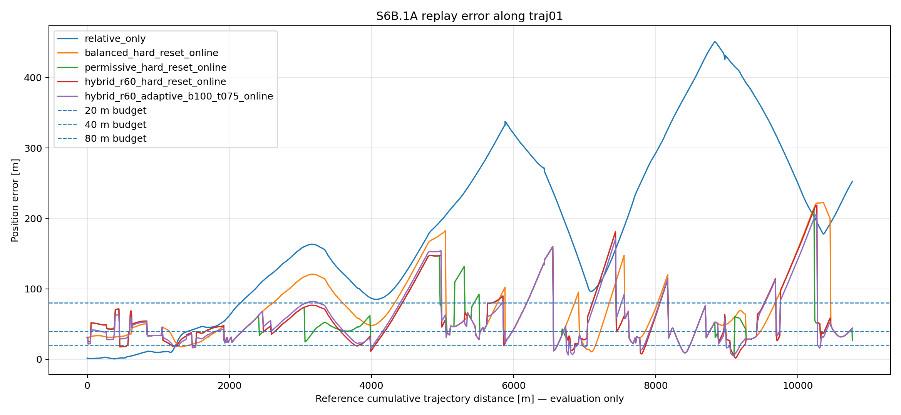

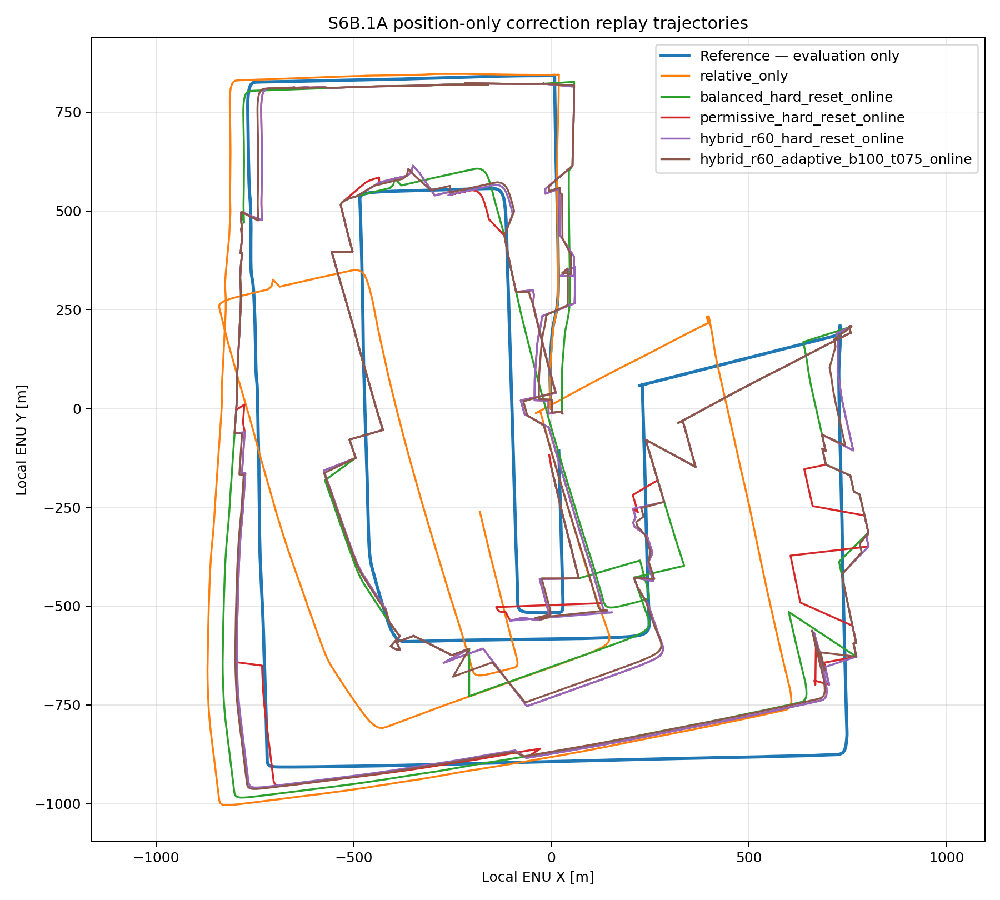

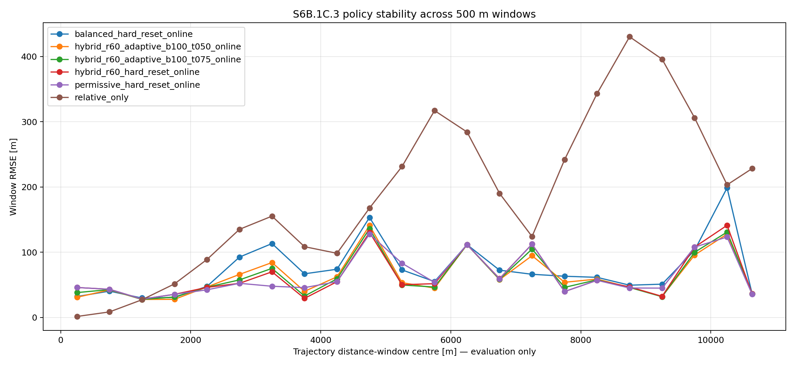

---

# Part V — S6B.2 Causal Raw Bootstrap and Fusion

## 19. Why causal bootstrap was tested

Raw ORB produces a visual trajectory with:

```text
unknown metres-per-pixel scale
unknown map orientation
unknown map translation
```

S6B.1 already had those quantities from evaluation-derived prefix alignment. S6B.2 removed that assistance.

Accepted balanced absolute observations were paired with raw visual positions. Every two-observation pair proposed a similarity transform:

```text
scale
rotation
translation
```

All causally available accepted observations then voted for the transform using map residual consensus.

---

## 20. Bootstrap preflight

```text
Raw frames:                         1034
Balanced absolute observations:       33
Two-anchor hypotheses:               519
Causal winner states:                 32
Raw/aligned visual-copy delta:         0
```

The raw visual trajectory was confirmed to be identical in the raw and aligned files. Only the later map transformation differed.

Early two-observation hypotheses were unstable because a pair always fits its own anchors. Stable multi-observation consensus emerged after several accepted observations.

---

## 21. Causal lock on traj01

The online-only lock criteria required:

```text
minimum accepted observations
minimum r60 consensus support
minimum inlier rate
bounded median and p95 residual
sufficient anchor separation
stable scale across consecutive winner states
stable circular rotation
```

Result on `traj01`:

```text
Selected after observations:       10
Lock frame:                         200
Lock token:                         201
Distance at lock, evaluation only: 1,971.589 m
Scale:                              0.270691 m/px
Rotation:                           1.670613°
Translation:                        (-44.086, 51.222) m
r60 support:                        8 / 10
Median prefix residual:             7.096 m
p95 prefix residual:                88.727 m
Scale span across lock window:      10.26%
Rotation spread:                    0.194°
```

Evaluation-only annotation showed that 8 of the 10 observations were true and 2 were false. Those labels were not used to select the transform.

These exact values are `traj01` outcomes, not universal system constants.

---

## 22. Causal operational phases on traj01

```text
Frames 0–199:
    local relative trajectory is available
    global map transform is not yet locked

Frame 200:
    causal scale, orientation and translation lock

Frames 200–1033:
    global map-frame relative–absolute fusion
    post-lock distance = 8,797.027 m
```

On another trajectory, the lock may occur earlier, later, or not at all under the frozen criteria.

---

## 23. Raw causal temporal replay

Temporal support was recomputed from the raw bootstrapped trajectory. S6B.1 temporal masks were not reused.

Raw lag-1 separation:

```text
Permissive true median residual:    31.90 m
Permissive false median residual:   76.45 m
```

Correct observations remained more motion-consistent than false observations.

### Post-lock policy comparison

| Policy | Accepted | True/false | Dangerous >100 m | RMSE | p95 | Max | Final | Failure >40 m |
|---|---:|---:|---:|---:|---:|---:|---:|---:|
| Raw relative only | 0 | — | 0 | 264.48 m | 403.85 m | 415.58 m | 241.89 m | 96.88% |
| Balanced hard | 23 | 17 / 6 | 0 | 123.44 m | 274.98 m | 325.63 m | 64.70 m | 77.34% |
| Hybrid-r60 hard | 50 | 35 / 15 | 0 | **82.55 m** | **164.92 m** | 205.31 m | 64.70 m | **70.38%** |
| Hybrid-r60 `t050` | 50 | 35 / 15 | 0 | 91.11 m | 183.47 m | 229.75 m | 64.70 m | 71.82% |
| Hybrid-r60 `t075` | 50 | 35 / 15 | 0 | 85.00 m | 170.86 m | **196.70 m** | 64.70 m | 72.90% |

The final causal result is:

```text
raw_bootstrap_hybrid_r60_hard_online
```

It reduced post-lock RMSE by approximately **68.79%** relative to raw bootstrapped relative-only.

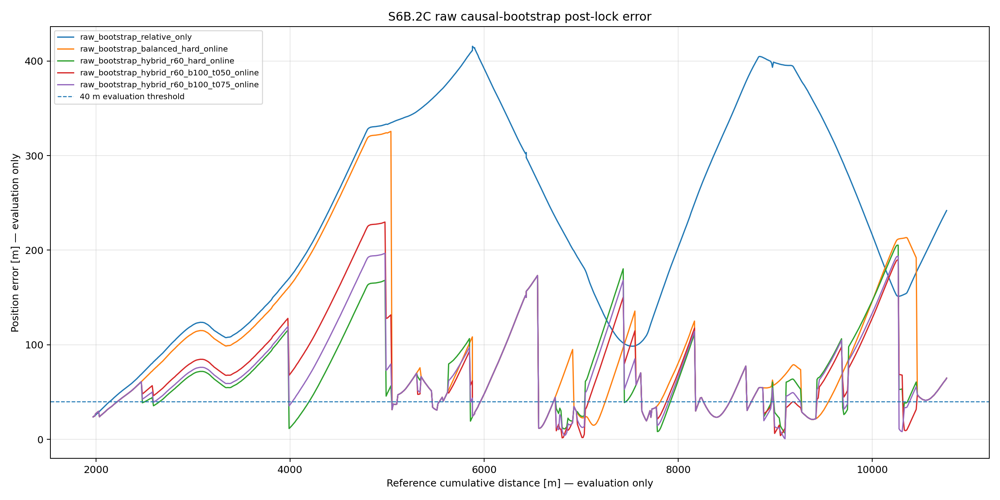

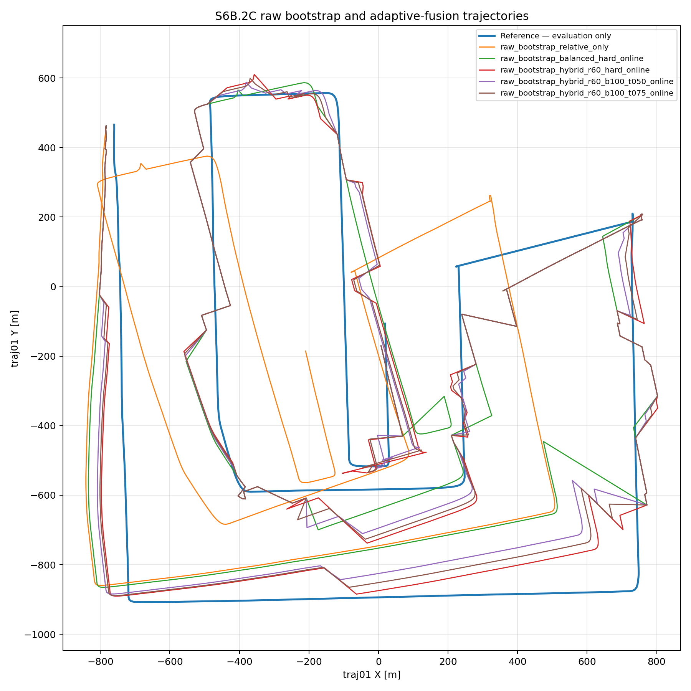

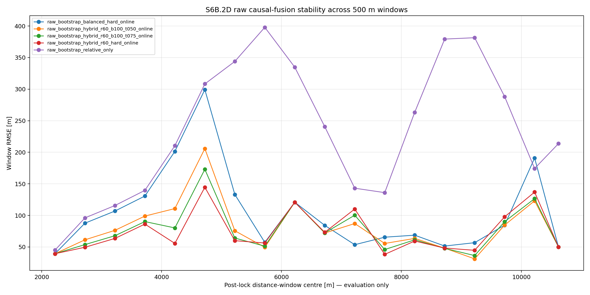

---

## 24. Why hard correction won after causal bootstrap

In the controlled replay, the relative trajectory was already well aligned to the map frame. A partial correction could protect against tile-centre noise.

In the raw causal replay, the fixed bootstrap transform accumulated larger residual map-frame drift. When the current estimate is badly displaced, a half correction leaves too much error active through subsequent frames.

Therefore:

```text
temporal consistency remained useful for deciding which fixes to accept,
but the tested fixed source-based soft weights did not beat full correction.
```

No event-by-event online mechanism was implemented to dynamically choose between half and full correction. This stage compared fixed policies:

```text
hard
temporal-only alpha 0.75
temporal-only alpha 0.50
```

A future dynamic correction strength would require an online uncertainty or innovation model.

---

# Part VI — What Is Frozen and What Is Not

## 25. Frozen development conclusion

On `traj01`:

```text
Relative ORB alone drifts strongly.
Balanced absolute corrections reduce drift.
Temporal support safely recovers additional corrections.
The hybrid-r60 accepted set performs better than balanced alone.
Under causal raw mapping, full position reset is the best tested policy.
```

Primary causal policy:

```text
raw_bootstrap_hybrid_r60_hard_online
```

Controlled soft-correction policies remain documented as ablations, not the final causal winner.

---

## 26. What the system actually knows online

The system does **not** know:

```text
its true current position error
whether a selected fix is truly within 40 m
the future safe horizon
the best correction alpha from ground truth
```

It knows:

```text
relative visual motion
absolute matcher confidence
selected map tile centre
temporal displacement agreement
whether bootstrap consensus has stabilized
```

Accordingly, the correct conceptual trigger is:

```text
attempt absolute localization on a scheduled or compute-available query
accept only when confidence is strong
or when medium confidence receives temporal support
apply the frozen correction rule
```

It is not:

```text
wait exactly N metres because the true error has reached a known threshold
```

---

## 27. Claims supported by this stage

Supported:

> On SatLoc `traj01`, an image-only ORB relative trajectory combined with confidence-gated satellite matching and temporal consistency substantially reduced position error. A causal raw visual-to-map bootstrap locked after 10 accepted balanced observations, and the post-lock hybrid-r60 hard-correction policy reduced RMSE from 264.48 m to 82.55 m over 8.80 km.

Supported:

> GNSS/reference coordinates were not used for realistic absolute retrieval, LightGlue ranking, confidence-gate acceptance, temporal acceptance, causal transform selection, or correction application.

Supported:

> Reference coordinates and success labels were used to evaluate and compare the generated trajectories.

Not supported yet:

```text
The system always locks after 10 observations.
The system always locks after 2 km.
The r60 threshold is universally optimal.
Hard reset is universally better than soft correction.
The reported performance generalizes to traj02/traj03.
The selected tile centre gives metre-level sub-tile localization.
```

---

## 28. Remaining limitations

1. **Single development trajectory.**  
   Exact thresholds and timing remain `traj01`-specific until frozen-policy validation.

2. **Candidate-pool ceiling.**  
   Current union Oracle@50 availability is only 38.8%.

3. **Tile-centre position.**  
   No LightGlue-geometric sub-tile coordinate refinement was applied.

4. **Position-only correction.**  
   Absolute heading correction was not available online.

5. **Fixed bootstrap transform.**  
   Scale/orientation are locked rather than slowly updated with uncertainty.

6. **No event-wise alpha controller.**  
   Hard and fixed soft policies were compared; dynamic selection was not implemented.

7. **No real-time benchmark yet.**  
   LightGlue Top-50 processing remains computationally expensive.

8. **Ground truth still required for evaluation.**  
   This is correct experimental practice; it is hidden from realistic policy decisions but needed to measure accuracy.

---

## 29. Decision: close this experimental stage

The stage already demonstrates:

```text
relative localization
absolute map localization
confidence gating
temporal consistency
drift correction
causal map-frame bootstrap
accuracy evaluation
failure analysis
limitations and production recommendations
```

Further work should be treated as a new block rather than extending S6B indefinitely:

```text
candidate-generation improvement
rotation-aware/local-verifier improvement
sub-tile geometric refinement
visual presentation and map animation
frozen validation on another trajectory
runtime optimization
```

---

# Part VII — Reproduction Commands

## 30. Environment

```bash
cd /Users/harishprabhu/Documents/drone-localisation

source .drone_venv/bin/activate
export PYTHONPATH=$PWD/src
```

---

## 31. Core S6A commands

The exact options are preserved in the scripts and reports. The stage was executed through the following core programs:

```bash
python scripts/satloc/s6a/s6a_1_orb_affine_stride_diagnostics.py

python scripts/satloc/s6a/s6a_2_orb_relative_trajectory.py

python scripts/satloc/s6a/s6a_3_rolling_anchor_safe_horizon.py

python scripts/satloc/s6a/s6a_4a_klt_relative_motion_comparison.py
```

---

## 32. S6B.0 correction manifest

```bash
python scripts/satloc/s6b/s6b_0_absolute_correction_manifest.py \
  2>&1 | tee \
  outputs/satloc/reports/s6b_relative_absolute/s6b0_absolute_correction_manifest.log
```

---

## 33. S6B.1 controlled replay commands

```bash
python scripts/satloc/s6b/s6b_1a_position_only_correction_replay.py \
  2>&1 | tee \
  outputs/satloc/reports/s6b_relative_absolute/s6b1a_position_only_correction_replay.log
```

```bash
python scripts/satloc/s6b/s6b_1c0_temporal_agreement_diagnostics.py \
  2>&1 | tee \
  outputs/satloc/reports/s6b_relative_absolute/s6b1c0_temporal_agreement.log
```

```bash
python scripts/satloc/s6b/s6b_1c1_temporal_hard_reset_replay.py \
  2>&1 | tee \
  outputs/satloc/reports/s6b_relative_absolute/s6b1c1_temporal_hard_reset_replay.log
```

```bash
python scripts/satloc/s6b/s6b_1c2_adaptive_soft_correction_sweep.py \
  2>&1 | tee \
  outputs/satloc/reports/s6b_relative_absolute/s6b1c2_adaptive_soft_correction_sweep.log
```

```bash
python scripts/satloc/s6b/s6b_1c3_policy_robustness_closeout.py \
  2>&1 | tee \
  outputs/satloc/reports/s6b_relative_absolute/s6b1c3_policy_robustness_closeout.log
```

---

## 34. S6B.2 causal replay commands

```bash
python scripts/satloc/s6b/s6b_2a_raw_bootstrap_preflight.py \
  2>&1 | tee \
  outputs/satloc/reports/s6b_relative_absolute/s6b2a_raw_bootstrap_preflight.log
```

```bash
python scripts/satloc/s6b/s6b_2b_causal_bootstrap_lock_selection.py \
  2>&1 | tee \
  outputs/satloc/reports/s6b_relative_absolute/s6b2b_causal_bootstrap_lock_selection.log
```

```bash
python scripts/satloc/s6b/s6b_2c_raw_causal_adaptive_fusion_replay.py \
  2>&1 | tee \
  outputs/satloc/reports/s6b_relative_absolute/s6b2c_raw_causal_adaptive_fusion_replay.log
```

```bash
python scripts/satloc/s6b/s6b_2d_raw_causal_fusion_closeout.py \
  2>&1 | tee \
  outputs/satloc/reports/s6b_relative_absolute/s6b2d_raw_causal_fusion_closeout.log
```

---

# Part VIII — Output Inventory

## 35. Main S6B metadata

```text
outputs/satloc/metadata/s6b_relative_absolute/
```

Important files include:

```text
s6b0_absolute_correction_manifest.csv
s6b1a_position_only_correction_events.csv
s6b1c0_temporal_agreement_diagnostics.csv
s6b1c0_temporal_confirmation_policy_sweep.csv
s6b1c1_temporal_hard_reset_metrics.csv
s6b1c2_adaptive_soft_metrics.csv
s6b1c3_policy_window_summary.csv
s6b1c3_policy_selection_summary.csv
s6b1c3_event_source_summary.csv
s6b2a_raw_bootstrap_causal_winners.csv
s6b2b_bootstrap_lock_stability.csv
s6b2b_selected_bootstrap_transform.json
s6b2c_raw_causal_fusion_metrics.csv
s6b2d_raw_policy_window_summary.csv
s6b2d_raw_event_source_summary.csv
s6b2d_controlled_vs_raw_comparison.csv
s6b2d_raw_policy_selection.csv
```

Large trajectory/candidate CSVs remain in `outputs/` and do not need to be committed to `docs/assets`.

---

## 36. Main reports

```text
outputs/satloc/reports/s6b_relative_absolute/
```

Key summaries:

```text
s6b0_absolute_correction_manifest_summary.json
s6b1c0_temporal_agreement_summary.json
s6b1c1_temporal_hard_reset_summary.json
s6b1c2_adaptive_soft_summary.json
s6b1c3_policy_robustness_summary.json
s6b2a_raw_bootstrap_preflight_summary.json
s6b2b_causal_bootstrap_lock_summary.json
s6b2c_raw_causal_fusion_summary.json
s6b2d_raw_causal_fusion_closeout_summary.json
```

---

# 37. Final one-paragraph result

The SatLoc S6 stage established a complete relative–absolute localization demonstrator on `traj01`. ORB provided stable consecutive-frame motion but accumulated substantial long-term drift. Full-map multi-variant retrieval and LightGlue supplied intermittent satellite tile observations, while confidence gating and temporal displacement agreement filtered corrections. In controlled replay, temporal hybrid correction reduced RMSE from 224.67 m to approximately 70–72 m. A stronger raw causal replay then estimated the visual-to-map transformation from accepted absolute observations without using reference coordinates for the lock decision. After locking at frame 200 on `traj01`, the hybrid-r60 hard-correction policy reduced post-lock RMSE from 264.48 m to 82.55 m over 8.80 km. Ground truth remained hidden from realistic retrieval, acceptance, bootstrap and correction decisions and was used only to evaluate the resulting trajectories.
