# Villoc 90° Nadir Localization — S8.11A.0 to S8.12C.1 Closeout

**Project:** GNSS-denied / weak-GNSS UAV visual localization  
**Dataset:** Villoc, Vilnius, visible RGB, approximately 90° nadir view  
**Stage covered:** `S8.11A.0` → `S8.12C.1`  
**Immediate next experiment:** causal previous-frame + current-frame nadir context with DINOv2 and explicit relative-altitude analysis

---

## 1. Executive conclusion

This block converted the validated Villoc map/query benchmark into a learned
retrieval and geometric-verification benchmark.

```text
115 nadir UAV queries
        ↓
DINOv2 ViT-S/14 descriptor cache
        ↓
three independent satellite tile databases
        ↓
independent Recall@K evaluation
        ↓
1024_s512 Top-20 candidate pool
        ↓
LightGlue/SuperPoint geometric verification
        ↓
center-only context-scale diagnostic
        ↓
scale + directional spatial multi-crop diagnostic
```

The strongest retrieval result was not Top-1 localization. It was **candidate
availability**:

```text
1024_s512 oracle Recall@20: 113 / 115 = 98.26%
any database oracle within Top-20: 115 / 115 = 100%
```

However, Top-1 tile-center error remained hundreds of metres. This establishes
a clear separation:

```text
candidate generation is largely capable of finding the correct neighbourhood

but

single-frame ranking and final geometric selection remain ambiguous
```

The three-query LightGlue and multi-crop studies then showed:

- query 52 succeeds because the zebra crossing, road and surrounding layout
  form many coherent correspondences;

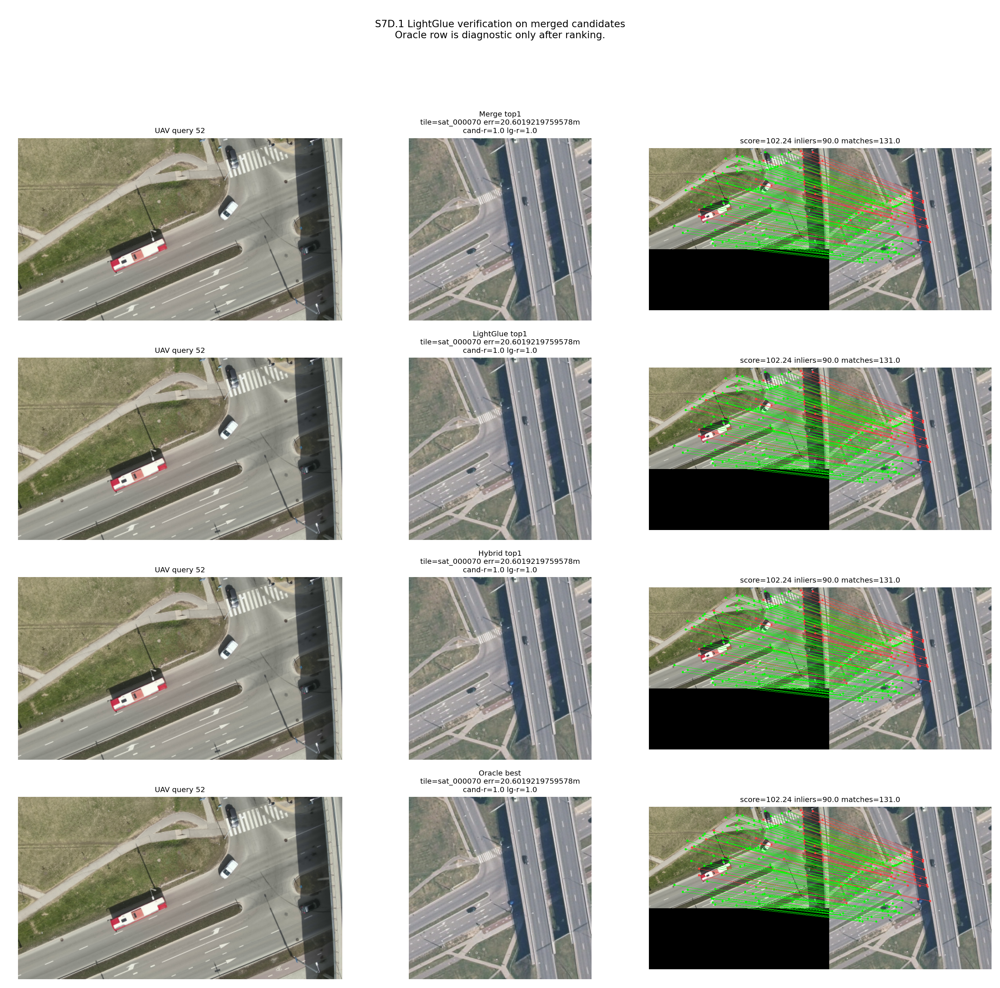

- query 23 can retain a correct tile near the top despite a large apparent
  road-orientation difference, so rotation alone is not the dominant failure;

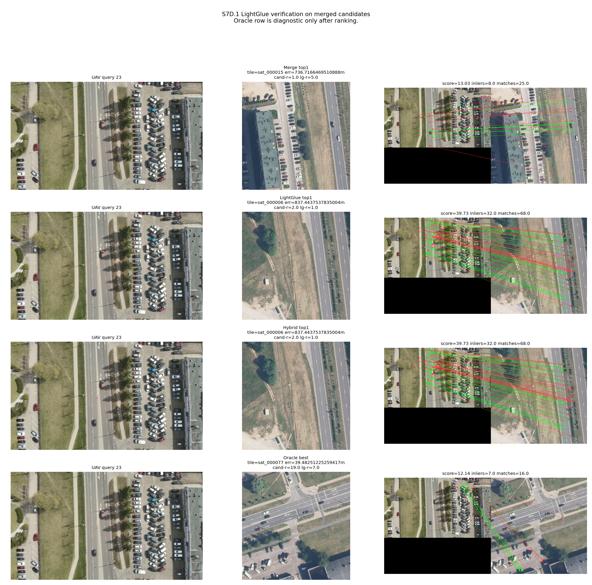

- query 33 contains usable geometric evidence, but scale/context placement and
  tile-center evaluation remain unfavorable;

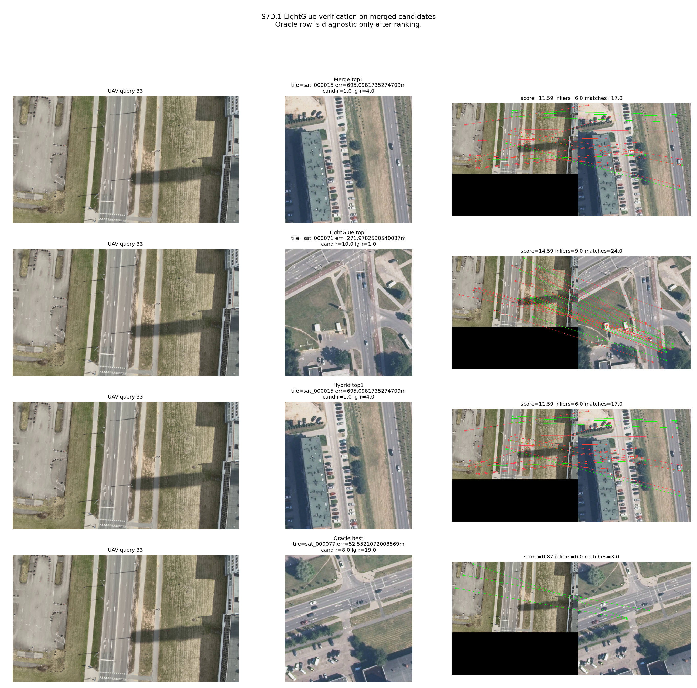

- searching more crops raises oracle evidence, but also raises the chance that
  a repeated non-oracle structure obtains the maximum score.

Therefore the decision is:

> Stop enlarging the independent crop bank. Increase UAV-side causal context,
> preserve heading as a separately calibrated runtime variable, and evaluate
> consistency rather than accepting the maximum score from one crop.

---

## 2. Scope and frozen prerequisites

S8.11 starts from the accepted S8.10 geometric benchmark:

```text
Queries:                 115
Sampling:                1 fps
Visible stream:          V
View:                    approximately nadir, pitch median ≈ -89.90°
Relative-altitude range: 23.52–70.06 m
Yaw range:               -8.80°–178.70°
Trajectory length:       approximately 748 m
Map:                     ORT10LT 2024–2026
Map resolution:          0.20 m/pixel
Map status:              PASS_TILE_INDEX_INTEGRITY
Oracle status:           PASS_UAV_TILE_ORACLE_AUDIT
```

### 2.1 Frozen tile databases

| Variant | Tiles | Tile footprint | Center spacing | Overlap/oracle behavior |
|---|---:|---:|---:|---|
| `512_s256` | 475 | 102.4 m | 51.2 m | smaller context, 4 oracle tiles/query |
| `1024_s512` | 108 | 204.8 m | 102.4 m | larger context, 4 oracle tiles/query |
| `1024_s256` | 391 | 204.8 m | 51.2 m | larger context, dense overlap, 16 oracle tiles/query |

### 2.2 Non-negotiable leakage rule

The following are evaluation-only:

```text
latitude / longitude
EPSG:3346 coordinates
ENU coordinates
oracle tile IDs
center-error labels
relative-altitude outcome analysis
```

They may be used for identity, audit, visualization and evaluation after
ranking. They must not enter descriptor generation, visual similarity,
LightGlue scoring or final visual selection.

---

## 3. Stage status

| Stage | Block | Status | Closeout |
|---|---|---|---|
| S8.11A.0 | source/path/environment inspection | complete | schemas, local checkpoint, CPU device and leakage boundary confirmed |
| S8.11A.1 | DINOv2 smoke/protocol | pass | ViT-S/14, 224 px, center-square, average-patch descriptor |
| S8.11B | map descriptor caches | `PASS_DESCRIPTOR_CACHES_BUILT` | three map variants cached independently |
| S8.11C | UAV query cache | `PASS_DESCRIPTOR_CACHES_BUILT` | 115 queries cached once |
| S8.11D | independent retrieval | complete | high Top-20 availability; weak Top-1 localization |
| S8.12A | LightGlue preflight | pass | `1024_s512@20`, 115 queries, 2,300 planned pairs |
| S8.12B.0 | three-query LightGlue smoke | complete | Q23/Q33/Q52 expose three different failure modes |
| S8.12C.0 | center-only context-scale sweep | complete | useful for Q52, not robust across Q23/Q33 |
| S8.12C.1 | scale + directional multi-crop | `PASS_SPATIAL_MULTICROP_ORACLE_NEAR_TOP` | 600 pairs; fused Top-1 oracle 2/3 |

---

## 4. S8.11A.0 — Preflight, source reuse and protocol boundary

### 4.1 Input schemas

Canonical query manifest:

```text
outputs/villoc/90_deg/metadata/
s8_10b_canonical_uav_query_manifest.csv
```

Shape:

```text
115 rows × 17 columns
```

Important fields:

```text
query_id
token0_id
frame_index
source_frame_cnt
image_path
timestamp_s
yaw_deg
pitch_deg
relative_altitude_m
canonical_query_filename
```

Model-input allowlist:

```text
query_id
token0_id
image_path
canonical_query_filename
```

Coordinate and oracle fields remained outside the descriptor input.

### 4.2 Reused DINOv2 implementation

The Villoc block reused the established SatLoc DINOv2 architecture rather than
creating a disconnected extractor:

```text
scripts/satloc/s7b/s7b_1_dinov2_global_baseline.py
```

Recorded source fingerprint prefix:

```text
SHA256: 74fdf6b6b75aa92b
```

Relevant implementation capabilities:

```text
DinoExtractor
DescriptorCache
forward_features
average patch-token pooling
L2 normalization
cosine/dot-product retrieval
compressed NPZ caches
row-ID/path alignment metadata
```

### 4.3 Environment

```text
Python:       3.10.13
Torch:        2.2.2
Torchvision:  0.17.2
NumPy:        1.26.4
Pandas:       2.2.2
Pillow:       12.2.0
scikit-learn: 1.4.2
CUDA:         unavailable
MPS runtime:  unavailable
Selected:     CPU
```

Local offline model assets were present:

```text
~/.cache/torch/hub/facebookresearch_dinov2_main
~/.cache/torch/hub/checkpoints/dinov2_vits14_pretrain.pth
checkpoint size: approximately 84.19 MB
```

The preflight performed no network download and extracted no descriptors.

Source record:

```text
source_records/s8_11a0_preflight_terminal.txt
```

---

## 5. S8.11B/C — Descriptor caches

### 5.1 Frozen model identity

```text
model:       dinov2_vits14
input:       224 × 224
crop mode:   center_square
pooling:     average normalized patch tokens
normalizing: L2
retrieval:   cosine similarity / normalized dot product
```

Run identity used in this block:

```text
dinov2_vits14_img224_center_square_avgpatch
```

### 5.2 Cache families

Separate map caches were built for:

```text
512_s256     — 475 descriptors
1024_s512    — 108 descriptors
1024_s256    — 391 descriptors
```

A single query cache was built for:

```text
Villoc V 1 fps — 115 descriptors
```

Each cache must preserve:

```text
descriptor row i
↔ stable query/tile ID i
↔ image path i
↔ model/transform identity
↔ source-table hash
```

This alignment is essential. A numerically valid descriptor matrix is unusable
if its row order can no longer be traced to the source IDs.

---

## 6. S8.11D — Independent multi-scale DINOv2 retrieval

### 6.1 Results

| Variant | R@1 | R@5 | R@10 | R@20 | R@50 | Median first oracle rank | Median Top-1 center error | Top-1 center RMSE |
|---|---:|---:|---:|---:|---:|---:|---:|---:|
| `512_s256` | 12/115 (10.43%) | 49/115 (42.61%) | 70/115 (60.87%) | 101/115 (87.83%) | 114/115 (99.13%) | 8 | 266.04 m | 350.48 m |
| `1024_s512` | 22/115 (19.13%) | 63/115 (54.78%) | 90/115 (78.26%) | 113/115 (98.26%) | 115/115 (100%) | 3 | 212.87 m | 302.83 m |
| `1024_s256` | 27/115 (23.48%) | 52/115 (45.22%) | 65/115 (56.52%) | 74/115 (64.35%) | 114/115 (99.13%) | 8 | 271.71 m | 331.56 m |

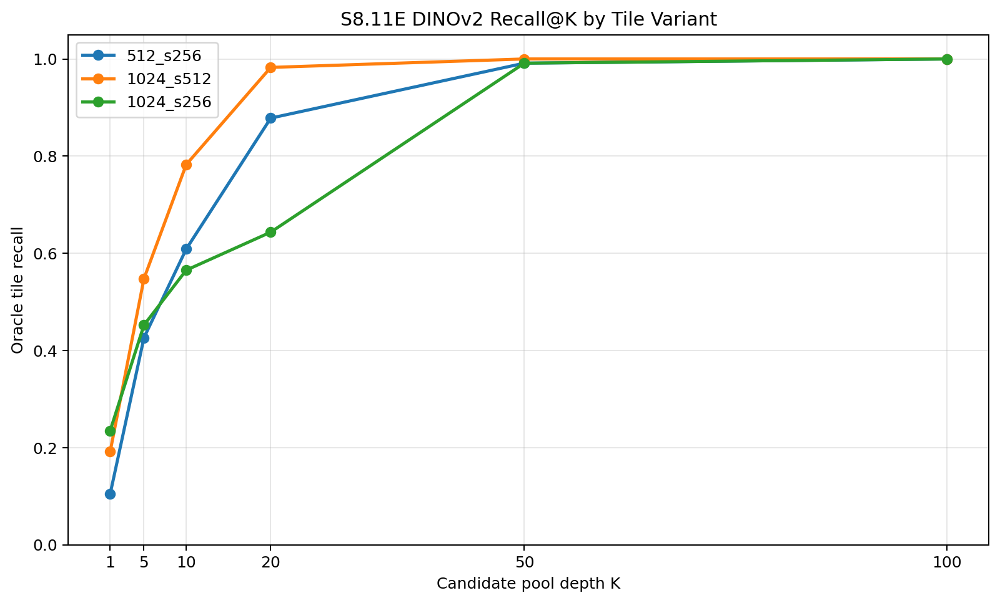

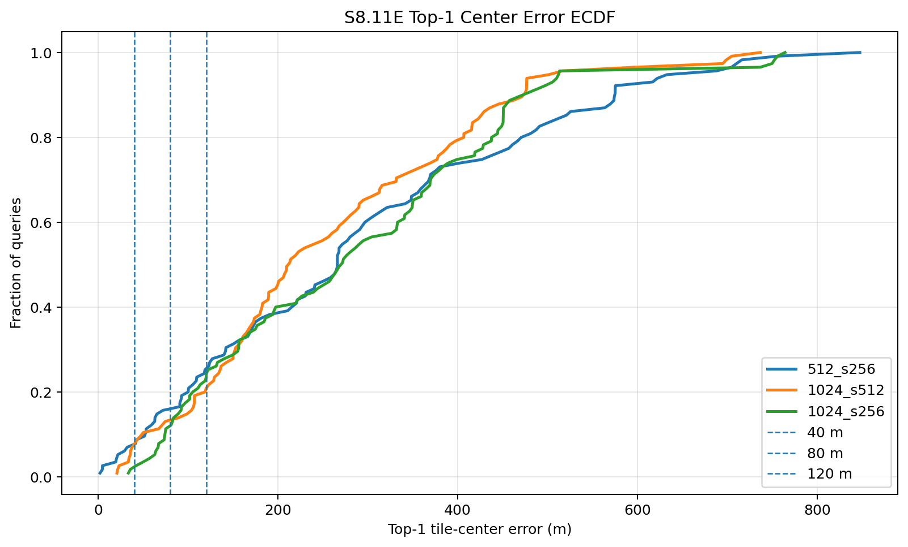

Machine-readable table:

```text
tables/s8_11d_retrieval_summary.csv
```

### 6.2 What the scale comparison means

#### `512_s256` versus `1024_s256`

Same center spacing, different footprint:

```text
small local detail
versus
large contextual tile
```

The dense 1024 database has the best R@1, but its R@20 is much weaker than the
coarser 1024_s512 database. Dense overlap creates many highly similar adjacent
large tiles, which can divide the oracle mass across more competing entries.

#### `1024_s512` versus `1024_s256`

Same footprint, different center density:

```text
coarse contextual lattice
versus
dense contextual lattice
```

`1024_s512` is the strongest verifier candidate pool because it places 113/115
queries inside Top-20 with only 108 map entries.

#### Multi-database union

```text
any variant oracle within Top-20: 115 / 115
```

This means every query has correct map evidence available somewhere in the combined shortlists.

### 6.3 Main retrieval conclusion

```text
High Recall@20
+
large Top-1 metric error
=
correct neighbourhood is often available, but not reliably selected
```

Therefore, the next bottleneck is not simply “search more tiles.” It is:

```text
distinguish the true coherent scene from visually repeated alternatives
```

---

## 7. S8.12A — LightGlue verifier preflight

The primary geometric-verification pool was frozen as:

```text
map database: 1024_s512
candidate depth: Top-20
queries: 115
planned pairs: 115 × 20 = 2,300
```

Environment:

```text
Python 3.10.13
Torch 2.2.2
CUDA: false
MPS: false
selected device: CPU
```

The purpose of LightGlue was not to recover a tile absent from retrieval. It was
to rerank candidates already inside the visual pool using local feature and
geometric evidence.

---

## 8. S8.12B.0 — Three-query LightGlue smoke

The smoke set intentionally represented three difficulty levels:

```text
Q52 — easy
Q33 — middle
Q23 — hard
```

### 8.1 Oracle membership and rank behavior

| Query | Role | First oracle DINO rank | Oracle DINO ranks | Oracle LightGlue ranks | Minimum oracle center error | ≤40 m? |
|---:|---|---:|---|---|---:|---|
| 23 | hard | 18 | 18, 19 | 1, 9 | 39.483 m | yes |
| 33 | middle | 4 | 4, 7, 8, 12 | 1, 5, 11, 18 | 52.552 m | no |
| 52 | easy | 1 | 1, 4, 8, 17 | 3, 5, 7, 10 | 20.602 m | yes |

### 8.2 Oracle versus non-oracle geometry

| Group | Homography success | Median matches | Median inliers | Median LG score | Geometry-gate rate |
|---|---:|---:|---:|---:|---:|
| oracle | 1.00 | 19.5 | 6.0 | 11.736 | 0.20 |
| non-oracle | 0.94 | 15.0 | 5.0 | 10.293 | 0.06 |

The oracle group is better on average, but the distributions still overlap.
Repeated roads, boundaries and vegetation can create plausible false geometry.

### 8.3 Query-specific interpretation

#### Query 52 — coherent geometry

The UAV image contains a distinctive combination:

```text
zebra crossing
road orientation and width
junction/edge layout
surrounding spatial arrangement
```

These cues produce many mutually consistent correspondences rather than one or
two isolated matches. Query 52 therefore became the reference success case.

#### Query 23 — orientation did not completely fail

The road orientations between UAV and satellite appear close to perpendicular,
yet the correct tile still reached the candidate set and was promoted by
LightGlue. Therefore:

```text
rotation sensitivity exists
but
rotation alone cannot explain the remaining failure
```

The more important issue is that a non-oracle repeated structure can produce
stronger aggregate evidence.

#### Query 33 — context placement and metric definition

The correct region is available early, but the useful area lies unfavorably
inside the large tile and the minimum tile-center error is above 40 m. This
motivated context-scale and spatial-position diagnostics rather than immediately
adding a new structural descriptor.

Machine-readable tables:

```text
tables/s8_12b_smoke_summary.csv
tables/s8_12b_geometry_audit.csv
```

---

## 9. S8.12C.0 — Center-only multi-scale context sweep

Satellite context scales tested:

```text
100%
75%
60%
45%
30%
```

This block tested whether the UAV-to-satellite footprint mismatch could be
reduced by retaining progressively smaller central portions of the same
candidate tile.

### 9.1 Result

- query 52 improved when the candidate was restricted toward its distinctive
  crossing/road area;

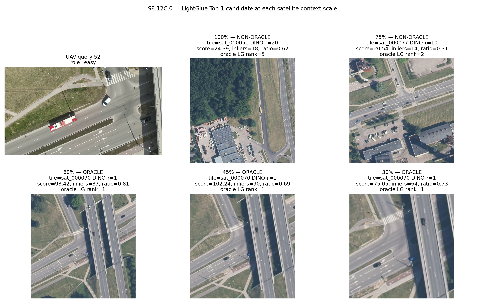

- query 23 lost useful surrounding context under tighter center crops;

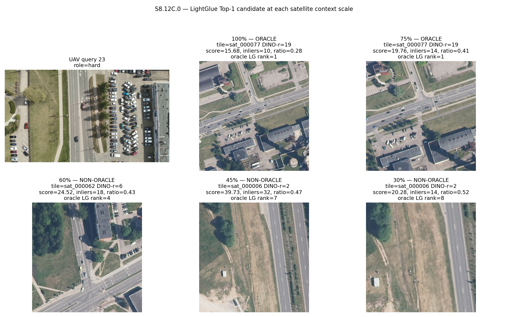

- query 33 lost structures located away from the tile center;

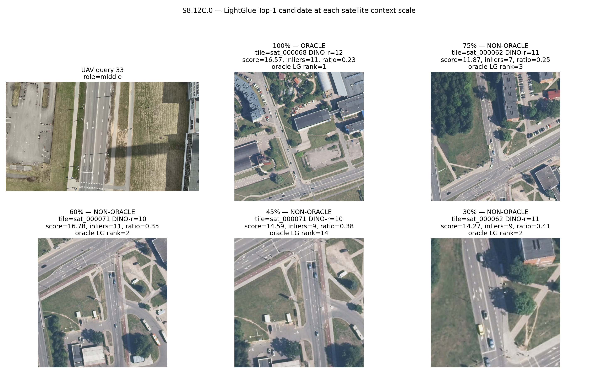

- no single center-only scale generalized across all three queries.

### 9.2 Decision

```text
scale hypothesis: partly supported
center-only crop policy: insufficient
```

The next diagnostic added directional crop positions while preserving candidate
identity.

---

## 10. S8.12C.1 — Spatial multi-crop LightGlue diagnostic

### 10.1 Experimental design

For each of the 20 DINO candidates of Q23, Q33 and Q52:

```text
scales:    60%, 45%
positions: north, south, east, west, centre
```

Total geometric comparisons:

```text
3 queries × 20 candidates × 2 scales × 5 positions = 600 pairs
```

Each tile received its maximum score across its crop variants and tiles were
reranked by that fused score.

### 10.2 Query-level result

| Query | Role | Fused Top-1 oracle? | Top crop | Top score | Top inliers | Best oracle fused rank | Best oracle crop | Oracle margin |
|---:|---|---|---|---:|---:|---:|---|---:|
| 23 | hard | no | 45% centre | 33.238 | 26 | 3 | 45% north | -7.108 |
| 33 | middle | yes | 60% east | 20.859 | 15 | 1 | 60% east | +0.494 |
| 52 | easy | yes | 60% centre | 98.417 | 87 | 1 | 60% centre | +58.071 |

Final run status:

```text
STATUS: PASS_SPATIAL_MULTICROP_ORACLE_NEAR_TOP
FUSED TOP-1 ORACLE: 2 / 3
DIRECTION HYPOTHESIS: 2 / 3
```

### 10.3 Directional oracle responses

#### Query 23

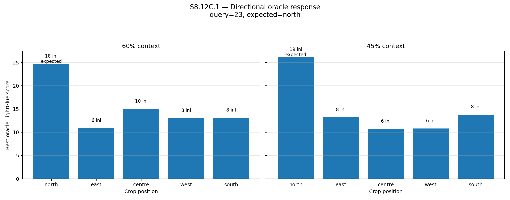

The expected northern crop gives the strongest oracle response, but a non-oracle
45% center crop still scores approximately 7.11 points higher. The oracle is
near the top, yet max fusion selects the wrong repeated structure. The below figure shows tiles of all direction shifted and searched to find candidate.

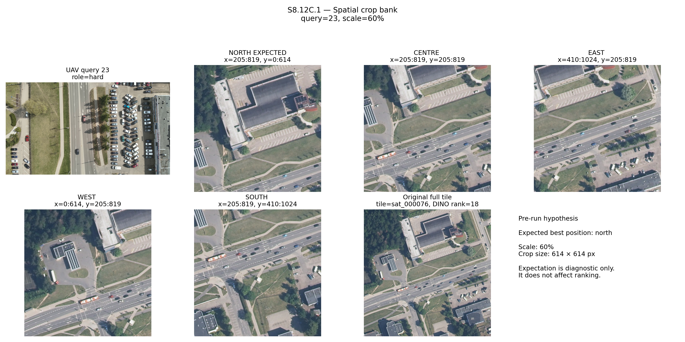

#### Query 33

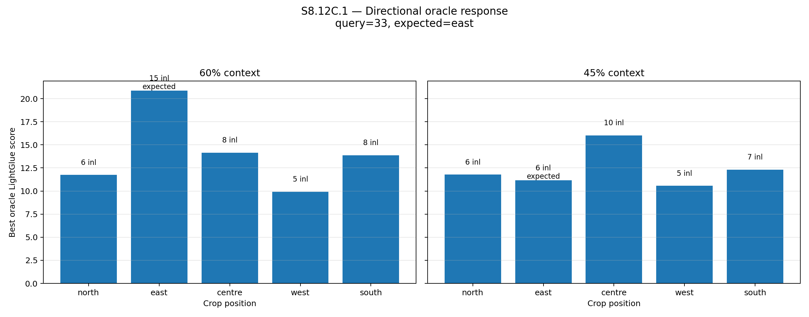

The 60% east crop matches the expected direction and moves the oracle to Top-1.
The positive margin is small, so the result is correct but not strongly
separated. The below figure shows tiles of all direction shifted and searched to find candidate.

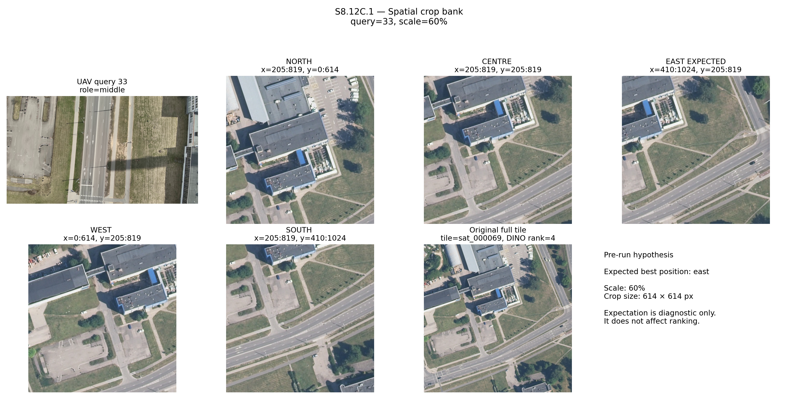

#### Query 52

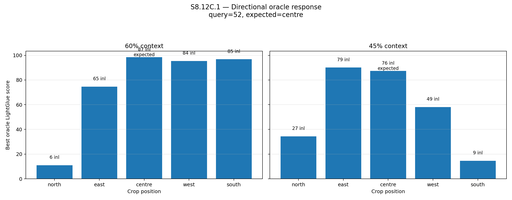

The 60% center crop produces a very large coherent response: 87 inliers and a
large positive oracle margin. Several nearby crops also remain strong, showing
that the result is supported by a spatial neighborhood rather than a single
fragile point. The below figure shows tiles of all direction shifted and searched to find candidate.

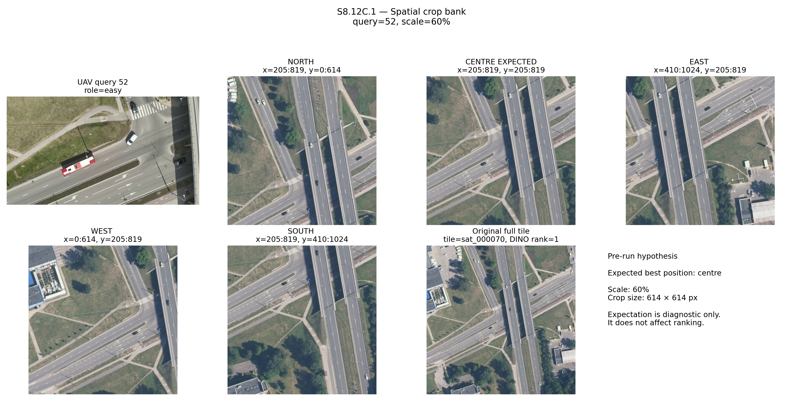

### 10.4 Main C.1 conclusion

The experiment confirms that the correct area can be recovered by changing
context position, but it also exposes a multiple-hypothesis problem:

```text
more crops
→ more chances to reveal the oracle
→ more chances for a repeated false structure to win by maximum score
```

Therefore the next step should not be an even larger crop bank. It should use:

```text
causal temporal context
multi-observation agreement
heading-aware consistency
confidence based on persistence, not one maximum
```

Exact terminal record:

```text
source_records/s8_12c1_spatial_multicrop_terminal.txt
```

Machine-readable tables:

```text
tables/s8_12c1_query_summary.csv
tables/s8_12c1_directional_oracle_response.csv
```

---

## 11. Important interpretations established

### 11.1 The primary bottleneck is context distinctiveness

The satellite candidate often covers a much larger geographic area than one UAV
frame. A single nadir image may contain only:

```text
generic road segment
tree boundary
roof edge
open ground
repeated urban texture
```

The satellite tile contains the larger arrangement, but the small UAV crop may
not expose enough of that arrangement to identify it uniquely.

### 11.2 Rotation is not dismissed, but it is not the whole failure

Q23 proves that learned retrieval and local matching can preserve the correct
candidate despite a strong apparent orientation difference. Heading alignment
may improve consistency and simplify directional reasoning, but it should not be
presented as a complete solution to repeated-structure VPR.

### 11.3 Query 52 is a configuration success, not merely a feature-count success

Its zebra crossing and road layout create a spatially coherent set of matches.
The research question is therefore:

> How can other frames expose a similarly distinctive configuration?

The immediate answer to test is to increase UAV-side causal field of view with a
past frame, rather than adding another handcrafted descriptor.

### 11.4 Tile-center error is not identical to visual correctness

Large tiles and coarse center spacing can produce a correct containing tile with
a center farther than 40 m from the UAV reference point. Keep both:

```text
oracle containment / oracle rank
and
tile-center metric error
```

Do not collapse them into one label.

### 11.5 Relative altitude may explain context availability

The Villoc sequence spans approximately 23.52–70.06 m relative altitude. The
visible footprint and object scale change across this range. Retrieval should be
analyzed as a function of altitude before choosing an operational height for
Vilnius.

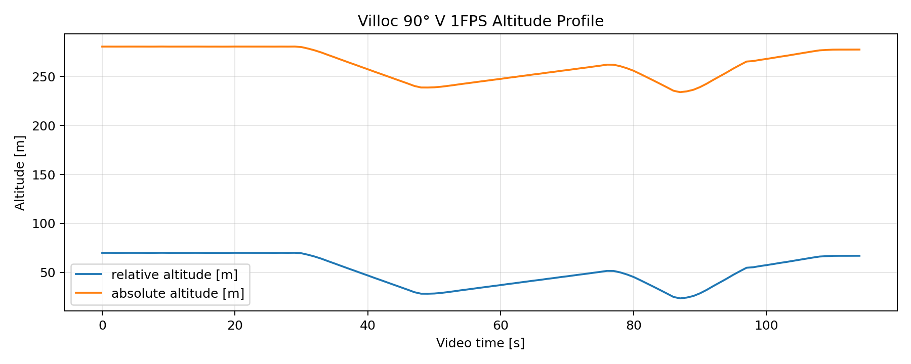

---

## 12. Ideas explored and their current disposition

| Idea | Current decision | Reason |
|---|---|---|
| larger independent crop bank | stop | raises both oracle evidence and false maximum opportunities |
| PHOG/LSD revisit | defer | SatLoc already showed structural descriptors were not the main bottleneck |
| fixed pre-rotated map cache bank | reject | user concept is one live, yaw-conditioned map canvas, not stored orientation copies |
| dynamic heading-aligned map canvas | preserve as separate controlled block | useful for runtime directional consistency; requires startup camera/yaw calibration |
| previous + current nadir frame | immediate next experiment | directly tests whether increased UAV context improves DINO ranking |
| 45° near/far view integration | later | valuable, but adds cross-view perspective and synchronization complexity |
| raw 45°+90° single homography | reject | mixed viewpoints are not one planar image geometry |
| descriptor/score-level temporal fusion | include as control | separates “more evidence” from pixel-canvas effects |

---

## 13. Heading-aligned dynamic cached-map concept — preserved for a later controlled block

The intended concept is:

```text
one immutable north-up georeferenced map
        ↓
assemble active cached neighbourhood / super-tile
        ↓
calibrate camera-image direction at startup
        ↓
apply current yaw change in real time
        ↓
rotate the same active map canvas
```

It is **not**:

```text
store 0°, 90°, 180°, 270° copies of every tile
```

### 13.1 Important observed yaw behavior

The video observation recorded in this closeout is:

```text
early:  yaw approximately 178° → approximately 77°
         image motion appears anticlockwise / left

later:  yaw approximately 6.6° → approximately -8.8°
         visible left turn continues across zero
```

This means frame 1 should not be accepted blindly as the stable operational
anchor. The first frames likely form a startup orientation transition.

---

## 14. Immediate next experiment — causal two-frame nadir DINO context

### 14.1 Research question

> After keeping map databases and DINO settings frozen, does adding one past
> nadir frame to the current frame improve oracle rank and separation from
> repeated false structures?

This is a context-augmentation experiment, not yet a relative-front-end mosaic.

### 14.2 Keep the 1 fps benchmark frozen

Do not replace the existing 115-query benchmark. Create a separate higher-rate
buffer, preferably 5 fps, from which a suitable previous sharp frame can be
selected.

```text
existing benchmark:
frames_v_1fps/          — frozen evaluation anchors

new temporal buffer:
frames_v_5fps/          — previous-frame selection source
```

At 5 fps, candidate temporal gaps can include approximately:

```text
0.2 s
0.4 s
0.6 s
0.8 s
1.0 s
```

The useful previous frame should not be assumed to be exactly one second old.
Select it using image quality and motion metadata.

### 14.3 Initial variants

| Variant | Input | Purpose |
|---|---|---|
| `V0_current` | current nadir only | frozen baseline |
| `V1_horizontal` | previous + current horizontal canvas | direct “stick two observations” test |
| `V2_vertical_square` | previous/current in a square-friendly layout | reduce extreme aspect ratio |
| `V3_score_fusion` | separate descriptors, weighted tile-score fusion | control for temporal evidence without seam artifacts |

For `V1` and `V2`:

```text
preserve individual frame aspect ratio
resize by long side
pad to the required DINO tensor
avoid stretching a long strip directly to 512 × 512
```

### 14.4 Pair-selection gates

Each temporal pair should record and optionally gate on:

```text
previous/current blur score
Δt
yaw and Δyaw
estimated translation or GPS displacement, evaluation-only during analysis
relative altitude
altitude difference
same/shared oracle tile membership, evaluation-only
```

Start with pairs where the previous and current positions share at least one
oracle tile. This gives a clean diagnostic before testing tile-boundary changes.

### 14.5 Ground-truth target

The primary target remains:

```text
current-frame position
```

Do not average the previous and current latitude/longitude as the main target.
The combined observation supplies context for the current real-time location.

Secondary diagnostics may report:

```text
previous-position error
mean error to both observations
whether the chosen tile contains both positions
```

### 14.6 Required metadata CSV

Suggested output:

```text
outputs/villoc/90_deg/metadata/s8_13_temporal_dino/
s8_13a_two_frame_nadir_context_manifest.csv
```

Recommended columns:

```text
context_pair_id
current_query_id
current_token0_id
previous_buffer_frame_id
previous_image_path
current_image_path
context_canvas_path
composition_type
previous_timestamp_s
current_timestamp_s
delta_t_s
previous_relative_altitude_m
current_relative_altitude_m
altitude_delta_m
previous_yaw_deg
current_yaw_deg
yaw_delta_deg
previous_blur_score
current_blur_score
previous_current_displacement_m_eval_only
shared_oracle_tile_ids_eval_only
current_target_easting_eval_only
current_target_northing_eval_only
```

### 14.7 Retrieval evaluation

Run every input variant against the same frozen map caches and report:

```text
Recall@1
Recall@5
Recall@10
Recall@20
median first oracle rank
oracle score margin
Top-1 tile-center error
runtime/query
```

Also compare per query:

```text
current-only rank
versus
two-frame context rank
```

This paired analysis is more informative than only comparing aggregate recall.

### 14.8 Relative-altitude analysis

Every result panel should display:

```text
previous relative altitude
current relative altitude
Δt
Δyaw
current-only oracle rank
temporal-context oracle rank
```

Do not choose fixed “low/middle/high” bands prematurely. First derive dataset
quantiles from the actual 115-query/temporal-pair distribution, then report both:

```text
continuous altitude correlations
and
quantile-stratified retrieval metrics
```

Questions to answer:

1. At what altitude does one nadir frame become too locally ambiguous?
2. Does a past frame help most at lower altitude because each frame covers less
   ground?
3. At high altitude, does extra context still help, or does resizing make useful
   objects too small?
4. Which height range gives the best balance of geographic footprint and local
   feature detail?


### 14.9 Smoke-set order

Begin with:

```text
Q23 — hard repeated-structure case
Q33 — context-placement case
Q52 — coherent-geometry success control
```

Then expand to a trajectory-stratified set containing:

```text
low / middle / high altitude
straight segments
pre-turn and post-turn sharp frames
repeated roads/buildings
highly distinctive landmarks
```

---

## 15. Later multi-view phase — 45° view

The 45° stream remains valuable but is deliberately postponed until the nadir
temporal-context result is understood.

The oblique image has at least two functional regions:

```text
lower / near-ground region:
same-time support for the current map neighbourhood

upper / far/front region:
forward-looking context that can be confirmed later by a nadir frame
```

The far region should be handled through delayed causal confirmation:

```text
past 45° forward view
        ↓
current/later 90° nadir view
        ↓
did the predicted scene become the observed ground patch?
```

Do not force the full 45° and 90° images into one homography. Match or describe
their evidence separately and fuse at the candidate/neighbourhood level.

---

## 16. Output and source inventory

### 16.1 Tables in this bundle

```text
tables/s8_stage_status.csv
tables/s8_11d_retrieval_summary.csv
tables/s8_12b_smoke_summary.csv
tables/s8_12b_geometry_audit.csv
tables/s8_12c1_query_summary.csv
tables/s8_12c1_directional_oracle_response.csv
```

### 16.2 Documentation figures

```text
docs/assets/villoc_s8_11_to_s8_12/
s8_stage_pipeline_and_decisions.png
s8_11d_recall_at_k.png
s8_11d_top1_error_summary.png
s8_12b_smoke_first_oracle_rank.png
s8_12c1_q23_directional_oracle_score.png
s8_12c1_q33_directional_oracle_score.png
s8_12c1_q52_directional_oracle_score.png
s8_12c1_fused_query_summary.png
s8_heading_calibration_observation.png
s8_next_temporal_dino_design.png
s8_altitude_context_evaluation_plan.png
```

### 16.3 Supplied source records

```text
source_records/s8_11a0_preflight_terminal.txt
source_records/s8_12c1_spatial_multicrop_terminal.txt
source_records/README_villoc_s8_1_to_s8_10b_prerequisite.md
source_records/CONTINUATION_PROMPT_villoc_s8_11_multiscale_dinov2.md
```

## 18. Continuation point

Start the next working session with:

```text
S8.13A.0 — Causal Two-Frame Nadir Context Preflight
```

The first implementation should:

1. inspect the original video frame rate and create a separate 5 fps temporal
   buffer without changing the frozen 1 fps benchmark;
2. build previous/current pair candidates with blur, yaw, Δt and relative
   altitude metadata;
3. generate `V0`, `V1`, `V2` and `V3` inputs for Q23/Q33/Q52;
4. run DINOv2 retrieval against the unchanged satellite databases;
5. produce side-by-side panels that explicitly show altitude and rank changes;
6. decide whether additional context improves distinctiveness before adding
   LightGlue or the 45° stream.
