# Villoc S8.12E.0–S8.12E.1B Closeout and Traj01 Stable-Altitude Transition

**Project:** GNSS-denied / weak-GNSS UAV visual localization  
**Dataset family:** Villoc Vilnius UAV video + SRT telemetry  
**Stages covered:** S8.12E.0 footprint-center-ray diagnostic, S8.12E.1A ORB Top-20 verifier baseline, S8.12E.1B LightGlue Top-20 verifier/reranker, and transition to the new `traj01_90deg_stable70m` dataset  
**Primary map/tile variant:** `1024_s512`  
**Primary descriptor tag:** `dinov2_vits14_img224_center_square_avgpatch_cpu`  
**Map source:** `ort10lt_2024_2026`, existing AOI300m map/tile database from `outputs/villoc/90_deg`  
**Status at closeout:** `PAUSE_S8_12E_AFTER_LIGHTGLUE_FULL_RUNS`; next stage should begin on the new stable-altitude trajectory dataset.

---

## 1. Why the evaluation logic had to change

Earlier diagnostics used `center_error <= 40 m` as the main hit/oracle indicator, and it was acceptable for strict final localization reporting. But it was misleading for candidate-pool analysis on `1024_s512` as it captures a larger FOV on satellite map.

For `1024_s512`:

```text
Tile size: roughly 1024 px × 1024 px
Ground coverage: roughly 204.8 m × 204.8 m
Half-side: roughly 102.4 m
Half-diagonal: roughly 144.8 m
```

Therefore, if the UAV body point lies inside a correct tile, the tile center can still be much farther than 40 m from the UAV point.

The corrected interpretation is:

| Question | Correct metric |
|---|---|
| Is the correct tile available in the candidate pool? | `candidate_contains_body` using tile bbox |
| Is the final selected estimate accurate as a point estimate? | center error thresholds such as `<=40m`, `<=80m`, `<=120m` |
| Is the retrieval stage failing? | `DINO contains body Top-K` |
| Is the reranker failing? | selected Top-1 vs best available Top-20 |

This correction changes the interpretation from “DINO Top-20 has only 29 oracle candidates” to:

```text
DINO Top-20 is almost always geometrically sufficient.
The issue is selecting the best candidate from Top-20.
```

---

## 2. S8.12E.0 — Footprint-center-ray diagnostic

### 2.1 Purpose

S8.12E.0 tested whether 45° oblique retrieval errors were mainly caused by evaluating the UAV body point instead of the forward visible camera footprint.

The idea was:

```text
For oblique 45° imagery, DINO may retrieve what the camera sees ahead of the UAV,
not the ground point directly below the UAV body.
```

The script projected an approximate footprint center ray using:

```text
relative altitude
pitch
yaw
```

and compared:

```text
body-to-tile-center error
footprint-to-tile-center error
corrected-body error after shifting candidates by footprint offset
```

### 2.2 Important implementation detail

The tile index used EPSG:3346 coordinates:

```text
center_easting
center_northing
left_easting
right_easting
bottom_northing
top_northing
```

The query index initially contained local ENU-style `x_enu_m / y_enu_m`, which was incompatible with the tile coordinates. The script was patched to project query latitude/longitude into EPSG:3346 before comparing to tile centers.

### 2.3 Result

The yaw sweep showed that simple global footprint correction did **not** improve the median error.

| Yaw offset | Body median error | Footprint/corrected median error | Improved rows |
|---:|---:|---:|---:|
| `0°` | 192.729 m | 215.767 m | 58 / 112 |
| `+90°` | 192.729 m | 212.388 m | 52 / 112 |
| `-90°` | 192.729 m | 195.996 m | 32 / 112 |
| `180°` | 192.729 m | 208.746 m | 51 / 112 |

### 2.4 Interpretation

The diagnostic run was useful, but negative:

```text
S8.12E.0 does not support a simple global footprint-offset correction
as the main explanation for 45° Top-1 retrieval errors.
```

The best yaw convention tested was `-90°`, but its corrected median was still worse than the original body-center baseline:

```text
body median:      192.729 m
best corrected:   195.996 m
```

So the 45° problem is not solved by shifting the oracle forward by one simple altitude-scaled footprint vector.

**Status:** `PASS_DIAGNOSTIC_NEGATIVE_RESULT`

### 2.5 Supporting Figures

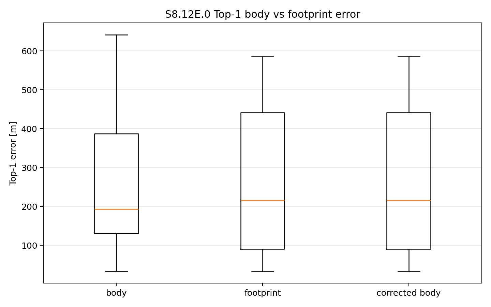  
  Interpretation: compares body, footprint, and corrected-body error distributions. The key point is that footprint correction did not reduce the median globally.

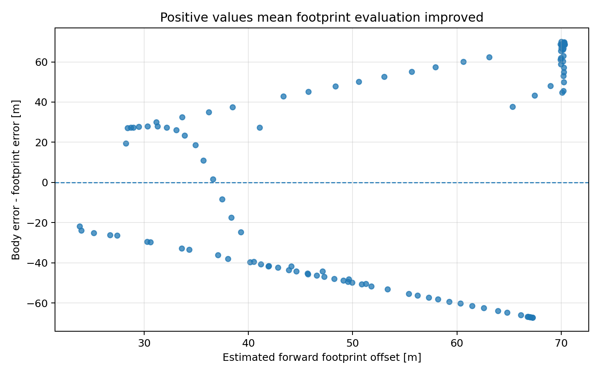  
  Interpretation: shows whether larger footprint offsets correspond to more improvement. This should be used to inspect whether altitude/pitch/yaw correction has any consistent effect.

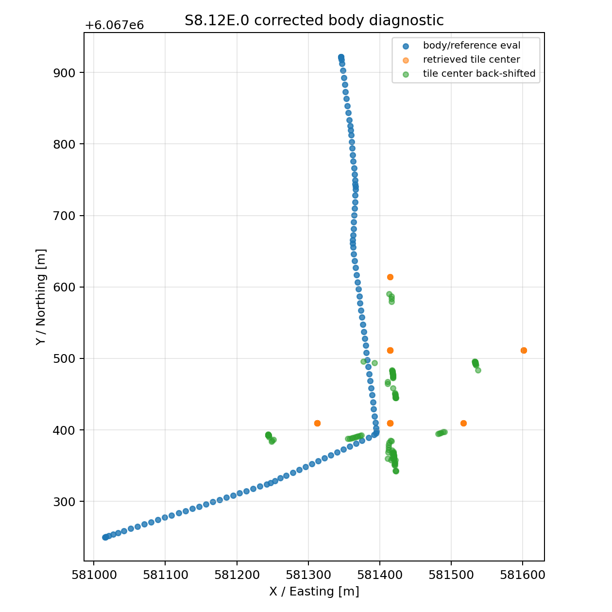  
  Interpretation: shows original body error against corrected-body error. Points below the diagonal are improved by correction; points above are worsened.

---

## 3. S8.12E.1A — ORB Top-20 verifier/reranker baseline

### 3.1 Why ORB was tested

ORB was used as a cheap, classical verifier baseline before LightGlue.

The pipeline was:

```text
DINO Top-20 candidates
        ↓
ORB keypoint + binary descriptor matching
        ↓
RANSAC/homography consistency evidence
        ↓
hybrid rerank score
        ↓
new selected Top-1 tile
```

ORB answers a low-level question:

```text
Do the UAV query and candidate tile share enough local corner-like features
with geometrically consistent matches?
```

This is different from DINO, which uses learned global/patch descriptors, and different from LightGlue, which uses a learned local matcher.

### 3.2 Corrected 45° ORB result

| Metric | Value |
|---|---:|
| Queries | 112 |
| DINO Top-1 center≤40m | 4 / 112 |
| DINO Top-1 contains body | 23 / 112 |
| ORB rerank Top-1 center≤40m | 2 / 112 |
| ORB rerank Top-1 contains body | 22 / 112 |
| DINO contains body Top-5 | 84 / 112 |
| DINO contains body Top-10 | 97 / 112 |
| DINO contains body Top-20 | 112 / 112 |
| DINO center≤40m Top-20 | 29 / 112 |
| DINO median center error | 192.729 m |
| ORB rerank median center error | 243.852 m |
| Best Top-20 median error | 50.184 m |
| Rerank improved rows | 47 |
| Rerank worsened rows | 51 |

Interpretation:

```text
ORB does not improve 45° selection.
The containing tile is already in Top-20 for all 112 queries,
but ORB cannot reliably promote it to Top-1.
```

### 3.3 Corrected 90° ORB result

| Metric | Value |
|---|---:|
| Queries | 115 |
| DINO Top-1 center≤40m | 8 / 115 |
| DINO Top-1 contains body | 22 / 115 |
| ORB rerank Top-1 center≤40m | 3 / 115 |
| ORB rerank Top-1 contains body | 35 / 115 |
| DINO contains body Top-5 | 63 / 115 |
| DINO contains body Top-10 | 90 / 115 |
| DINO contains body Top-20 | 113 / 115 |
| DINO center≤40m Top-20 | 28 / 115 |
| DINO median center error | 212.871 m |
| ORB rerank median center error | 215.058 m |
| Best Top-20 median error | 49.995 m |
| Rerank improved rows | 48 |
| Rerank worsened rows | 56 |

Interpretation:

```text
ORB slightly increases 90° tile containment, but median error does not improve.
This makes ORB a weak/negative baseline.
```

**Status:** `PASS_NEGATIVE_BASELINE_ORB_VERIFIER`

### 3.4 Figures to include

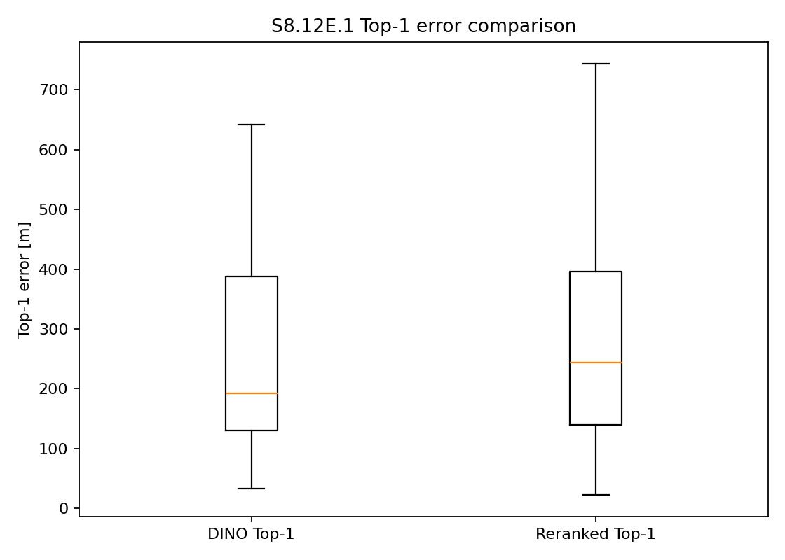  
  Interpretation: shows ORB reranking worsens the 45° error distribution relative to DINO Top-1.

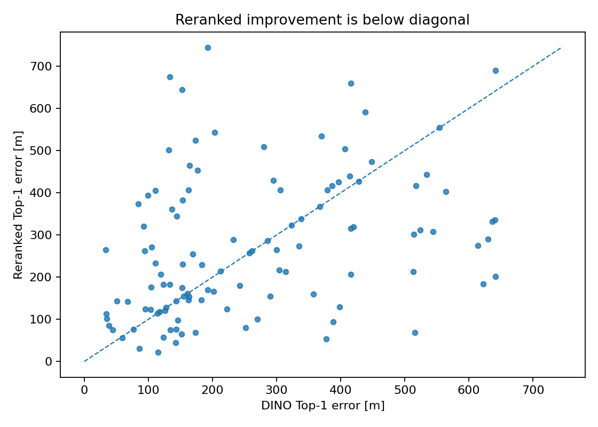  
  Interpretation: points below the diagonal are improved by ORB; points above are worsened. The row counts show too many worsened cases.

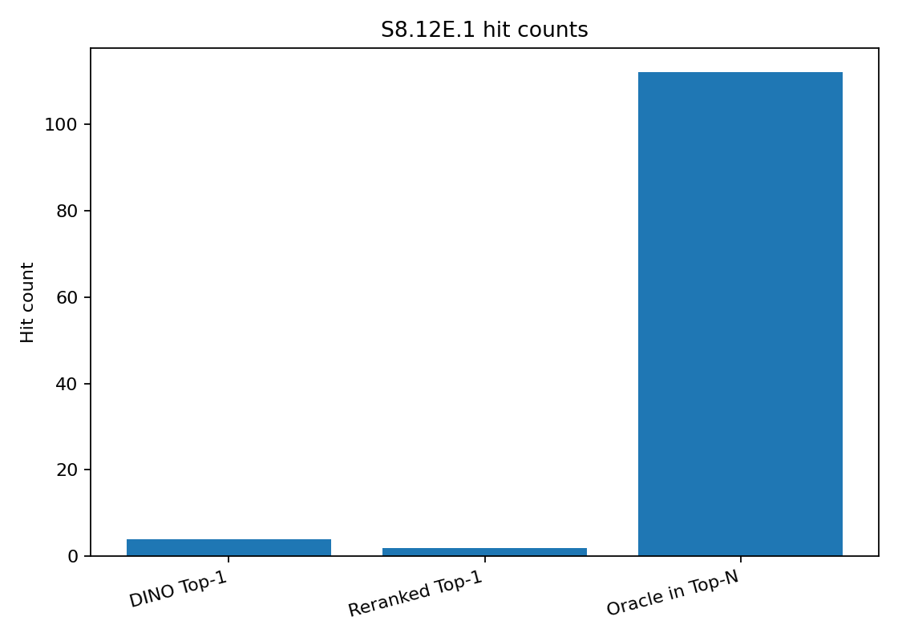  
  Interpretation: shows that corrected containment metrics reveal a strong DINO pool, but ORB does not select reliably.

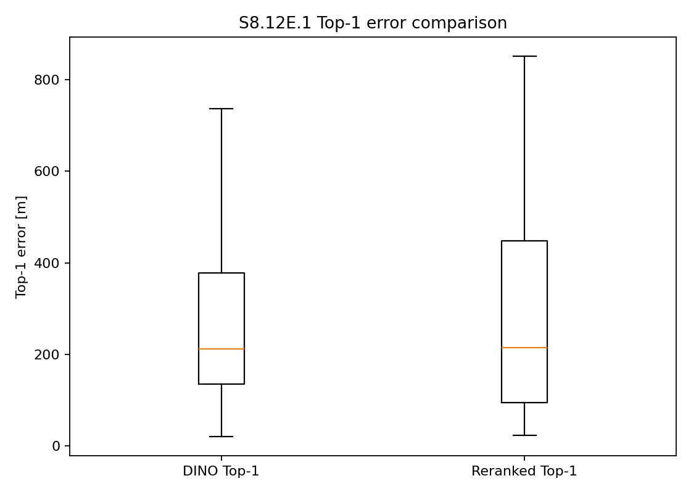  
  Interpretation: useful for showing that ORB is only weakly helpful in nadir 90°.

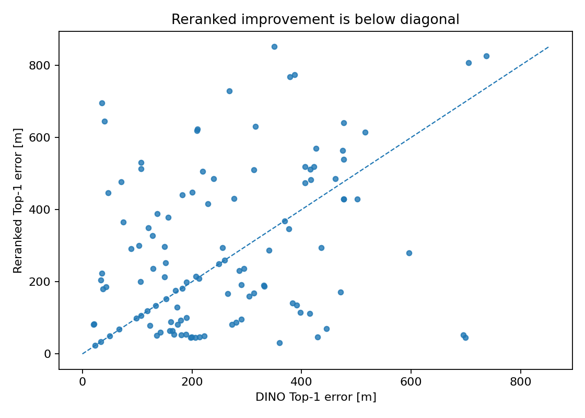  
  Interpretation: the improved/worsened distribution explains why containment improved but median error did not.

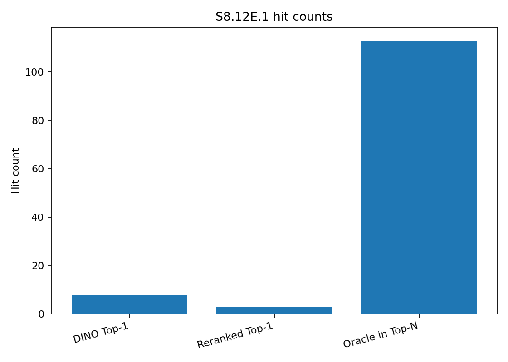  
  Interpretation: use this to compare DINO Top-K availability against ORB-selected Top-1.

---

## 4. S8.12E.1B — LightGlue Top-20 verifier/reranker

### 4.1 Why LightGlue was tested after ORB

ORB gave a weak/negative baseline. The next natural verifier was LightGlue because it is a learned local matcher and should be more robust than ORB to some UAV-vs-orthophoto differences.

S8.12E.1B was implemented as a separate script because it has different runtime needs:

```text
model loading
feature extraction
feature caching
device selection
max-keypoint control
runtime tracking
```

The pipeline was:

```text
DINO Top-20 candidates
        ↓
LightGlue/SuperPoint matching for each query-candidate pair
        ↓
matching statistics + geometric score
        ↓
hybrid score with DINO prior
        ↓
reranked Top-1 tile
```

The actual full runs used:

```text
max_keypoints = 780
resize_long = 768
device = cpu
policy = hybrid
```

---

## 5. Full LightGlue results

### 5.1 Full 45° LightGlue result

| Metric | Value |
|---|---:|
| Queries | 112 |
| Pairs | 2240 |
| Device | CPU |
| Max keypoints | 780 |
| DINO Top-1 center≤40m | 4 / 112 |
| DINO Top-1 contains body | 23 / 112 |
| LG Top-1 center≤40m | 2 / 112 |
| LG Top-1 contains body | 34 / 112 |
| DINO contains body Top-5 | 84 / 112 |
| DINO contains body Top-10 | 97 / 112 |
| DINO contains body Top-20 | 112 / 112 |
| DINO center≤40m Top-20 | 29 / 112 |
| DINO median center error | 192.729 m |
| LG median center error | 145.605 m |
| Best Top-20 median error | 50.184 m |
| Rerank improved rows | 25 |
| Rerank worsened rows | 4 |
| Runtime | 3147.5 s |
| Mean pair runtime | 1.402 s/pair |

Interpretation:

```text
This is a positive LightGlue result.
For 45°, LightGlue increases selected-tile containment from 23/112 to 34/112
and decreases median center error from 192.729 m to 145.605 m.
```

However, the oracle gap remains large:

```text
LG median center error:       145.605 m
Best Top-20 median error:      50.184 m
```

So LightGlue improves selection but does not fully exploit the candidate pool.

**45° status:** `POSITIVE_PROMOTE_LIGHTGLUE_OVER_ORB`

### 5.2 Full 90° LightGlue result

| Metric | Value |
|---|---:|
| Queries | 115 |
| Pairs | 2300 |
| Device | CPU |
| Max keypoints | 780 |
| DINO Top-1 center≤40m | 8 / 115 |
| DINO Top-1 contains body | 22 / 115 |
| LG Top-1 center≤40m | 10 / 115 |
| LG Top-1 contains body | 26 / 115 |
| DINO contains body Top-5 | 63 / 115 |
| DINO contains body Top-10 | 90 / 115 |
| DINO contains body Top-20 | 113 / 115 |
| DINO center≤40m Top-20 | 28 / 115 |
| DINO median center error | 212.871 m |
| LG median center error | 206.511 m |
| Best Top-20 median error | 49.995 m |
| Rerank improved rows | 27 |
| Rerank worsened rows | 17 |
| Runtime | 2179.6 s |
| Mean pair runtime | 0.945 s/pair |

Interpretation:

```text
This is a weak-positive LightGlue result.
It slightly improves strict center<=40m hits, containment, and median error,
but the effect is much smaller than for 45°.
```

The oracle gap remains large:

```text
LG median center error:       206.511 m
Best Top-20 median error:      49.995 m
```

**90° status:** `WEAK_POSITIVE_LIGHTGLUE`

### 5.3 LightGlue figures:

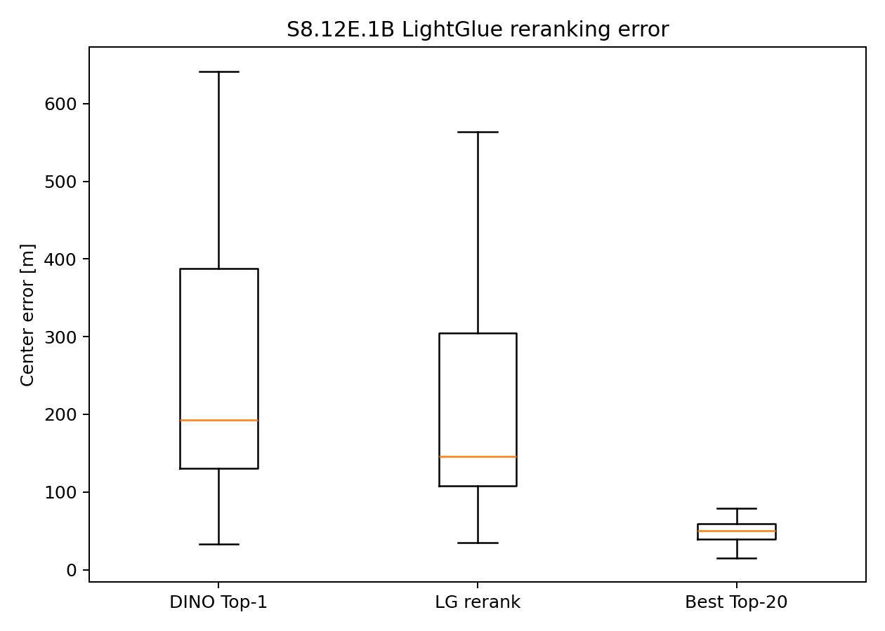  
  Interpretation: shows that LightGlue reduces the 45° median error distribution compared with DINO Top-1, while the Best Top-20 box remains the candidate-pool ceiling.

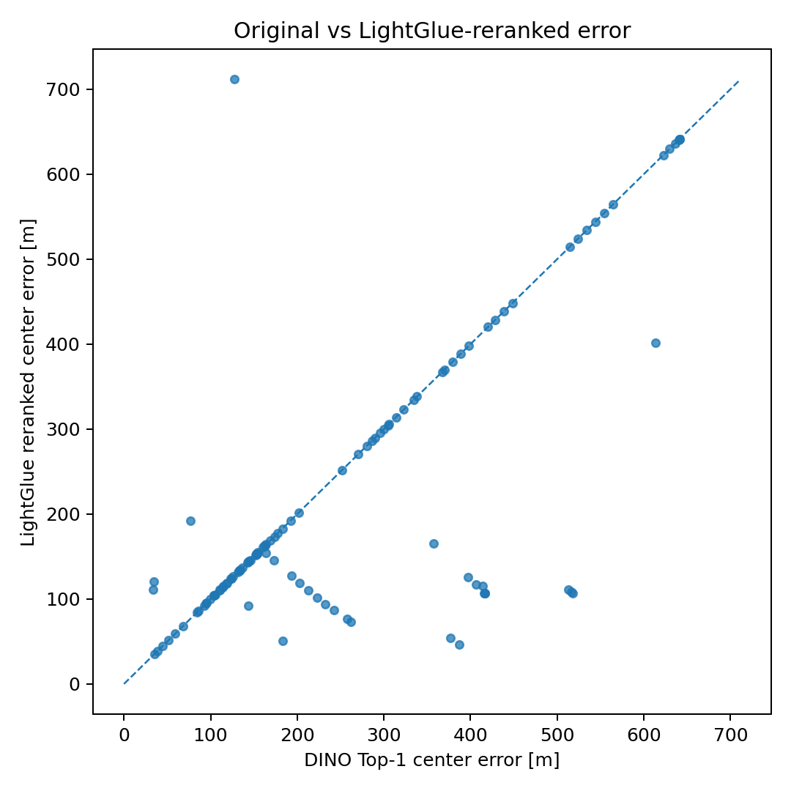  
  Interpretation: points below the diagonal are improved by LightGlue. This figure supports the 25 improved vs 4 worsened row conclusion.

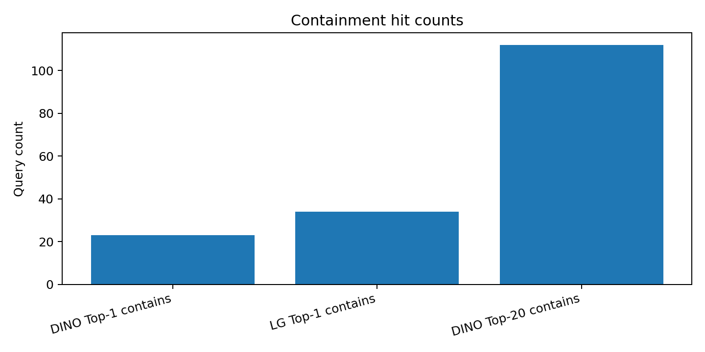  
  Interpretation: shows the gap between DINO Top-K candidate availability and LightGlue-selected Top-1 containment.

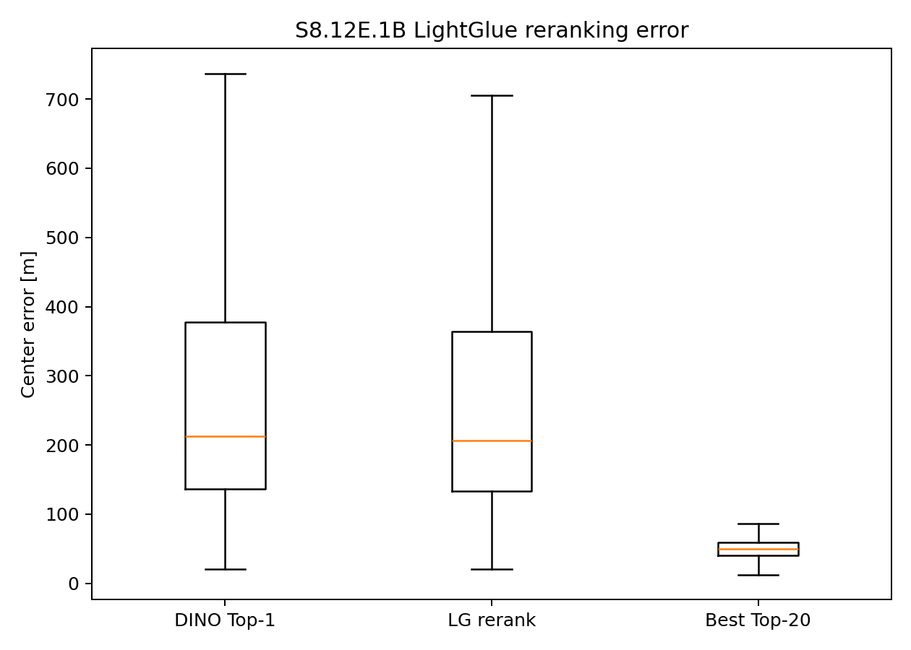  
  Interpretation: shows the weaker 90° improvement, where LightGlue slightly reduces median error but remains far from Best Top-20.

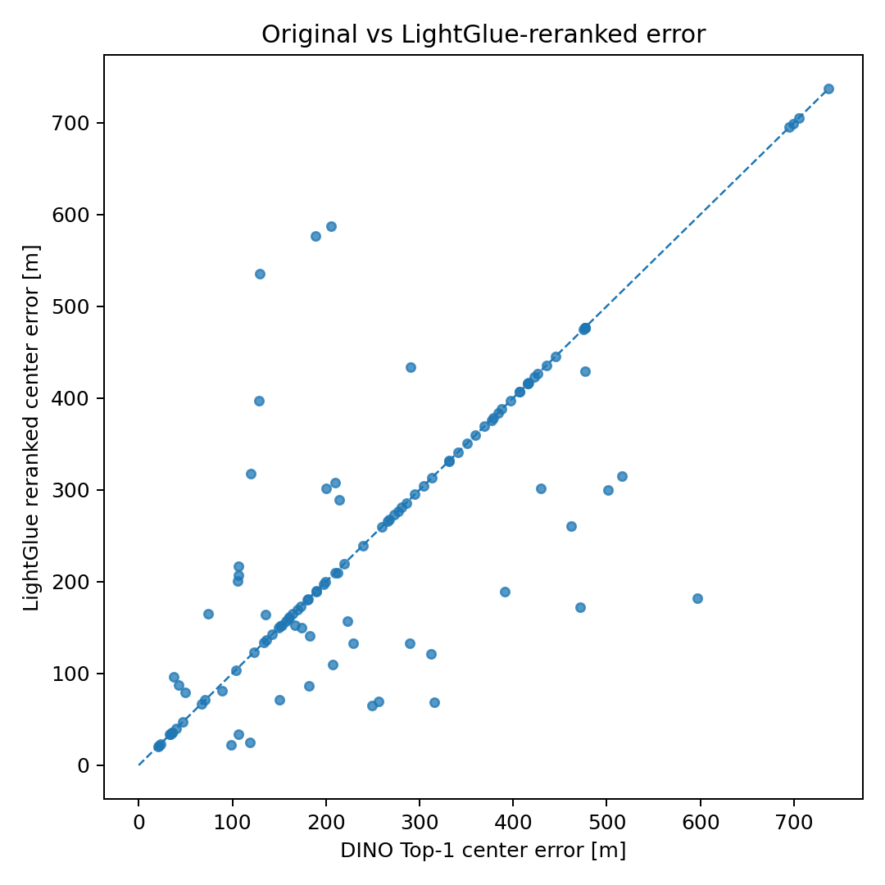  
  Interpretation: shows that LightGlue improves more rows than it worsens, but with less separation than in 45°.

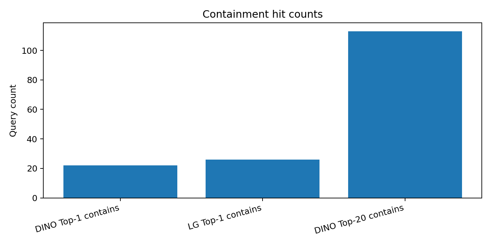  
  Interpretation: use this to compare the small LightGlue Top-1 containment gain against the much stronger DINO Top-20 candidate availability.

---

## 6. Comparison summary: DINO vs ORB vs LightGlue

### 6.1 45° comparison

| Method | Top-1 contains body | Center≤40m | Median center error | Improved rows | Worsened rows | Interpretation |
|---|---:|---:|---:|---:|---:|---|
| DINO Top-1 | 23 / 112 | 4 / 112 | 192.729 m | — | — | Strong candidate generator, weak final selector |
| ORB rerank | 22 / 112 | 2 / 112 | 243.852 m | 47 | 51 | Negative/weak baseline |
| LightGlue rerank | 34 / 112 | 2 / 112 | 145.605 m | 25 | 4 | Positive learned verifier |
| Best Top-20 | 112 / 112 contains-body available | 29 / 112 center≤40m available | 50.184 m | — | — | Candidate-pool ceiling |

### 6.2 90° comparison

| Method | Top-1 contains body | Center≤40m | Median center error | Improved rows | Worsened rows | Interpretation |
|---|---:|---:|---:|---:|---:|---|
| DINO Top-1 | 22 / 115 | 8 / 115 | 212.871 m | — | — | Strong Top-20 candidate generator, weak Top-1 selector |
| ORB rerank | 35 / 115 | 3 / 115 | 215.058 m | 48 | 56 | More containment but not better localization |
| LightGlue rerank | 26 / 115 | 10 / 115 | 206.511 m | 27 | 17 | Weak-positive learned verifier |
| Best Top-20 | 113 / 115 contains-body available | 28 / 115 center≤40m available | 49.995 m | — | — | Candidate-pool ceiling |

### 6.3 Main lesson

```text
The Villoc system is no longer blocked by map coverage or candidate generation.
It is blocked by robust online candidate selection.
```

The next useful analysis for this branch, when resumed, is:

```text
S8.12E.1C — LightGlue confidence and policy diagnostics
```

It should analyze existing CSVs only, not run new heavy matching:

```text
LightGlue score vs error
matches/inliers/coverage vs error
score margin between rank-1 and rank-2
cases improved by LightGlue
cases worsened by LightGlue
confidence gates that keep good corrections and reject bad ones
```

---

## 7. New dataset transition: `traj01_90deg_stable70m`

### 7.1 Why this dataset is important

A new dataset was prepared after the LightGlue block was paused.

The new dataset is expected to be useful because:

```text
It is 90° nadir.
It stays inside the existing AOI300m.
It has a stable relative altitude around 70-80 m.
It likely captures more map context per frame than the earlier lower-altitude portions.
It follows a route and may revisit the same place, making it a future loop-closure candidate.
```

This makes it useful for both:

```text
absolute retrieval / map localization
future relative trajectory + loop-closure experiments
```

Folder structure:

```text
data/raw/villoc/
  90_deg/
  45_deg/
  traj01_90deg_stable70m/

data/processed/villoc/
  90_deg/
  45_deg/
  traj01_90deg_stable70m/

outputs/villoc/
  90_deg/
  45_deg/
  traj01_90deg_stable70m/
```

### 7.3 Merged video/SRT decision

The raw recording consisted of two DJI video/SRT pairs:

```text
DJI_20260729104901_0002_V.MP4
DJI_20260729104901_0002_V.SRT
DJI_20260729105250_0003_V.MP4
DJI_20260729105250_0003_V.SRT
```

They were merged into:

```text
villoc_traj01_90deg_stable70m_V_merged.MP4
villoc_traj01_90deg_stable70m_V_merged.SRT
```

The merged video is continuous. The SRT timestamps are continuous. The frame counter was reset to be continuous from the beginning to the end of the merged video.

Therefore, no segment-reset parser fix is required for this dataset.

Important note:

```text
If future merged SRT files contain raw DJI frame counter resets,
then preserve raw_frame_cnt and create a separate global_source_frame_cnt.
For this dataset, the frame counter has already been normalized.
```

### 7.4 Final YAML identity

The prepared config is:

```text
configs/dataset_villoc_traj01_90deg_stable70m.yaml
```

Expected structure:

```yaml
dataset:
  folder_name: villoc_traj01_90deg_stable70m
  name: villoc_traj01_90deg_stable70m_20260729
  sequence_name: traj01_90deg_stable70m
  type: villoc_video_srt
  view_angle_group: 90deg
  description: "Villoc Vilnius 90-degree nadir RGB trajectory, stable 70-80 m relative altitude, possible loop-closure route"
  raw_root: data/raw/villoc/traj01_90deg_stable70m
  processed_root: data/processed/villoc/traj01_90deg_stable70m
  output_root: outputs/villoc/traj01_90deg_stable70m

streams:
  V:
    modality: rgb
    role: primary_visual
    video: villoc_traj01_90deg_stable70m_V_merged.MP4
    srt: villoc_traj01_90deg_stable70m_V_merged.SRT
    fps_expected: 29.97
    resolution_expected: [3840, 2160]
    duration_s: 403.425
    frame_count: 12090

reference:
  source: srt_gps
  gps_usage: evaluation_only
  local_frame: ENU
  origin_policy: first_valid_primary_visual_srt_row

map:
  reuse_existing_map: true
  map_reference_dataset: villoc_90deg_aoi300m
  map_source: ort10lt_2024_2026
  canonical_aoi_tif: data/processed/villoc/90_deg/maps/ort10lt_2024_2026/ort10lt_2024_2026_aoi300m.tif

  tile_variants:
    512_s256:
      tiles_dir: data/processed/villoc/90_deg/maps/ort10lt_2024_2026/tiles_512_s256
      index_csv: outputs/villoc/90_deg/metadata/s8_9_satellite_tile_index_512_s256.csv

    1024_s512:
      tiles_dir: data/processed/villoc/90_deg/maps/ort10lt_2024_2026/tiles_1024_s512
      index_csv: outputs/villoc/90_deg/metadata/s8_9_satellite_tile_index_1024_s512.csv

    1024_s256:
      tiles_dir: data/processed/villoc/90_deg/maps/ort10lt_2024_2026/tiles_1024_s256
      index_csv: outputs/villoc/90_deg/metadata/s8_9_satellite_tile_index_1024_s256.csv

rules:
  use_srt_for:
    - frame_alignment
    - reference_trajectory
    - map_bbox_sanity_check
    - evaluation
    - sanity_checks

  never_use_srt_for:
    - retrieval_ranking
    - verifier_ranking
    - correction_acceptance
    - threshold_tuning_from_error
```

---

## 8. Recommended next pipeline order

Recommended order:

```text
S8.1  Parse merged SRT
S8.2  Extract frames at 1 fps
S8.3  Build reference trajectory
S8.4  Visual audit/contact sheets
S8.5  Build UAV frame index
S8.6  Map bbox/AOI sanity check only
S8.10B Tile/oracle audit using existing AOI300m tiles
S8.11BC Build query DINO descriptors while reusing existing map cache
S8.11D Run independent DINO retrieval, starting with 1024_s512
S8.12D Run retrieval diagnostics
Compare against old 90° and 45° results
Later inspect loop-closure potential
```

First validation checks:

```text
SRT row count
timestamp range
frame_cnt range
relative altitude range and median
frame extraction count
alignment median/max error
first and last extracted frame names
trajectory inside AOI300m
```

Do not regenerate the map/tile database unless the AOI sanity check fails.

---


## 9. Conclusion

The key conclusion is:

```text
DINOv2 Top-20 candidate generation is strong.
The correct/containing tile is usually already inside Top-20.
The remaining bottleneck is final candidate selection/reranking.
```

The most important correction noted was evaluation-related:

```text
For 1024_s512, each tile covers about 204 × 204 m.
Therefore, center error <= 40 m is too strict for candidate-pool availability.
A correct containing tile can easily have center error > 40 m.
```

So the evaluation was split into two meanings:

```text
Candidate-pool oracle:
  tile bbox contains UAV body/reference point

Localization accuracy:
  selected tile center error <= 40 / 80 / 120 m
```

After this correction, the Villoc problem became clear:

```text
DINO retrieval already places the correct tile in Top-20 for nearly all queries.
ORB is too weak as a verifier.
LightGlue improves 45° reranking meaningfully and 90° reranking mildly, but still remains far below the Top-20 oracle ceiling.
```


Then a new route dataset also prepared:

```text
traj01_90deg_stable70m
```

This dataset is inside the existing AOI300m and should reuse the existing map/tile/cache side while rebuilding only query-side assets.

---
