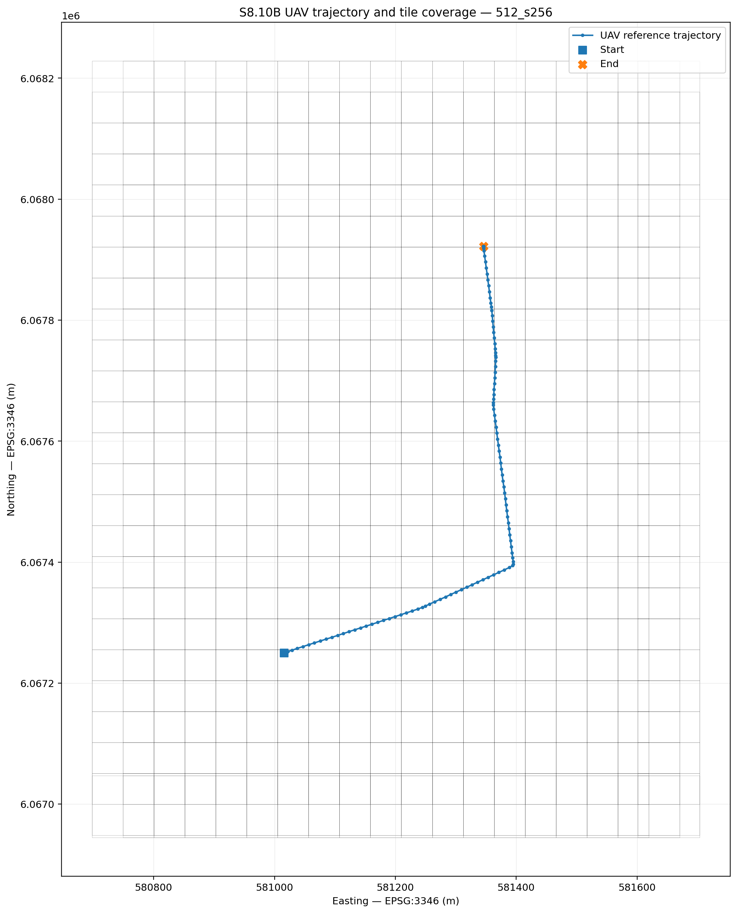

# Villoc 90° Nadir Localization — Dataset Preparation, Orthophoto Tiling, and Geometric Oracle Closeout

**Project:** GNSS-denied / weak-GNSS UAV localization  
**Dataset:** Villoc, Vilnius, 90° nadir RGB stream  
**Stage covered:** S8.1–S8.10B  
**Closeout status:** `PASS_UAV_TILE_ORACLE_AUDIT`  
**Next stage:** Multi-scale DINOv2 retrieval benchmark and descriptor-cache construction

---

## 1. Executive conclusion

The Villoc 90° dataset has now been converted from raw DJI video and subtitle telemetry into a validated map-localization benchmark.

The completed pipeline is:

```text
Raw RGB video + SRT telemetry
        ↓
S8.1 telemetry parsing
        ↓
S8.2 1 fps UAV frame extraction
        ↓
S8.3 reference trajectory
        ↓
S8.4 visual-quality audit
        ↓
S8.5 canonical UAV query index
        ↓
S8.6 localization AOI and map plan
        ↓
S8.7 canonical orthophoto validation
        ↓
S8.8 AOI raster crop
        ↓
S8.9 three multi-scale reference tile databases
        ↓
S8.10A tile/index integrity audit
        ↓
S8.10B trajectory coverage and oracle-tile audit
```

The final geometric result is:

```text
UAV queries:                     115
Reference tile variants:         3
Queries inside map crop:         115 / 115
Queries without oracle tiles:    0
Variants passing coverage audit: 3 / 3
Overall status:                  PASS_UAV_TILE_ORACLE_AUDIT
```

The benchmark is now ready for image-only retrieval experiments. GPS, latitude, longitude, ENU, and projected coordinates are retained only for query identity, oracle construction, visualization, and evaluation. They must not enter retrieval ranking or verification.

---

## 2. Research objective

The project aims to localize a UAV in a known map under GNSS-denied or weak-GNSS conditions using:

```text
UAV camera imagery
+
available georeferenced map imagery
```

The Villoc sequence is valuable because it provides:

- real drone imagery over Vilnius;
- a near-nadir camera orientation;
- 115 extracted RGB query frames;
- wide yaw variation;
- altitude variation;
- an approximately 748 m trajectory;
- an official orthophoto covering the flight region;
- reference GPS/SRT telemetry for evaluation only.

Unlike the earlier SatLoc benchmark, Villoc allows the complete data-generation chain to be controlled:

```text
raw video
→ frame extraction
→ telemetry alignment
→ map crop
→ tile generation
→ geometric oracle construction
→ retrieval benchmark
```

---

## 3. Raw dataset

### 3.1 Source directory

```text
data/raw/villoc/90_deg/
```

Primary files:

```text
CAM_20260413115710_0001_V.MP4
CAM_20260413115710_0001_V.SRT

CAM_20260413115710_0001_S.MP4
CAM_20260413115710_0001_S.SRT

CAM_20260413115710_0001_T.MP4
CAM_20260413115710_0001_T.SRT
```

The current benchmark uses the visible RGB stream:

```text
stream_id = V
modality  = rgb
view      = nadir_90deg
```

### 3.2 Representative telemetry

The SRT includes:

```text
latitude
longitude
relative altitude
absolute altitude
gimbal yaw
gimbal pitch
gimbal roll
focal length
digital zoom
exposure metadata
```

Representative first query:

```text
latitude:         54.735065
longitude:        25.257999
relative altitude: 70.020 m
absolute altitude: 280.465 m
gimbal yaw:       178.7°
gimbal pitch:     -89.9°
gimbal roll:      0.0°
```

The approximately `-90°` pitch confirms a nadir-looking camera.

---

## 4. Repository scaffold

The Villoc pipeline uses:

```text
configs/
    dataset_villoc_90deg.yaml

data/raw/villoc/90_deg/

data/processed/villoc/90_deg/
    frames_v_1fps/
    frames_s_1fps/
    frames_t_1fps/
    metadata/
    maps/

outputs/villoc/90_deg/
    figures/
    logs/
    maps/
    metadata/
    reports/
    trajectories/

scripts/villoc/

docs/assets/villoc_90deg/
```

Typical execution environment:

```bash
source .drone_venv/bin/activate
export PYTHONPATH=$PWD/src
```

---

# 5. S8.1 — SRT telemetry parsing

## Purpose

Parse the subtitle telemetry from each stream into structured records.

## Configuration

```text
configs/dataset_villoc_90deg.yaml
```

## Main result

Visible stream:

```text
Rows:             3420
Video time:       0.000–114.073 s
Frame counter:    1–3420
Latitude range:   54.735065–54.741049
Longitude range:  25.257999–25.263930
Relative altitude: 23.52–70.06 m
Pitch median:     approximately -89.90°
Yaw range:        -8.80°–178.70°
```

Other parsed streams:

```text
S stream rows: 3417
T stream rows: 1027
```

## Interpretation

The visible video and telemetry provide a complete approximately 114 s nadir sequence with significant horizontal motion, altitude change, and yaw change.

---

# 6. S8.2 — RGB frame extraction at 1 fps

## Purpose

Reduce the full video to a manageable and repeatable query set while retaining trajectory coverage.

## Result

```text
Requested frames:         115
Extracted frames:         115
Median alignment error:   8 ms
Maximum alignment error:  17 ms
```

Output frames:

```text
data/processed/villoc/90_deg/frames_v_1fps/
```

Representative filename:

```text
v_frame_00000_srcframe_000001.jpg
```

Metadata:

```text
outputs/villoc/90_deg/metadata/
s8_2_extracted_frames_V_1fps.csv
```

## Interpretation

The 1 fps extraction gives one stable query per second, preserving the full route while avoiding strong frame-to-frame redundancy.

---

# 7. S8.3 — Reference trajectory

## Output

```text
outputs/villoc/90_deg/trajectories/
s8_3_reference_trajectory_V_1fps.csv
```

## Result

```text
Rows:                 115
Approximate XY length: 748 m
```

Important columns:

```text
sample_id
frame_cnt
frame_path
lat
lon
rel_alt_m
abs_alt_m
x_enu_m
y_enu_m
z_enu_m
gb_yaw_deg
gb_pitch_deg
gb_roll_deg
```

## Interpretation

The sequence includes:

- a mostly nadir view;
- substantial yaw variation;
- two noticeable descent/ascent portions;
- later high-altitude frames where road/highway visibility changes;
- sufficient spatial extent for short-path map localization.

---

# 8. S8.4 — Visual audit

## Purpose

Verify that the extracted queries are readable and identify quality variation before retrieval.

## Results

```text
Frames:                   115
Median Laplacian variance: 343.74
Mean brightness:          133.12
Mean contrast:            37.00
Mean edge density:        0.0987
Relative altitude range:  23.52–70.06 m
Yaw range:                -8.80°–178.70°
```

Generated diagnostics included:

```text
overview contact sheet
four batch contact sheets
trajectory XY figure
altitude figure
yaw figure
```

These figures should be copied into documentation assets where available.

---

# 9. S8.5 — Canonical UAV frame index

## Main index

```text
outputs/villoc/90_deg/metadata/
s8_5_uav_frames_index_v_1fps.csv
```

## Golden subset

```text
outputs/villoc/90_deg/metadata/
s8_5_golden20_manifest_v_1fps.csv
```

## Query count

```text
115
```

## Important identity fields

```text
token0_id
sample_id
token1_order
source_frame_cnt
zero_based_frame_index
timestamp_s
image_path
latitude
longitude
x_enu_m
y_enu_m
rel_alt_m
gb_yaw_deg
gb_pitch_deg
```

## Leakage rule

The index explicitly stores:

```text
reference_usage = evaluation_only
gt_leakage_rule = do_not_use_lat_lon_or_enu_for_retrieval_ranking
```

This rule remains frozen for all later stages.

---

# 10. Canonical query naming convention

S8.10B introduced a SatLoc-style self-describing query identity without renaming the physical images.

Pattern:

```text
token{token0_id:06d}_
frame{zero_based_frame_index:06d}_
src{source_frame_cnt:06d}_
lat{latitude:.6f}_
lon{longitude:.6f}.jpg
```

Example:

```text
token000001_frame000000_src000001_lat54.735065_lon25.257999.jpg
```

Meaning:

| Component | Meaning |
|---|---|
| `token000001` | Stable retrieval/query token |
| `frame000000` | Extracted 1 fps zero-based frame |
| `src000001` | Original source-video/SRT frame |
| `lat...lon...` | Evaluation-only reference position |

Physical frame remains:

```text
data/processed/villoc/90_deg/frames_v_1fps/
v_frame_00000_srcframe_000001.jpg
```

Canonical manifest:

```text
outputs/villoc/90_deg/metadata/
s8_10b_canonical_uav_query_manifest.csv
```

The canonical name is metadata only. Later benchmark packaging should use symlinks rather than rename or duplicate the source images.

---

# 11. S8.6 — Map AOI and tile plan

## Flight bounding box

Raw EPSG:4326:

```text
South: 54.735065
North: 54.741049
West:  25.257999
East:  25.263930
```

Padded by 300 m:

```text
South: 54.7323700665
North: 54.7437439335
West:  25.2533309563
East:  25.2685980437
```

EPSG:3346 / LKS-94 bounds:

```text
xmin: 580697.8984
ymin: 6066944.8568
xmax: 581703.7306
ymax: 6068228.2945
```

Plan report:

```text
outputs/villoc/90_deg/reports/
s8_6_map_bbox_plan.json
```

## Map source

```text
Geoportal ORT10LT orthophoto
2024–2026 edition
LKS-94 / Lithuania TM
```

Initial browser/export previews were unsuitable because they were only approximately:

```text
1033 × 579 px
```

and appeared pixelated at deep zoom. Therefore, the workflow moved to the canonical georeferenced GeoTIFF.

---

# 12. S8.7 — Canonical master orthophoto validation

The canonical master raster was validated for:

```text
CRS
pixel resolution
bounds
band count
readability
AOI coverage
```

Important CRS note:

The GeoTIFF projection is operationally LKS-94 / Lithuania TM, but the WKT stores the datum name as `unnamed`. Therefore, `pyproj.CRS.equals(EPSG:3346)` may return false even though the projection parameters match.

The accepted operational projection parameters are:

```text
Transverse Mercator
central meridian: 24°
scale factor:     0.9998
false easting:    500000 m
false northing:   0 m
unit:             metre
GRS 1980 ellipsoid
```

Later scripts should avoid relying only on authority-name equality and should also validate coordinate domain and projection parameters.

---

# 13. S8.8 — AOI raster crop

Canonical cropped orthophoto:

```text
data/processed/villoc/90_deg/maps/
ort10lt_2024_2026/
ort10lt_2024_2026_aoi300m.tif
```

Result:

```text
Width:          5030 px
Height:         6418 px
Resolution:     0.20 m/pixel
Approximate size: 20.45 MB
AOI coverage:   100%
Status:         PASS
```

Ground coverage:

```text
Width:  1006.0 m
Height: 1283.6 m
```

This crop is the single canonical source for all reference-tile variants.

---

# 14. Why the map remains raster

The orthophoto is a raster image, not a vector map.

## Why not SVG?

SVG stores vector primitives:

```text
lines
curves
polygons
text
```

An orthophoto stores per-pixel appearance:

```text
trees
roofs
roads
shadows
vehicles
terrain texture
```

Converting the raster to SVG would provide no useful localization benefit and would greatly increase complexity and file size.

## Why JPEG tile images?

JPEG is appropriate for RGB retrieval tiles because:

- DINOv2 and similar models depend mainly on structure and appearance;
- high-quality JPEG preserves roads, roofs, vegetation, and layout;
- JPEG reduces storage and I/O;
- descriptors are robust to mild compression artifacts.

PNG is more appropriate for:

```text
segmentation masks
binary maps
label rasters
lossless scientific pixel analysis
```

The canonical source remains GeoTIFF. JPEG is only the efficient image representation for derived retrieval tiles.

---

# 15. S8.9 — Multi-scale reference tile generation

Three databases were generated from the same 0.20 m/pixel AOI raster.

## Variant A — `512_s256`

```text
Tile size:     512 px
Stride:        256 px
Ground footprint: 102.4 m
Center spacing:   51.2 m
Nominal overlap:  50%
Grid:          19 × 25
Tile count:    475
```

## Variant B — `1024_s512`

```text
Tile size:     1024 px
Stride:        512 px
Ground footprint: 204.8 m
Center spacing:   102.4 m
Nominal overlap:  50%
Grid:          9 × 12
Tile count:    108
```

## Variant C — `1024_s256`

```text
Tile size:     1024 px
Stride:        256 px
Ground footprint: 204.8 m
Center spacing:   51.2 m
Nominal overlap:  75%
Grid:          17 × 23
Tile count:    391
```

## Core interpretation

```text
Tile size controls visual context.
Stride controls spatial sampling density and center quantization.
```

The `1024_s256` variant therefore combines:

```text
large visual context
+
dense center spacing
```

---

# 16. S8.10A — Tile/index integrity audit

## Purpose

Verify that each generated tile database is structurally complete and geometrically consistent.

## Audited checks

```text
expected grid size
expected tile count
index row count
disk file count
unique tile IDs
image readability
image dimensions
raster-derived tile positions
right-edge anchoring
bottom-edge anchoring
full horizontal coverage
full vertical coverage
missing files
unindexed files
duplicate IDs
corrupt images
```

## Result

```text
Variants audited: 3
Variants passed:  3
Variants failed:  0
Total failures:   0
Status:           PASS_TILE_INDEX_INTEGRITY
```

| Variant | Expected | Index rows | Disk files | Corrupt | Failures |
|---|---:|---:|---:|---:|---:|
| `512_s256` | 475 | 475 | 475 | 0 | 0 |
| `1024_s512` | 108 | 108 | 108 | 0 | 0 |
| `1024_s256` | 391 | 391 | 391 | 0 | 0 |

## Edge anchoring

Final edge starts:

```text
512_s256:
right edge start  = 4518 px
bottom edge start = 5906 px

1024_s512:
right edge start  = 4006 px
bottom edge start = 5394 px

1024_s256:
right edge start  = 4006 px
bottom edge start = 5394 px
```

The final shortened step at the right and bottom boundaries is intentional. It prevents uncovered strips in the source raster.

Examples:

```text
512_s256 final horizontal step: 166 px
512_s256 final vertical step:    18 px

1024_s512 final horizontal step: 422 px
1024_s512 final vertical step:   274 px

1024_s256 final horizontal step: 166 px
1024_s256 final vertical step:    18 px
```

These are expected boundary effects, not tiling failures.

Frozen status:

```text
S8.10A_ACCEPTED = true
S8.10A_STATUS   = PASS_TILE_INDEX_INTEGRITY
```

---

# 17. S8.10B — UAV trajectory coverage and oracle-tile audit

## Purpose

Before testing retrieval, determine whether every UAV query has geometrically valid map tiles.

For each query and each tile database, the stage computes:

```text
whether the query lies inside the map crop
all tiles containing the reference position
number of oracle tiles
nearest tile center
nearest-center error
top geometric neighbors
whether the nearest-center tile is also an oracle
whether edge-anchored tiles affect the query
```

This establishes the geometric upper bound independently of image retrieval.

## Script

```text
scripts/villoc/
s8_10b_uav_tile_oracle_audit.py
```

## Run command

```bash
export PYTHONPATH=$PWD/src

python scripts/villoc/s8_10b_uav_tile_oracle_audit.py \
  --config configs/dataset_villoc_90deg.yaml \
  --src-tif data/processed/villoc/90_deg/maps/ort10lt_2024_2026/ort10lt_2024_2026_aoi300m.tif \
  --uav-index-csv outputs/villoc/90_deg/metadata/s8_5_uav_frames_index_v_1fps.csv \
  --trajectory-csv outputs/villoc/90_deg/trajectories/s8_3_reference_trajectory_V_1fps.csv \
  --trajectory-crs EPSG:3346 \
  --variant "512_s256:outputs/villoc/90_deg/metadata/s8_9_satellite_tile_index_512_s256.csv" \
  --variant "1024_s512:outputs/villoc/90_deg/metadata/s8_9_satellite_tile_index_1024_s512.csv" \
  --variant "1024_s256:outputs/villoc/90_deg/metadata/s8_9_satellite_tile_index_1024_s256.csv"
```

## Merge rule

The UAV index and trajectory are merged using:

```text
sample_id ↔ sample_id
```

This avoids unsafe row-order alignment.

## CRS handling

The raster has no recoverable EPSG authority in its WKT, even though its Lithuania TM parameters match the accepted LKS-94 raster.

The script therefore reports:

```text
Raster CRS has no recoverable EPSG authority.
Proceeding with coordinate-domain validation because its Lithuania TM
projection parameters match the accepted LKS-94 raster used in S8.7–S8.10A.
```

## Final result

```text
UAV queries:             115
Physical images renamed: False
Variants audited:        3
Overall status:          PASS_UAV_TILE_ORACLE_AUDIT
```

### Summary table

| Variant | Oracle tiles/query | Mean nearest error | Median | P95 | Maximum | Edge-oracle queries |
|---|---:|---:|---:|---:|---:|---:|
| `512_s256` | 4 | 18.20 m | 19.60 m | 28.48 m | 34.78 m | 0 |
| `1024_s512` | 4 | 45.67 m | 47.90 m | 65.04 m | 70.60 m | 0 |
| `1024_s256` | 16 | 18.20 m | 19.60 m | 28.48 m | 34.78 m | 0 |

All 115 queries:

```text
lie inside the map crop
have at least one oracle tile
have the nearest-center tile inside their oracle set
remain away from artificial anchored-edge bands
```

## Interpretation

### `512_s256`

```text
small footprint
fine local detail
4 valid overlapping oracle tiles/query
low center quantization error
```

### `1024_s512`

```text
large footprint
coarse contextual imagery
4 valid overlapping oracle tiles/query
larger center spacing
larger center quantization error
```

### `1024_s256`

```text
large contextual footprint
dense center spacing
16 valid overlapping oracle tiles/query
same nearest-center precision as 512_s256
```

The identical nearest-center statistics for `512_s256` and `1024_s256` arise because both use the same 256 px stride.

Frozen status:

```text
S8.10B_ACCEPTED = true
S8.10B_STATUS   = PASS_UAV_TILE_ORACLE_AUDIT
S8.10B_QUERY_COUNT = 115
S8.10B_CANONICAL_NAMING = token-frame-source-lat-lon
S8.10B_GT_LEAKAGE = prohibited_for_retrieval_ranking
```

---

# 18. Generated S8.10B outputs

## Canonical query manifest

```text
outputs/villoc/90_deg/metadata/
s8_10b_canonical_uav_query_manifest.csv
```

## Per-variant oracle tables

```text
outputs/villoc/90_deg/metadata/
s8_10b_uav_tile_oracle_512_s256.csv

outputs/villoc/90_deg/metadata/
s8_10b_uav_tile_oracle_1024_s512.csv

outputs/villoc/90_deg/metadata/
s8_10b_uav_tile_oracle_1024_s256.csv
```

## Summary

```text
outputs/villoc/90_deg/metadata/
s8_10b_uav_tile_oracle_summary.csv
```

## Reports

```text
outputs/villoc/90_deg/reports/
s8_10b_uav_tile_oracle_audit.json

outputs/villoc/90_deg/reports/
s8_10b_uav_tile_oracle_audit_512_s256.json

outputs/villoc/90_deg/reports/
s8_10b_uav_tile_oracle_audit_1024_s512.json

outputs/villoc/90_deg/reports/
s8_10b_uav_tile_oracle_audit_1024_s256.json
```

## Figures

```text
outputs/villoc/90_deg/figures/
s8_10b_trajectory_vs_tiles_512_s256.png

outputs/villoc/90_deg/figures/
s8_10b_trajectory_vs_tiles_1024_s512.png

outputs/villoc/90_deg/figures/
s8_10b_trajectory_vs_tiles_1024_s256.png
```

---

Recommended documentation references:



---

# 20. Multi-scale descriptor idea

The three tile databases should not be merged into a single image database before benchmarking.

Each variant should first receive an independent DINOv2 descriptor cache:

```text
512_s256 tile images
        ↓
DINOv2
        ↓
512_s256 descriptor cache

1024_s512 tile images
        ↓
DINOv2
        ↓
1024_s512 descriptor cache

1024_s256 tile images
        ↓
DINOv2
        ↓
1024_s256 descriptor cache
```

A UAV query descriptor is then searched independently against each database.

This permits a clean comparison of:

```text
fine local detail
versus
large visual context
versus
large context with dense overlap
```

## Important clarification

The descriptors are initially:

```text
cached separately
evaluated separately
not concatenated
not fused
```

Only after the independent benchmark should multi-scale fusion be tested.

---

# 21. Proposed next-stage architecture

## Phase 1 — Independent descriptor caches

For each map variant:

```text
load tile index
load tile images
run DINOv2
L2-normalize descriptors
save descriptor matrix
save ordered tile IDs
save model/config metadata
validate row-to-tile alignment
```

Expected cache families:

```text
s8_11_dinov2_map_512_s256_*.npz
s8_11_dinov2_map_1024_s512_*.npz
s8_11_dinov2_map_1024_s256_*.npz
```

Query descriptors should also be cached once:

```text
s8_11_dinov2_queries_v_1fps_*.npz
```

## Phase 2 — Independent retrieval benchmark

For every query and every variant:

```text
cosine similarity
top-K tile IDs
top-K scores
oracle hit at K
first oracle rank
nearest-center error of retrieved tile
scene/frame metadata
runtime
```

Suggested K values:

```text
1, 5, 10, 20, 50, 100
```

Main metrics:

```text
Recall@K
median first-oracle rank
mean/median selected-center error
percentage below 20 m / 40 m / 100 m
runtime/query
cache size
```

## Phase 3 — Multi-scale candidate fusion

Only after the independent results are frozen:

```text
512_s256 ranking
+
1024_s512 ranking
+
1024_s256 ranking
        ↓
candidate merge
```

Candidate fusion options:

```text
reciprocal rank fusion
normalized similarity fusion
source-balanced union
coarse-to-fine regional restriction
```

## Phase 4 — Geometric verification

Top merged candidates:

```text
DINOv2 candidate generation
        ↓
LightGlue verification
        ↓
inlier count / inlier ratio / geometry score
        ↓
final selected map tile
```

## Phase 5 — Short trajectory localization

```text
relative ORB motion
+
absolute map corrections
        ↓
fused trajectory
```

---

# 22. Why multi-scale retrieval is scientifically useful

The multi-scale design separates two effects:

```text
visual footprint
and
spatial sampling density
```

Comparisons:

```text
512_s256 vs 1024_s256
→ same center lattice, different visual footprint

1024_s512 vs 1024_s256
→ same visual footprint, different center density

512_s256 vs 1024_s512
→ different footprint and different center density
```

This enables stronger conclusions than simply selecting one tile size.

Potential research question:

```text
How do map-tile footprint and overlap influence aerial-to-orthophoto
retrieval, and can multi-scale ranking improve robust absolute localization?
```

---

# 24. Next stage

Proceed in a fresh chat with:

```text
S8.11 — Multi-scale DINOv2 descriptor caches and independent retrieval benchmark
```

The first block should not immediately implement fusion.

Correct order:

```text
S8.11A preflight and benchmark protocol freeze
S8.11B DINOv2 map-cache construction
S8.11C UAV query-cache construction
S8.11D independent retrieval per tile scale
S8.11E scale comparison and failure analysis
S8.11F multi-scale candidate fusion
S8.12 LightGlue verification
S8.13 short relative + absolute localization demonstration
```

This preserves experimental interpretability and prevents premature mixing of scales.
