# Week 1–4 Progress Presentation — GNSS-Denied UAV Visual Localization

**Project:** `drone-localisation`  
**Prepared by:** Harish Prabhu  
**Scope covered:** Week 1 to current completed SatLoc S4C.6 closeout  
**Current direction after this closeout:** learned / semantic-aware verification inside the current structural top-K candidate pool

---

## Introduction

I developed and evaluated a modular GNSS-denied UAV visual localization pipeline across both task paths: **relative localization from camera motion** and **absolute/map-based localization from UAV-to-satellite image matching**. The current result is a reproducible baseline chain with clear evidence about what works, what fails, and why the next step should move toward learned or semantic-aware verification.

---

## 1. Task and Implementation Scope

My internship task is to develop and demonstrate a drone localization algorithm for GNSS-denied or weak-GNSS outdoor environments using onboard visual data and available maps.

I structured the work into two implementation paths:

1. **Relative localization** — estimate the drone trajectory from a known start point using camera frames and, where available, telemetry such as altitude, IMU, or heading.
2. **Absolute / map-based localization** — estimate candidate map/GPS positions by matching UAV frames to georeferenced satellite, orthophoto, or pre-recorded map imagery.

```text
GNSS / reference coordinates are used only for evaluation, plotting, and diagnostics.
They are not used inside retrieval, ranking, scoring, or localization estimation.
```

---

## 2. Task Path Overview

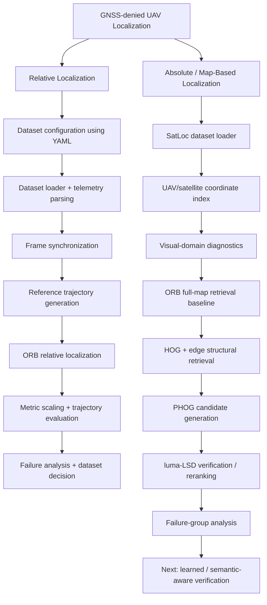
```mermaid
flowchart TD
    A[GNSS-denied UAV Localization] --> B[Relative Localization]
    A --> C[Absolute / Map-Based Localization]

    B --> B1[Dataset configuration using YAML]
    B1 --> B2[Dataset loader + telemetry parsing]
    B2 --> B3[Frame synchronization]
    B3 --> B4[Reference trajectory generation]
    B4 --> B5[ORB relative localization]
    B5 --> B6[Metric scaling + trajectory evaluation]
    B6 --> B7[Failure analysis + dataset decision]

    C --> C1[SatLoc dataset loader]
    C1 --> C2[UAV/satellite coordinate index]
    C2 --> C3[Visual-domain diagnostics]
    C3 --> C4[ORB full-map retrieval baseline]
    C4 --> C5[HOG + edge structural retrieval]
    C5 --> C6[PHOG candidate generation]
    C6 --> C7[luma-LSD verification / reranking]
    C7 --> C8[Failure-group analysis]
    C8 --> C9[Next: learned / semantic-aware verification]
```

---

## 3. Actual Development Decision Path

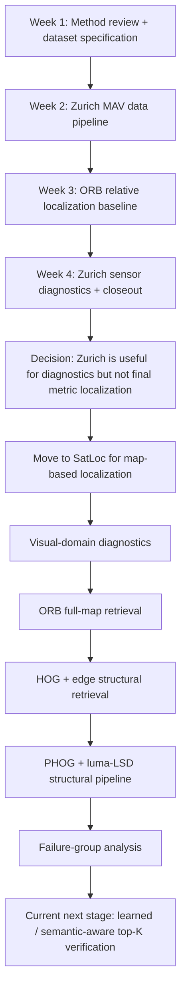
```mermaid
flowchart TD
    A[Week 1: Method review + dataset specification] --> B[Week 2: Zurich MAV data pipeline]
    B --> C[Week 3: ORB relative localization baseline]
    C --> D[Week 4: Zurich sensor diagnostics + closeout]
    D --> E[Decision: Zurich is useful for diagnostics but not final metric localization]
    E --> F[Move to SatLoc for map-based localization]
    F --> G[Visual-domain diagnostics]
    G --> H[ORB full-map retrieval]
    H --> I[HOG + edge structural retrieval]
    I --> J[PHOG + luma-LSD structural pipeline]
    J --> K[Failure-group analysis]
    K --> L[Current next stage: learned / semantic-aware top-K verification]
```

---

## 4. Week-by-Week Progress Summary

| Week / Stage | Focus | What I completed | Main decision |
|---|---|---|---|
| Week 1 | Task understanding, method review, dataset specification | Classified methods into relative localization, absolute map matching, sensor fusion, and robustness methods | Start with controllable classical baselines and common evaluation format |
| Week 2 | Zurich MAV dataset pipeline | Built YAML-based dataset config, loader, telemetry parsing, reference trajectory generation, visualization, and frame synchronization | Dataset pipeline works and is reusable |
| Week 3 | Relative localization baseline | Implemented ORB matching, stride diagnostics, image-motion trajectory, metric scaling, evaluation, and failure analysis | ORB tracking works; metric conversion is limited by dataset geometry |
| Week 4A | Zurich closeout | Tested IMU/barometer/quaternion readiness, gyro/yaw relation, and sensor-assisted ORB scaling | Zurich is retained as diagnostic/baseline dataset, not final metric localization dataset |
| Week 4B / SatLoc S3–S4 | Map-based localization | Built SatLoc loader, coordinate index, ORB retrieval, HOG+edge, PHOG, luma-LSD, and failure-group analysis | Classical structural methods are useful but have reached a ceiling |

---

# Part A — Relative Localization Branch: Zurich MAV

## 5. Why I Started with Zurich MAV

I first worked on the relative-localization path by estimating the UAV motion relative to a known start point, comparing against reference trajectory, and visualize the result.

The Zurich MAV dataset was used to build and validate the reusable pipeline:

```text
YAML dataset config
↓
Zurich MAV loader
↓
telemetry parsing + robust CSV handling
↓
reference trajectory generation
↓
frame synchronization
↓
ORB frame-to-frame motion estimation
↓
metric scaling attempt
↓
error evaluation + diagnostics
```

---

## 6. Zurich MAV Reference Trajectory Visualization

The first important milestone was that I could load the dataset, convert the reference trajectory into local coordinates, and visualize the flight path correctly.

### Zurich MAV reference trajectory in local ENU coordinates

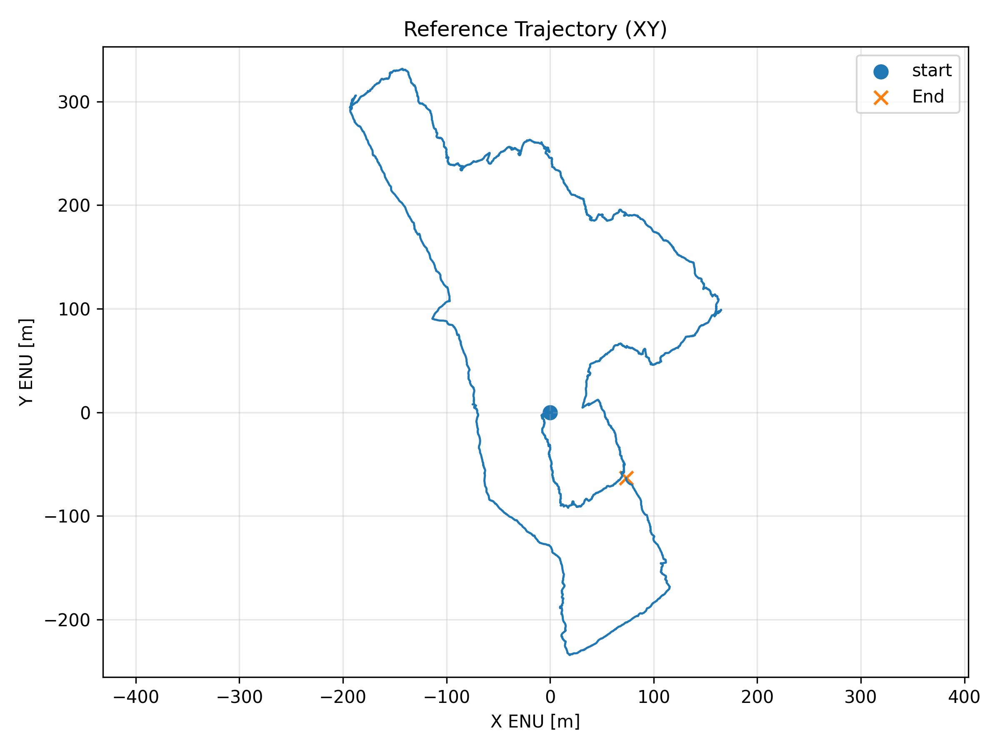

### Zurich MAV altitude profile

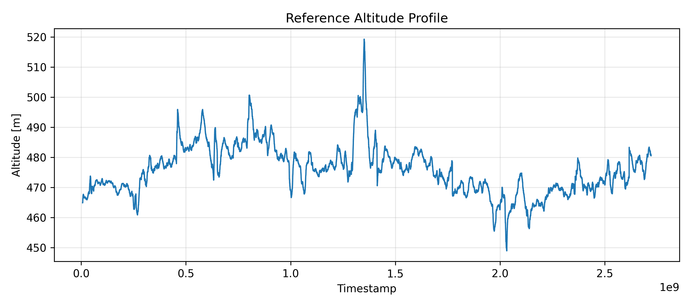

### Speed Profile fo the drone

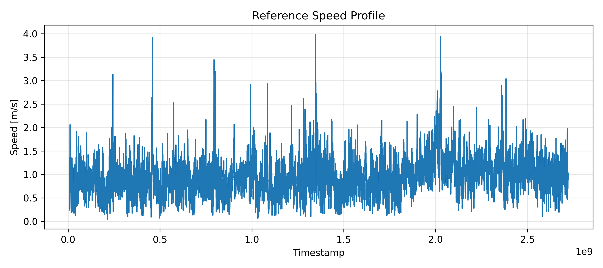

---

## 7. Zurich MAV Relative Localization Result

I implemented ORB feature matching with RANSAC/homography filtering and accumulated the image-motion trajectory.

The key result was:

```text
ORB image-to-image tracking works well.
The weak part is converting image motion into real metric ENU displacement.
```

### Sample ORB tracking result

```text
Frames used:         350
Attempted pairs:     349
OK pairs:            349
Failed pairs:        0
Median matches:      1347
Median inliers:      1202
Median inlier ratio: 0.903
Aligned shape RMSE:  0.656 m
```

This showed that the visual tracking layer itself was not the main failure.

---

## 8. Full Zurich MAV ORB Evaluation

I then tested selected full-dataset windows using stride-1 and stride-5 settings.

### ORB tracking quality

| Run | Frames | Median inlier ratio | Interpretation |
|---|---:|---:|---|
| `full_00001_01000_stride1` | 1000 | 0.915 | strong tracking |
| `full_00001_01000_stride5` | 200 | 0.803 | usable fast mode |
| `full_40000_41000_stride1` | 1001 | 0.914 | strong tracking |
| `full_40000_41000_stride5` | 201 | 0.661 | usable but weaker |

### Metric ENU trajectory evaluation

| Run | Estimated path | Reference path | RMSE | Final error | Drift / 100 m |
|---|---:|---:|---:|---:|---:|
| `full_00001_01000_stride1` | 5.961 m | 19.312 m | 3.548 m | 6.799 m | 35.208 m |
| `full_00001_01000_stride5` | 6.423 m | 19.056 m | 3.481 m | 6.744 m | 35.389 m |
| `full_40000_41000_stride1` | 24.911 m | 41.235 m | 22.675 m | 28.345 m | 68.741 m |
| `full_40000_41000_stride5` | 26.288 m | 41.235 m | 20.519 m | 24.774 m | 60.080 m |

---

## 9. Zurich MAV Visual Results

### Early segment — metric trajectory versus reference

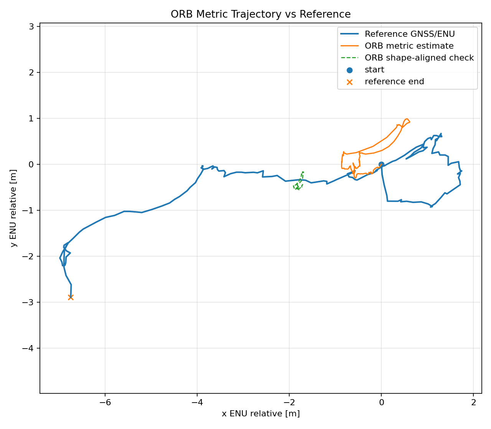

### Early segment — error over frame

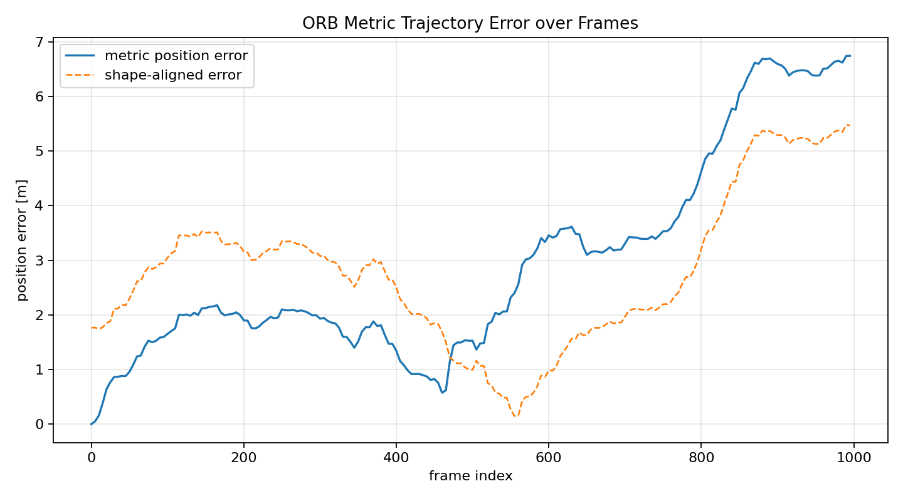

### Middle segment — metric trajectory versus reference

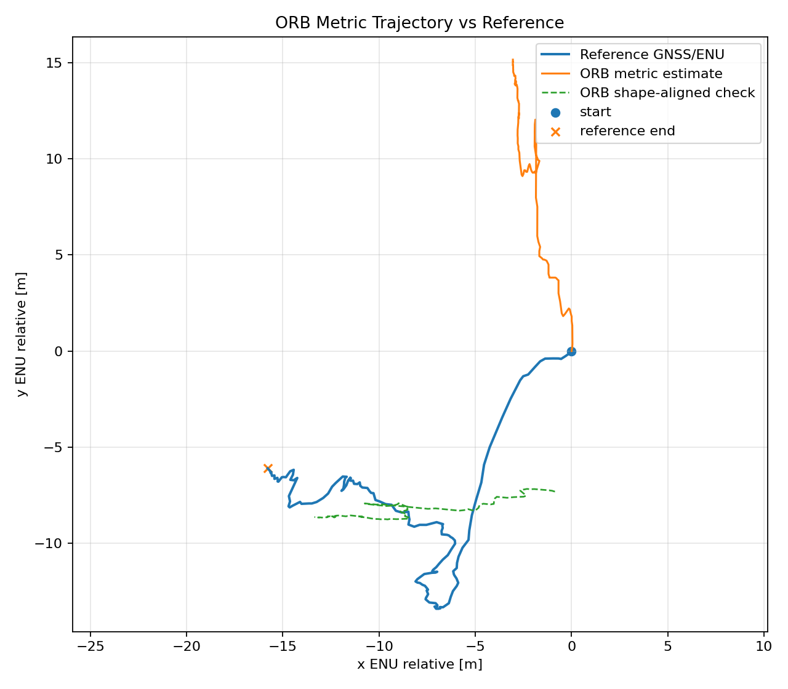

### Middle segment — error over frame

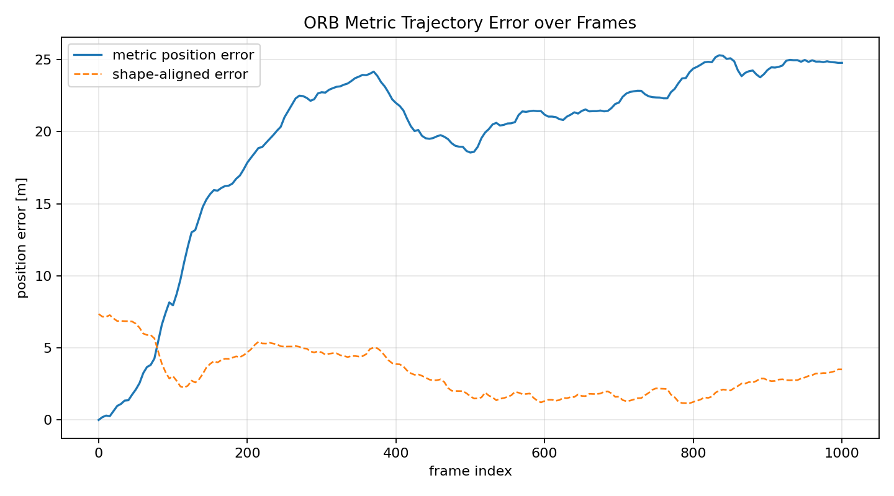

---

## 10. Why Zurich MAV Was Closed as a Diagnostic Dataset

My main conclusion from Zurich MAV is that the visual tracking layer worked, but the physical conversion layer did not generalize.

The limitation came from:

```text
- oblique camera view instead of clean nadir view `*(MAJOR REASON)`
- urban 3D structure and parallax
- missing reliable true AGL / depth `*(MAJOR REASON)`
- uncertain camera-to-body extrinsics 
- unusable OnboardPose height and azimuth channels `*(MAJOR REASON)`
- no clean georeferenced orthophoto package for direct frame-to-map localization
```

Therefore, I froze Zurich MAV as a diagnostic and baseline dataset because it is useful for loading, synchronization, ORB tracking, stride testing, and sensor diagnostics.

### Height and barometer candidate diagnostic

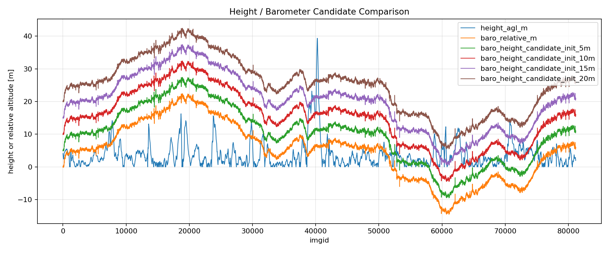

---

## 11. Optional Zurich Sensor Diagnostics

I also checked whether the available IMU/barometer/quaternion streams could support the next estimator stage.

### Accelerometer axis/sign mapping

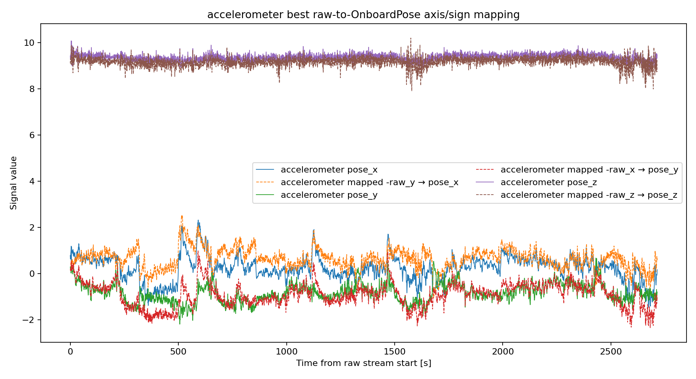

### Gyroscope axis/sign mapping

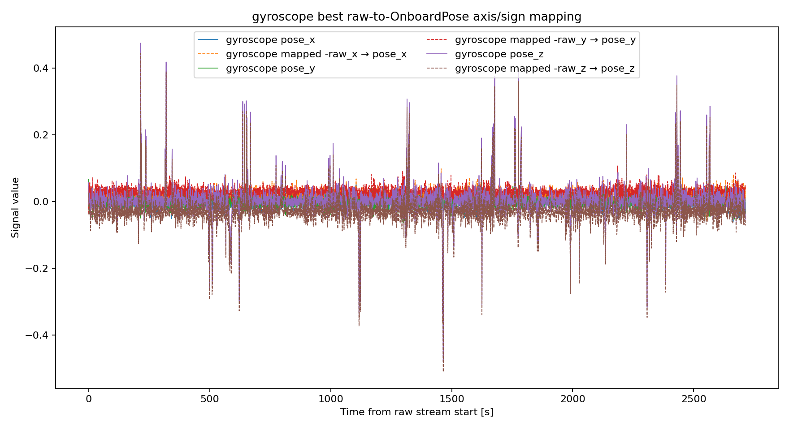

Main interpretation:

```text
The raw IMU and OnboardPose streams are meaningful for diagnostics, especially gyro z / yaw-rate relation.
However, without reliable camera-to-body geometry and true AGL/depth, they do not directly solve the metric conversion issue for Zurich MAV.
```

## sensor-assisted ORB trajectory figures:

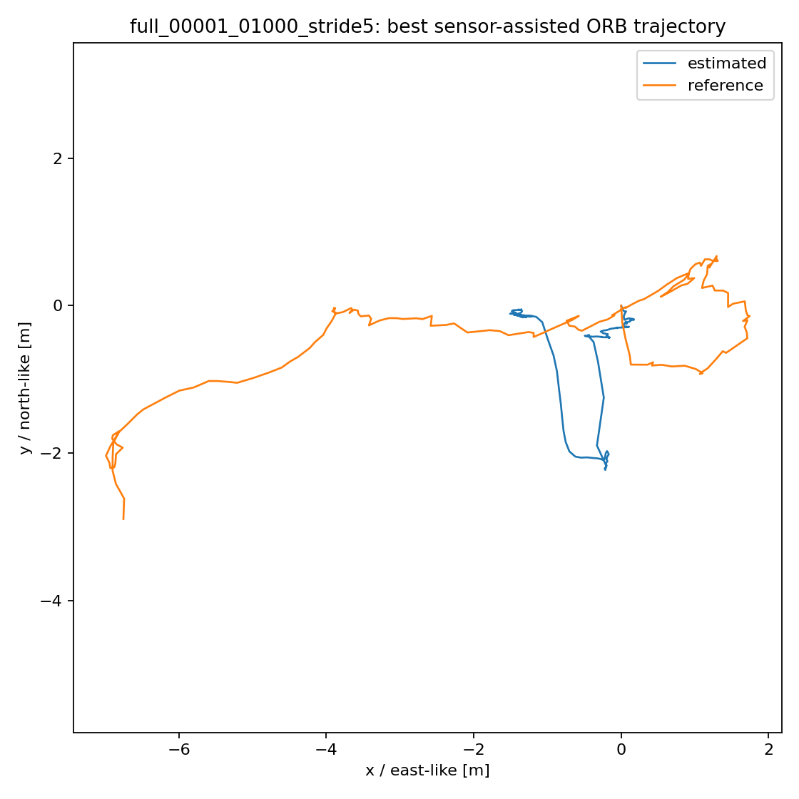

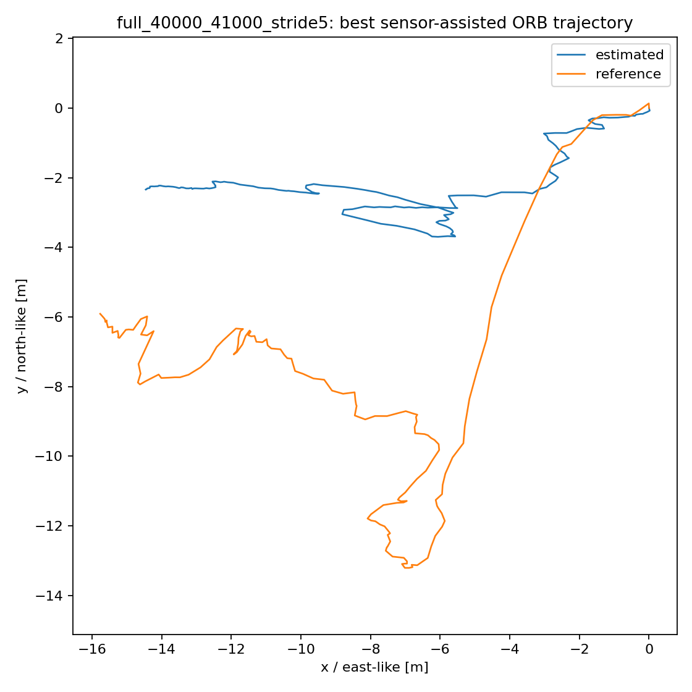

---

# Part B — Absolute / Map-Based Localization Branch: SatLoc

## 12. Why I Moved to SatLoc

After closing Zurich MAV dataset, I moved to SatLoc because it better matches the absolute/map-based branch of the task.

SatLoc provides:

```text
- UAV image frames
- satellite / orthophoto map imagery
- georeferenced map metadata
- coordinate labels usable for evaluation
```

SatLoc does not provide the full IMU/barometer stream needed for VIO-style fusion, so I treated this phase as a **map-image retrieval and candidate localization** problem.

The rule remained:

```text
UAV filename lon/lat is reference/evaluation data only.
It is not used inside retrieval ranking or scoring.
```

---

## 13. SatLoc Dataset and Reference Visualization

The SatLoc loader and coordinate-indexing pipeline built the link between UAV frames, satellite tiles, GeoTIFF metadata, and evaluation coordinates.

### SatLoc reference trajectory in ENU / global local view

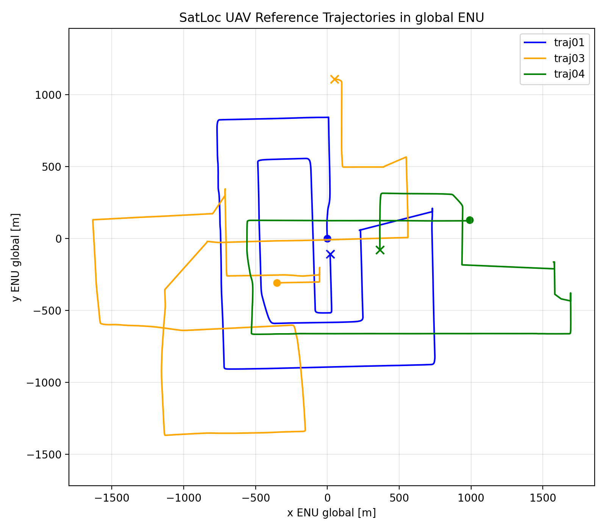

### SatLoc reference trajectory in longitude/latitude

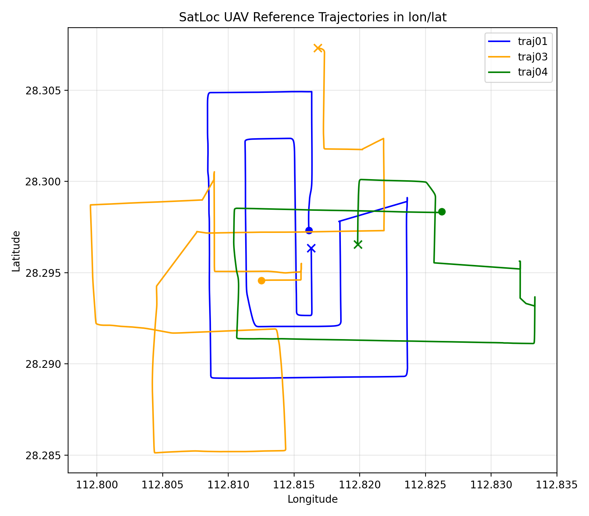

Dataset inspection summary:

```text
UAV images:                    2959
UAV parsed coordinates:        2959
UAV sequences:                 3
Satellite tile rows:           8625
Satellite tile files matched:  8625
GeoTIFF:                       8192 × 4650, EPSG:4326
Reference CSV rows:            8625
```

---

## 14. SatLoc Map-Matching Development Path

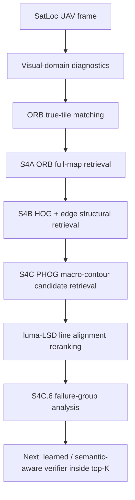
```mermaid
flowchart TD
    A[SatLoc UAV frame] --> B[Visual-domain diagnostics]
    B --> C[ORB true-tile matching]
    C --> D[S4A ORB full-map retrieval]
    D --> E[S4B HOG + edge structural retrieval]
    E --> F[S4C PHOG macro-contour candidate retrieval]
    F --> G[luma-LSD line alignment reranking]
    G --> H[S4C.6 failure-group analysis]
    H --> I[Next: learned / semantic-aware verifier inside top-K]
```

---

## 15. S3.5 — Visual-Domain Diagnostics

Before running full retrieval, I studied the visual gap between UAV and satellite images.

Main observations:

```text
- UAV images are sharper, closer, and sometimes rotated.
- Satellite tiles are blurrier and map-like.
- Vegetation, shadows, roads, ponds, roofs, and fields behave differently under feature extraction.
- A visually cleaner preprocessing method does not always improve matching.
```

### Feature preprocessing example

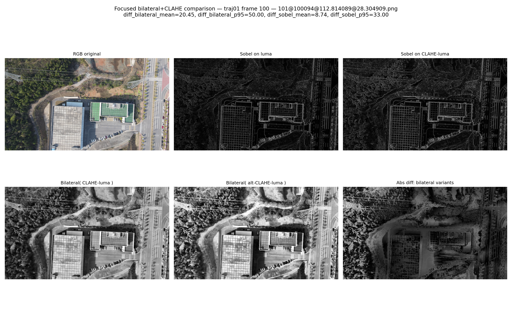

### ORB preprocessing comparison

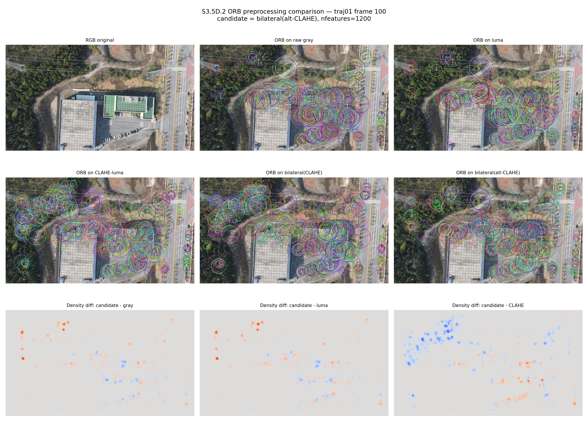

### True tile ORB matching

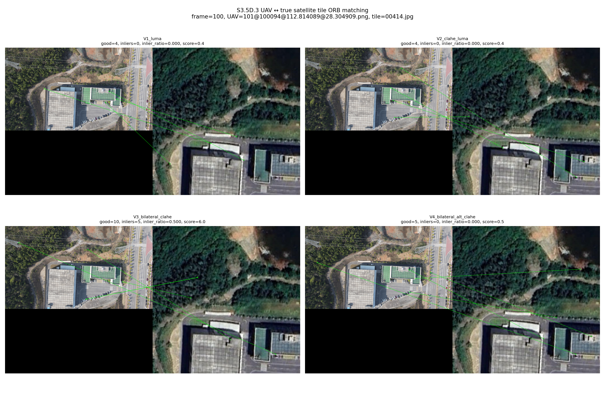

Key decision:

```text
Direct ORB matching to one true satellite tile is weak.
The next step should be top-K satellite tile retrieval and candidate localization.
```

---

## 16. S4A — ORB Full-Map Retrieval Baseline

I implemented a full ORB retrieval baseline over all satellite tiles.

Pipeline:

```text
UAV query image
↓
CLAHE-luma preprocessing
↓
ORB keypoints + descriptors
↓
match against cached satellite tile descriptors
↓
Lowe ratio filtering
↓
RANSAC homography scoring
↓
rank all 8625 satellite tiles
↓
evaluate only after ranking
```

### S4A result summary

| Metric | Result |
|---|---:|
| Query count | 10 |
| Satellite tiles per query | 8625 |
| Recall@1 | 0.0 |
| Recall@5 | 0.0 |
| Recall@10 | 0.0 |
| First correct rank median | 271.0 |
| Top-1 error median | 1488.65 m |
| Closest correct error median | 15.85 m |
| Runtime per query mean | 191.26 s |

### ORB recall summary

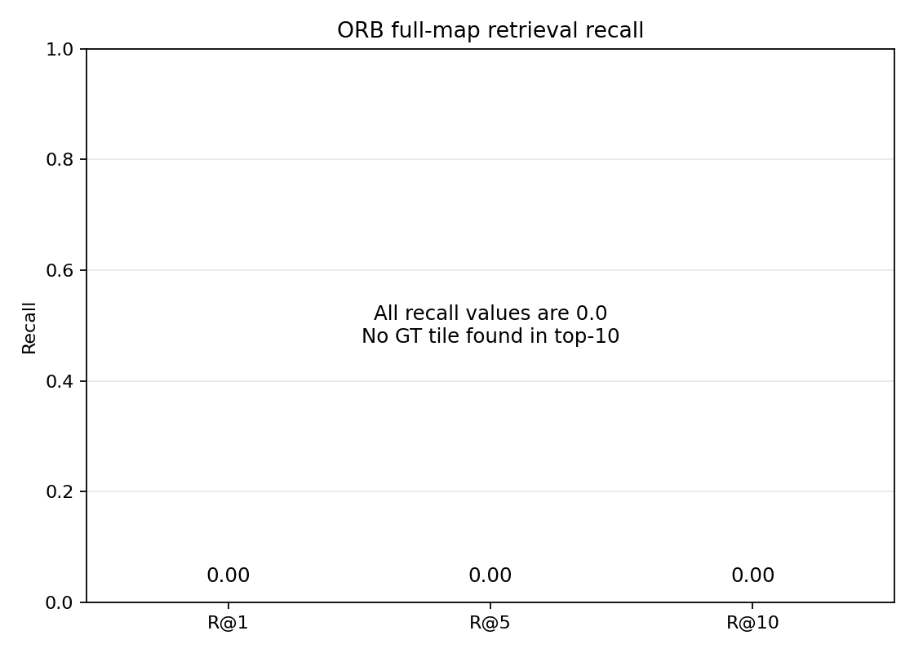

### ORB top-1 error

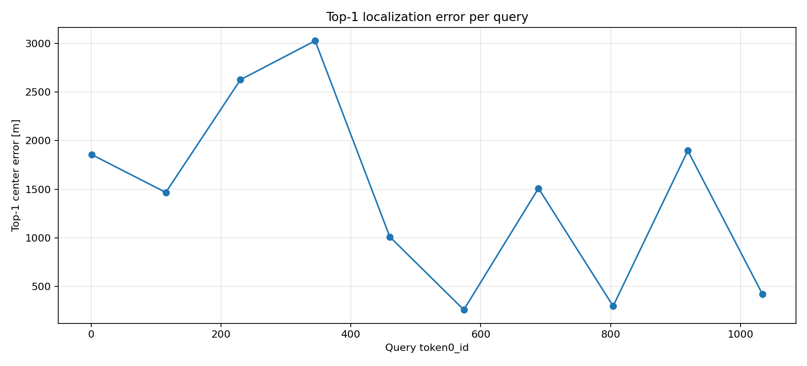

Main conclusion:

```text
ORB is a useful reproducible classical baseline, but it is too local and ambiguous for full-map UAV-to-satellite retrieval.
False positives from vegetation, shadows, roads, and repeated structures can score higher than the true tile.
```

---

## 17. S4B — HOG + Edge Structural Retrieval

After ORB failed as global retrieval, I tested a broader structural descriptor using Sobel/HOG-style edge layout.

Main idea:

```text
ORB matches local binary patches.
HOG + edge compares larger-scale structural layout.
```

What improved:

```text
HOG + edge retrieved more visually meaningful neighborhoods than ORB.
Some examples reached near-correct candidates within tens of meters.
```

What still failed:

```text
HOG + edge sees gradients, not object identity.
It cannot know whether an edge belongs to a road, pond, roof, forest, or construction land.
```

### S4B score decomposition example

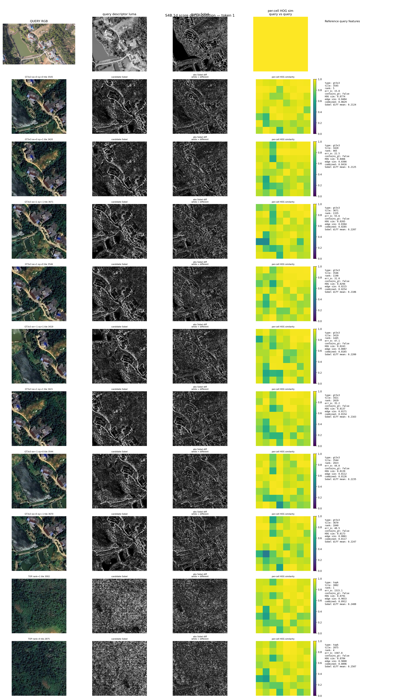

### S4B texture penalty / rerank example

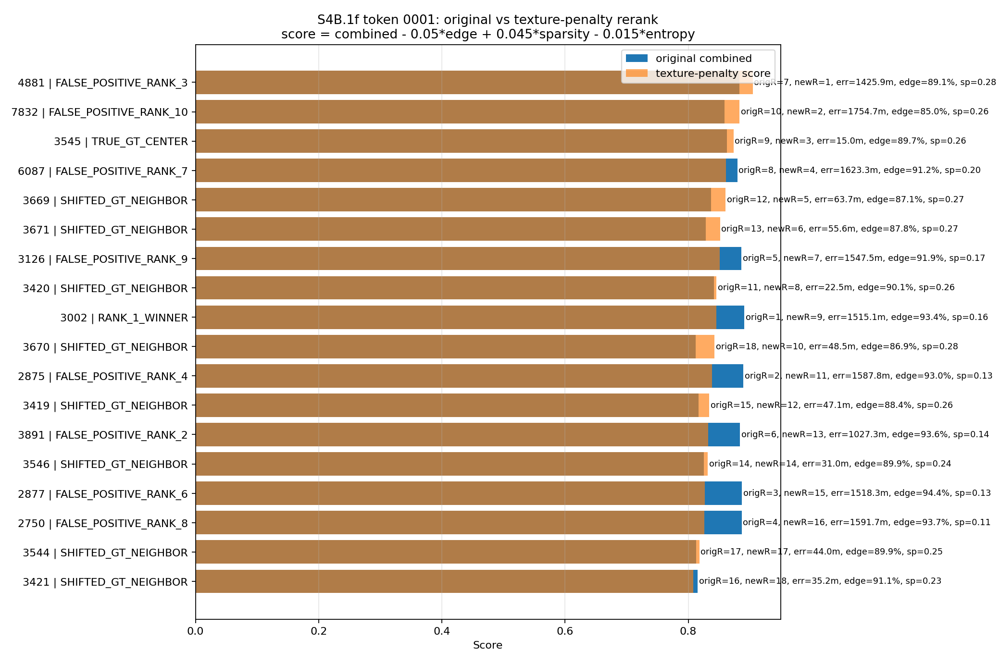

Main conclusion:

```text
HOG + edge is a stronger structural baseline than ORB, but pure gradient structure is not enough for reliable absolute localization.
```

---

## 18. S4C — PHOG + luma-LSD Classical Structural Pipeline

The strongest classical pipeline so far is:

```text
UAV luma image
├── Sobel macro-contour → PHOG descriptor → full-map PHOG top-50 candidate retrieval
└── LSD on luma image → distance-transform line alignment → rerank PHOG top-50
```

Important clarification:

```text
Sobel/PHOG and LSD are not pixel-level fused.
Sobel/PHOG is the candidate generator.
luma-LSD is the candidate verifier / reranker.
```

---

## 19. S4C Key Results

### PHOG candidate generation

On the selected 73-frame diagnostic subset:

| Method | Top-1 <=20 m | Top-1 <=40 m | Top-10 <=40 m | Median Top-1 Error | Median Best Top-10 Error |
|---|---:|---:|---:|---:|---:|
| PHOG only | 8.22% | 17.81% | 30.14% | 1449.88 m | 485.04 m |

### luma-LSD reranking

| Profile | Top-1 <=20 m | Top-1 <=40 m | Top-10 <=40 m | Median Top-1 Error | Median Best Top-10 Error |
|---|---:|---:|---:|---:|---:|
| `lsd_only` | 13.70% | 30.14% | 42.47% | 706.55 m | 223.11 m |
| `lsd_strong` | 15.07% | 30.14% | 41.10% | 1007.58 m | 223.11 m |
| `phog_only` | 8.22% | 17.81% | 30.14% | 1449.88 m | 485.04 m |

Main improvement:

```text
luma-LSD reranking improved PHOG top-1 <=40 m from 17.8% to 30.1%
and reduced median top-1 error from 1449.9 m to 706.6 m.
```

---

## 20. S4C.6 Failure-Group Analysis

The most important current result is the failure-group analysis. It tells me whether the problem is candidate generation, reranking, or structural ambiguity.

Threshold used:

```text
40 m
```

### Failure group summary

| Failure group | Count | Rate | Main meaning |
|---|---:|---:|---|
| `candidate_pool_failure` | 37 | 50.68% | Correct candidate is often not close enough in PHOG top-50 |
| `lsd_rescue` | 11 | 15.07% | luma-LSD successfully rescues PHOG failures |
| `stable_success` | 11 | 15.07% | Both PHOG and LSD work |
| `selection_failure_correct_in_pool` | 9 | 12.33% | Correct candidate exists but reranker chooses wrong tile |
| `weak_pool_near_candidate` | 3 | 4.11% | Some near candidate exists but not within 40 m |
| `lsd_destroyed_phog_success` | 2 | 2.74% | LSD overrides an already-correct PHOG result |

### Failure group counts

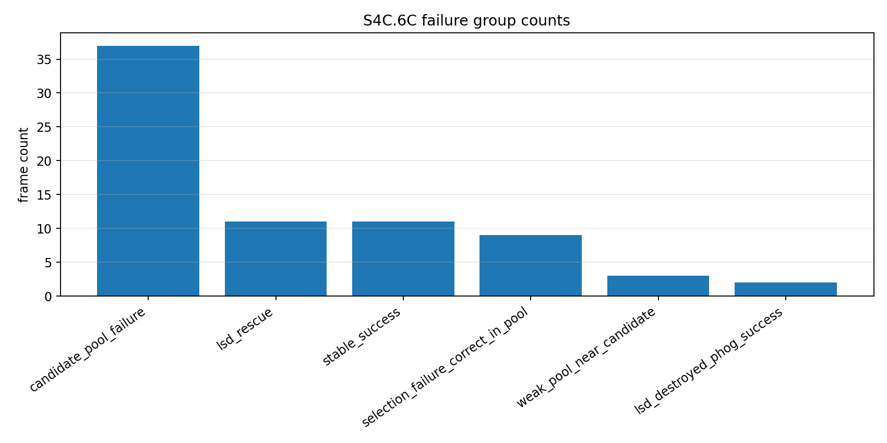

### PHOG vs luma-LSD error

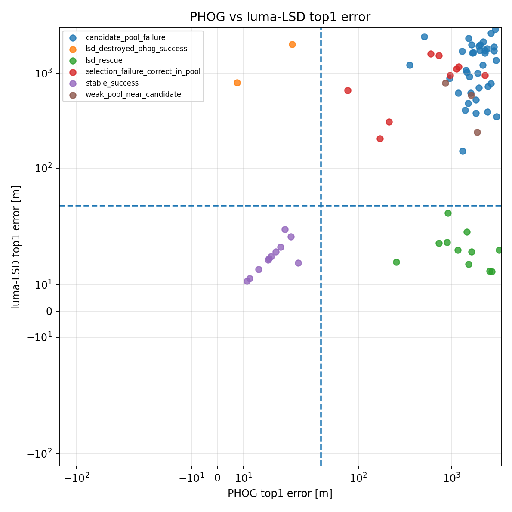

### Selection gap to oracle

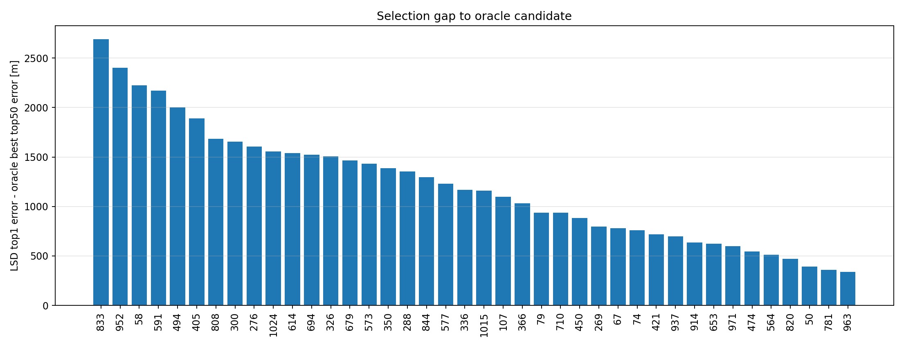

### Structure availability versus error

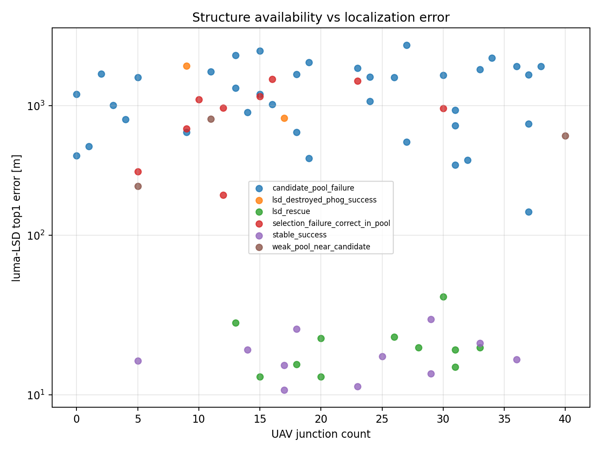

---

## 21. Representative Failure / Success Panels

I have only a few representative examples here. The detailed panels are available under:

```text
docs/assets/s4c6_representatives/
```

### Some representative panel for sucess/failure:

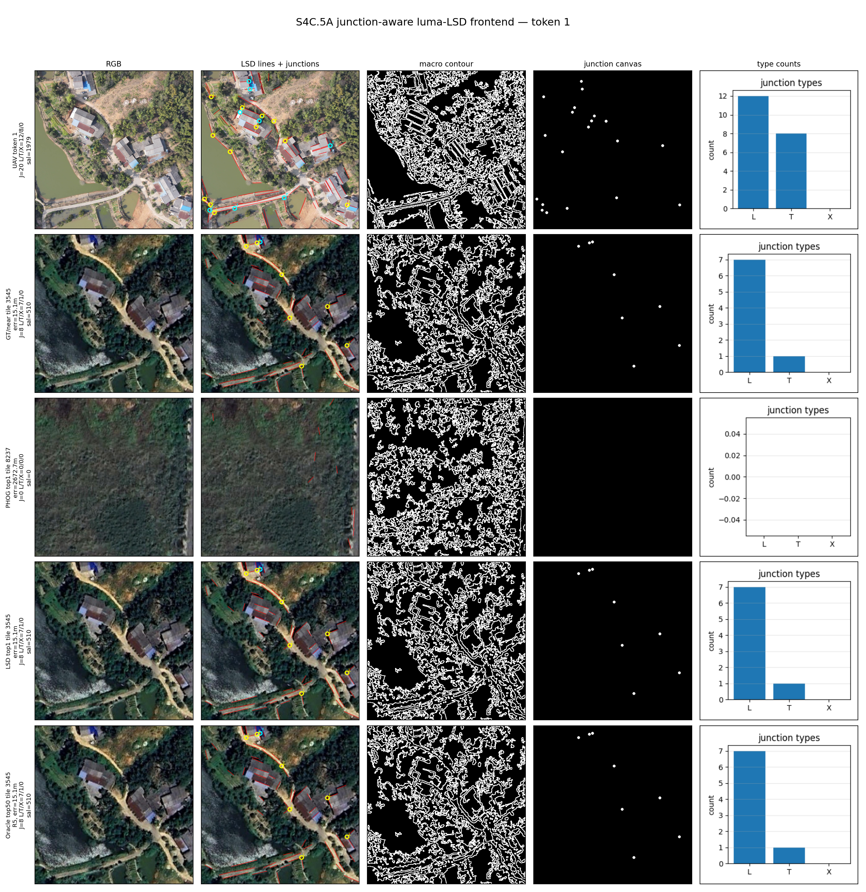

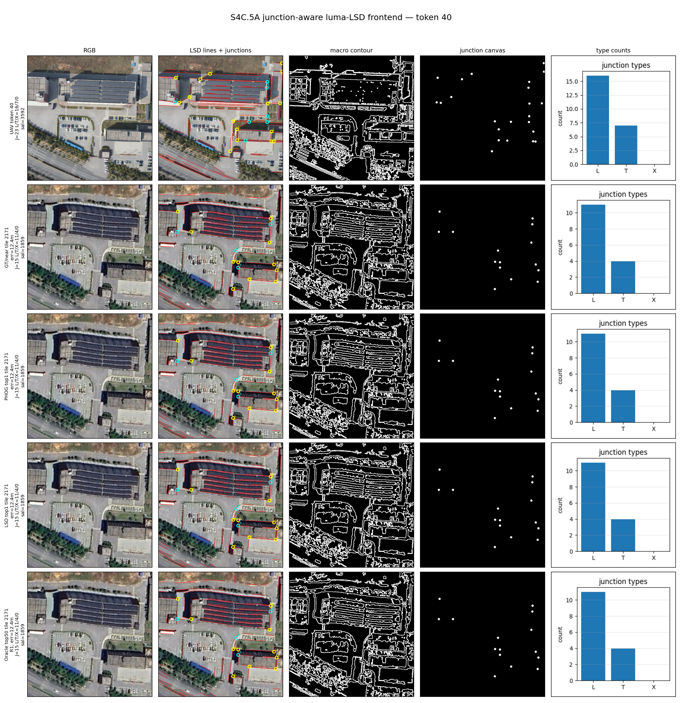

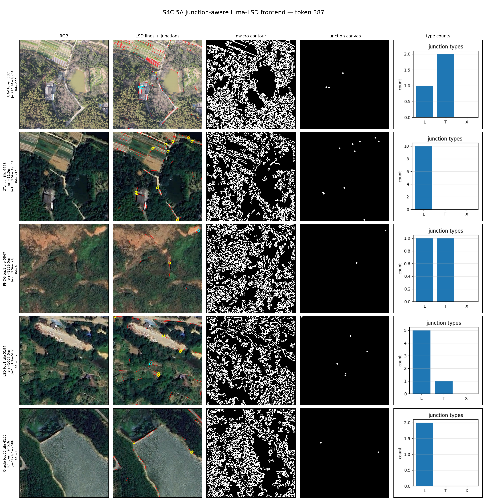

---

# Part C — Current Interpretation and Next Step

## 22. What I Have Successfully Built

As of this Week 1–4 progress point, I have built and maintained a continuous implementation chain:

```text
method review
↓
dataset specification
↓
YAML-based dataset loading
↓
reference trajectory generation
↓
frame synchronization
↓
relative ORB localization
↓
metric scaling and failure diagnosis
↓
Zurich dataset closeout
↓
SatLoc map-based dataset loader
↓
UAV/satellite coordinate index
↓
ORB retrieval baseline
↓
HOG + edge structural retrieval
↓
PHOG candidate generation
↓
luma-LSD verification
↓
failure-group analysis
```

---

## 23. Main Technical Insights

### Relative localization insight

```text
Feature tracking can work even when final metric localization fails.
Zurich MAV showed strong ORB tracking, but metric conversion needs geometry, true AGL/depth, or reliable camera-to-body calibration.
```

### Absolute / map-based insight

```text
Classical UAV-to-satellite retrieval is difficult because the UAV and satellite visual domains differ strongly.
ORB is too local.
HOG/PHOG improve structural retrieval.
luma-LSD is useful as a verifier.
But classical structure alone cannot reliably solve object identity and false positives.
```

### Failure-analysis insight

```text
The current bottleneck is split into two cases:
1. candidate-pool failure: the correct area is not good enough in PHOG top-50.
2. selection failure: the correct candidate exists, but the verifier/reranker selects a wrong structural lookalike.
```

This is why I planned to move either to Segmentation mask or GNNs for mapping objects in the scene or learning-based lightweight models to re-rank.
---

## 25. Plan For Next Stage

```text
S5A — learned or semantic-aware verification inside PHOG top-K candidates
```

Controlled pipeline:

```text
UAV frame
↓
PHOG / structural retrieval gives top-K candidates
↓
learned matcher or semantic verifier runs only inside top-K
↓
evaluate on S4C.6 failure groups
```

Candidate methods for controlled comparison:

```text
- SuperPoint + LightGlue style matching
- LoFTR-style detector-free matching
- RoMA / dense matching style verification
- DINO / CLIP / NetVLAD / CosPlace-style global descriptors if compute permits
- semantic or region-aware masking for water, road, vegetation, buildings, and bare land
```

Plan is to test above on top-K verification using the existing candidate pool.

---
