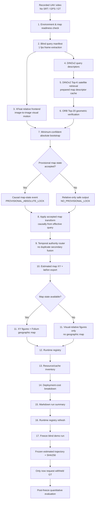
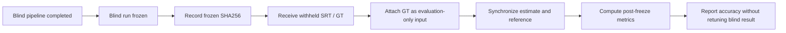

# Blind Recorded-Flight UAV Localization Demo

**Run ID:** `blind_recorded_flight_final_001`
**Pipeline status:** `SUCCESSFUL_DEMO_ORCHESTRATED_BLIND_RUN`
**Stages completed:** `17 / 17`
**Localization state:** `PROVISIONAL_ABSOLUTE_LOCK`
**Reference / GT used during localization:** **No**

---

## 1. Purpose

This demo evaluates a **blind, recorded-flight visual localization pipeline** for a UAV.

The main question is:

> Can the UAV estimate an absolute geographic trajectory from camera imagery and a prepared satellite/orthophoto map **without using GPS, SRT coordinates, or ground truth during localization**?

---

## 2. Blind-data contract

### Allowed before output freeze

* recorded RGB video frames
* configured/assumed flight altitude
* configured near-nadir camera orientation
* prepared orthophoto/map tiles
* map tile geometry
* DINOv2 descriptors, similarities, and ranks
* ORB geometric-verification evidence
* XFeat image-to-image relative motion
* causal temporal consistency
* previous blind localization decisions

### Not allowed before output freeze

* GPS coordinates from the recorded flight
* SRT coordinates
* reference ENU trajectory
* reference latitude/longitude
* oracle map tile
* localization error against GT
* RMSE / median / p95 error
* GT-based parameter selection
* GT-based transform alignment

The final trajectory is therefore generated **without knowing whether it is geographically correct**. Geographic correctness is evaluated only after the frozen output is compared with the withheld reference/GT trajectory.

---

## 3. End-to-end orchestration



### Pipeline story

The pipeline starts by checking that the environment, prepared map, tile index, and model caches are available. The recorded video is then sampled at 1 fps to create the blind query sequence.

From there, two streams run in parallel. **XFeat** follows the motion between consecutive UAV frames and builds a relative visual trajectory. At the same time, **DINOv2** compares each UAV image against the prepared orthophoto tiles and returns the most visually similar map candidates. **ORB** then checks those candidates geometrically and provides more precise evidence inside the retrieved map regions.

The **minimum-confident bootstrap** combines the relative motion and map observations over time. It does not accept the first plausible map match immediately. It waits until the observations are consistent enough to establish a provisional map state. If this condition is never reached, the system stays relative-only. In this run, the provisional map state was accepted at query 30.

Once the map state is available, the accepted transform is applied **causally** from that query onward. Earlier frames remain relative-only. The temporal router then passes this state forward without applying another independent correction layer.

The resulting map coordinates are converted to latitude/longitude and used to create the trajectory figures and interactive map. The remaining stages record runtime and resource information, generate the run summary, refresh the runtime registry, and finally freeze the blind result before any GT or SRT reference is accessed.

---

## 4. How the localization works

### 4.1 Relative visual motion — XFeat

Consecutive UAV frames are matched using **XFeat** to build an image-to-image relative-motion chain.

Before an absolute map state is accepted, this trajectory remains a **visual relative trajectory** because monocular image motion does not independently provide a trustworthy metric map scale.

### 4.2 Global map retrieval — DINOv2

Each sampled UAV frame is encoded using DINOv2:

* model: `dinov2_vits14`
* image size: `518`
* crop: `center_square`
* pooling: `avgpatch`
* execution device in this run: CPU

The descriptor is compared with a reusable descriptor cache built from prepared orthophoto tiles.

For this run:

* queries: **123**
* prepared map tiles: **475**
* Top-K: **20**
* retrieval candidate rows: **2460**

DINO proposes visually similar map regions. It does **not** by itself establish that the top candidate is geographically correct.

### 4.3 Geometric verification — ORB

The DINO Top-20 candidates are checked using ORB-based geometric verification.

For this run:

* queries: **123**
* query-candidate pairs: **2460**
* selected homography available: **123 / 123**
* selected median inliers: **7**
* selected original DINO rank median: **5**

This stage provides geometric evidence for candidate selection and sub-tile localization.

### 4.4 Minimum-confident absolute bootstrap

The absolute bootstrap does not immediately trust a retrieved map candidate. Candidate observations are accumulated and checked causally for sufficient agreement.

For this flight:

* localization state: `PROVISIONAL_ABSOLUTE_LOCK`
* maturity query: **30**
* final accepted source query: **30**
* accepted map-state events: **1**

Accepted transform:

* scale: approximately **0.39079 map metres / visual pixel**
* rotation: approximately **+0.581°**

The state remains explicitly **provisional**.

### 4.5 Causal map alignment

A transform accepted at query 30 is used **only from that point onward**.

The earlier relative-only trajectory is not rewritten using a future transform.

Therefore:

* total frames: **123**
* relative-only frames: **29**
* map-aligned frames: **94**
* map-aligned query range: **30 → 123**

### 4.6 Temporal authority

The minimum-confident bootstrap already owns the causal accept/hold behavior for the map state.

The downstream temporal stage therefore does **not** apply a second independent fusion layer.

For this run:

* temporal fusion applied: **False**
* secondary fusion applied: **False**
* coordinates modified by temporal router: **False**

### 4.7 Geographic export

Once a provisional map transform is available, map-aligned positions are exported to geographic coordinates.

For this run:

* source CRS: `EPSG:3346`
* target CRS: `EPSG:4326`
* estimated map positions available: **94**
* estimated lat/lon available: **94**
* pre-lock backfill: **False**
* GT/reference used: **False**
* `ABSOLUTE_LOCKED` emitted: **False**

The latitude/longitude columns are therefore **visual localization estimates**, not GPS measurements.

---

## 5. Demo outputs

### Estimated XY trajectory


This shows the map-aligned estimated trajectory after the provisional absolute map state becomes available.

### Interactive estimated map

[`estimated_fused_map.html`](./maps/estimated_fused_map.html)

This is the Folium map containing the estimated geographic trajectory over the prepared orthophoto.

GitHub does not render the interactive Folium HTML directly. **Download the `.html` file and open it locally in a web browser** to view the interactive map.

### Run summary

[`demo_run_summary.md`](./demo_run_summary.md)

This contains the automatically generated summary of the final run, including the localization state, number of map-aligned poses, runtime information, and execution status.

The file links included in `demo_run_summary.md` point to the same trajectory figure and interactive map listed above.

---

## 6. Final blind run result

| Item                             |                                                             Result |
| -------------------------------- | -----------------------------------------------------------------: |
| Orchestrator                     |                                                             `PASS` |
| Completed stages                 |                                                          `17 / 17` |
| Video duration                   |                                                             ~124 s |
| Blind query frames               |                                                                123 |
| Relative frame pairs             |                                                                122 |
| Map tiles                        |                                                                475 |
| DINO Top-K                       |                                                                 20 |
| ORB candidate pairs              |                                                               2460 |
| Bootstrap state                  |                                        `PROVISIONAL_ABSOLUTE_LOCK` |
| Absolute maturity query          |                                                                 30 |
| Relative-only frames             |                                                                 29 |
| Map-aligned frames               |                                                                 94 |
| Estimated lat/lon poses          |                                                                 94 |
| Accepted causal map-state events |                                                                  1 |
| Secondary temporal fusion        |                                                              False |
| GT/reference used                |                                                              False |
| `ABSOLUTE_LOCKED` emitted        |                                                              False |
| Frozen blind run SHA256          | `734780591aa6438329f8992b362605f478b38c71d80ab800318afe95b46420a5` |

---

## 7. Runtime and deployment result

Execution environment:

* macOS
* 2 physical CPU cores / 4 logical cores
* 8 GiB system RAM
* CPU execution for DINOv2, XFeat, and ORB
* no CUDA
* no MPS acceleration

Measured orchestration wall time:

* **748.025 s**
* approximately **12.47 minutes**

Measured reusable offline map-descriptor preparation:

* **955.130 s**

Measured per-new-flight total:

* approximately **700.024 s**

Online-like serial localization estimate:

* approximately **3878.6 ms/query**
* equivalent capacity: approximately **0.258 Hz**
* 1 Hz real-time target: **not met on this CPU configuration**

The cached DINO similarity search itself is very fast; most CPU cost comes from query encoding and pairwise geometric verification.

---

## 8. Important interpretation of the current result

The pipeline has demonstrated that it can:

* process the recorded flight without SRT/GPS/GT,
* build a relative visual-motion trajectory,
* retrieve candidate regions from a prepared orthophoto,
* geometrically verify satellite candidates,
* establish one provisional absolute map state,
* causally align later relative poses into the map frame,
* export estimated latitude/longitude,
* generate visual and interactive map outputs,
* record runtime/resource information,
* and freeze the result without reference access.

However:

> **This blind run alone does not establish geographic accuracy.**

The current state is intentionally named `PROVISIONAL_ABSOLUTE_LOCK`, not `ABSOLUTE_LOCKED`.

---

## 9. Post-freeze evaluation protocol



The frozen blind run used for evaluation must remain:

```text
SHA256
734780591aa6438329f8992b362605f478b38c71d80ab800318afe95b46420a5
```

Recommended post-freeze metrics:

* number of synchronized estimated/reference poses
* horizontal position error per frame
* RMSE
* mean error
* median error
* p95 error
* maximum error
* final-position error
* trajectory overlay
* error versus time
* qualitative inspection of the provisional-lock point

These metrics are evaluation-only and must not be fed back into the frozen run.

---

## 10. Reproduction command

The final run was generated using the one-command orchestrator if raw video, AOI satellite map, cached map tiles are available:

```bash
cd /Users/harishprabhu/Documents/drone-localisation
source .drone_venv/bin/activate
export PYTHONPATH=$PWD/src

python scripts/demo/run_recorded_flight_demo.py \
  --config configs/demo_villoc_blind_recorded.yaml \
  --run-id blind_recorded_flight_final_001
```

No GT, SRT, or GPS reference argument was attached to the localization run.

---

## 11. Final execution status

```text
BLIND RECORDED-FLIGHT ORCHESTRATION COMPLETE

execution status : PASS
stages completed : 17/17
localization     : PROVISIONAL_ABSOLUTE_LOCK
reference used   : False
```
