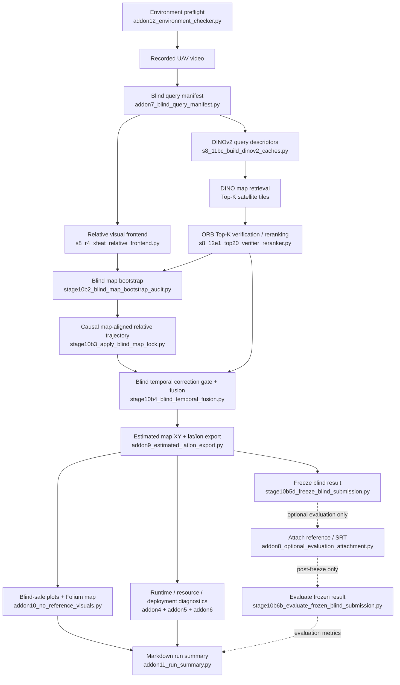

# Blind Demo Add-ons — Architecture & AI Handoff

## Purpose

This branch adds a **blind-safe UAV visual localization workflow and supporting demo utilities** on top of the existing Villoc/S8 pipeline.

The main goal is:

> Given a recorded UAV video and a prepared georeferenced map, estimate the UAV trajectory **without using GPS, SRT, GNSS, or ground-truth coordinates
during localization**.

Ground truth may be attached **only after the blind result has been frozen**, for evaluation.

This branch is intentionally a clean implementation branch. Development-only validation scripts and exploratory audit scripts are not included.

---

## Architecture



---

## Core Blind-Safety Contract

During localization, the following are **forbidden as decision inputs**:

* GPS / GNSS
* SRT latitude/longitude
* ground-truth ENU coordinates
* oracle tile labels
* GT error thresholds such as `<40 m`
* reference-derived trajectory alignment
* any evaluation result

The blind pipeline may use:

* video/image frames
* known camera-flight assumptions supplied by the dataset configuration
* prepared satellite/orthophoto map tiles
* DINO descriptors
* XFeat relative visual motion
* ORB geometric verification
* map-tile geometry
* causal temporal consistency
* previously accepted blind corrections

---

## Main Blind Pipeline

```text
video
  │
  ▼
blind query manifest
  │
  ├──────────────► XFeat relative visual motion
  │
  └──────────────► DINOv2 map retrieval
                         │
                         ▼
                  ORB Top-K reranking
                         │
        ┌────────────────┘
        ▼
blind map bootstrap
        │
        ▼
causal map alignment
        │
        ▼
temporal gating + soft correction fusion
        │
        ▼
estimated map XY
        │
        ▼
estimated latitude / longitude
        │
        ├────────► blind-safe plots / map
        ├────────► runtime + resource summaries
        └────────► run summary
```

The estimated latitude/longitude values are **visual map-matching outputs**. They are not GPS inputs.

---

## Evaluation Boundary

Evaluation is deliberately separated from localization:

```text
BLIND LOCALIZATION
      │
      ▼
estimated trajectory
      │
      ▼
FREEZE RESULT
      │
      │  only after this point
      ▼
optional reference / SRT attachment
      │
      ▼
evaluation
      │
      ├── absolute position error
      ├── drift-over-time / distance
      ├── retrieval threshold sensitivity
      └── accepted-correction safety
```

The evaluator integrates the functionality originally developed as:

* Add-on 1 — drift/time metrics
* Add-on 2 — threshold sensitivity
* Add-on 3 — accepted-correction safety

These diagnostics are evaluation-only and must never influence the blind trajectory.

---

## Engineering Diagnostics

The branch also measures deployment-relevant computation.

### Important runtime stages

* XFeat relative frontend
* DINO query descriptor encoding
* DINO cached map retrieval
* ORB Top-20 verification/reranking
* temporal gating
* fusion

Supporting costs such as:

* PNG generation
* Folium rendering
* CSV writing
* Markdown summary generation

are measured for completeness but should **not** be treated as localization bottlenecks.

### Resource profiling

`addon5_resource_reporting.py` and `measure_stage_memory.py` record CPU/device information and peak process RSS for the main computational stages.

`addon6_deployment_cost_breakdown.py` separates:

```text
offline reusable work
vs
per-recorded-flight preprocessing
vs
online-like localization computation
```

---

## Important Script Roles

```text
scripts/villoc/blind_demo/

addon7_blind_query_manifest.py
    Build the reference-free query/frame manifest.

stage10b2_blind_map_bootstrap_audit.py
    Acquire the first causal map lock from blind visual/map evidence.
    Despite the historical filename "audit", this is part of the
    operational blind localization chain.

stage10b3_apply_blind_map_lock.py
    Transform the relative visual trajectory into the map frame
    after causal initialization.

stage10b4_blind_temporal_fusion.py
    Apply blind temporal consistency and soft absolute corrections.

addon9_estimated_latlon_export.py
    Export estimated map coordinates and latitude/longitude.

addon10_no_reference_visuals.py
    Generate blind-safe XY plots, confidence/correction plots,
    and an interactive estimated trajectory map.

stage10b5d_freeze_blind_submission.py
    Freeze/hash the blind output before any reference evaluation.

addon8_optional_evaluation_attachment.py
    Attach optional post-run reference information.

stage10b6b_evaluate_frozen_blind_submission.py
    Evaluate the frozen blind trajectory.
    Contains integrated drift, threshold-sensitivity,
    and correction-safety evaluation.

addon4_runtime_benchmark.py
    Canonical runtime registry.

addon5_resource_reporting.py
    CPU/device, memory, storage, and cache resource reporting.

addon6_deployment_cost_breakdown.py
    Offline vs per-flight vs online-like engineering cost summary.

addon11_run_summary.py
    Produce the concise Markdown run summary.

addon12_environment_checker.py
    Preflight environment, dependencies, video, map index,
    DINO cache, XFeat, and output paths before a run.
```

---

## Current Reference Implementation

The feature was developed and validated using:

```text
dataset:
traj01_90deg_stable120m

map tile variant:
512_s256

DINO descriptor:
dinov2_vits14_img518_center_square_avgpatch_cpu

relative frontend:
XFeat

absolute retrieval:
DINOv2

geometric reranker:
ORB Top-20

fusion:
causal temporal gating + soft corrections
```

The current implementation is a **working blind localization baseline / proof-of-concept**, not a production navigation system.

---

## Known Limitations / Future Development

We should preserve the blind/evaluation separation while improving:

1. **Sub-tile localization**

   * Current absolute evidence is still strongly tied to tile-level localization.
   * Improve camera position estimation inside the matched map tile.

2. **Map initialization**

   * Improve accuracy and speed of the first blind map lock.

3. **Retrieval robustness**

   * Repeated buildings, roads, vegetation, and similar-looking regions remain difficult.
   * Improve ranking so good candidates appear within smaller Top-K sets.

4. **Absolute localization scheduling**

   * Current CPU-heavy DINO + ORB chain should not simply be assumed to run at full camera rate.
   * Investigate asynchronous or event-triggered absolute updates.

5. **Fusion**

   * Current soft-correction fusion is a baseline.
   * Future options include uncertainty-aware filtering, EKF/error-state approaches, sliding-window optimization, or pose graphs.

6. **Uncertainty**

   * Confidence scores are currently ranking/gating evidence, not calibrated localization probabilities.

7. **Demo orchestration**

   * The next branch should build a single entry point that runs:
     environment check → blind localization → outputs → optional evaluation.

---

## Next Development Branch

The intended next branch is:

```text
demo/blind-villoc-recorded-flight
```

Its responsibility should be orchestration rather than inventing a new localization algorithm.

Target usage:

```text
new recorded UAV video
        │
        ▼
one demo command
        │
        ├── environment preflight
        ├── blind frame/query preparation
        ├── XFeat relative localization
        ├── DINO retrieval
        ├── ORB verification
        ├── map bootstrap
        ├── blind temporal fusion
        ├── estimated lat/lon
        ├── blind-safe figures/map
        ├── runtime/resource summary
        └── Markdown run summary

optional later:
reference attachment → evaluation
```

### Critical rule for future development

**Do not simplify the workflow by reintroducing GPS/SRT/reference coordinates into localization.**

If a new stage requires ground truth to decide which candidate, correction, trajectory alignment, or threshold is correct, that stage belongs in
**evaluation**, not in the blind localization pipeline.
